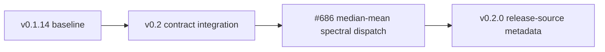

# Changelog

## [0.2.3] - 2026-09-05

This maintenance-release candidate implements GWpy 4.0.1/4.0.2 compatibility
fixes across the audited GWpy-derived API surface. Historical automated
differential evidence is recorded for runtime candidate
`d55717e9aed9ef5c22bb5d8ed0df95e19a313545`, with review and evidence source
`ff47d66ce985c295193a8d8cd1acef3ddd61add1`. That runtime's human
scientific/data-model sign-off is approved: the release owner reapproved the
four unchanged parent-parity risks, signal methods, and signal-related internal
reconstruction authority for non-second irregular axes on 2026-09-04. The
approval is strictly limited to the six approved risk groups and excludes other
contracts. The historical approval remains bound only to candidate
`c7b79db7fee2e646069679a0efe3d65c7ed4e562` and exactly five disclosed
parent-parity risks; see the
[aggregate sign-off report](https://github.com/tatsuki-washimi/gwexpy/blob/main/docs/developers/reports/report_v0.2.3_human_scientific_data_model_signoff_20260903.md).
This approval does not cover later source revisions.
The candidate adds no public API or dependency.

The release owner separately approved the scalar reconstruction delta on
2026-09-05 for runtime tree `88c9de982f4b284afbb5845c13cecb2d90d938dc`,
including the inherited `ScalarField` reductions. This limited approval
preserves the earlier exception scopes and does not authorize publication.

The current follow-up fixes scalar reduction allocation on NumPy 2 and
updates CI provisioning and audit provenance. Each new source requires
same-candidate scientific/data-model review, same-candidate release-security
review, candidate-wide QA, and fresh 19-cell qualification. The
release remains **HOLD** pending the final release gate. Any later
runtime/data-model semantic change invalidates an aggregate sign-off and
requires reapproval. Documentation-only recording commits do not alter the
runtime candidate.

The current inventory evidence covers 575 logical members with 62 selectors
and 396 executed cases per oracle. The historical c7 approval covered the same
575 logical members with 59 selectors and 384 executed cases per oracle; the
generated inventory's 1,150 case rows are a separate logical version-row count.

### Implemented with automated evidence

- **Scalar statistics on NumPy 2**: reductions of `Array3D`, `Array4D`, and
  `ScalarField` can allocate their zero-dimensional `Quantity` result instead
  of failing under strict `copy=False` semantics. Values, units, and reduction
  axis rules are preserved.

- **HDF5 collections**: appending a `TimeSeriesDict` no longer opens an
  unspecified target in truncating mode. Native `names=`, `group=`, append,
  duplicate-name, legacy-manifest, and link-safety outcomes now follow the
  installed GWpy oracle while private exact-time sidecars remain additive.
- **Native HDF5 auto-identification**: `TimeSeries` and `TimeSeriesDict` now
  match GWpy for native `.h5` / `.hdf5` auto-read and auto-write. Structural
  NDScope detection retains precedence over the lower-priority generic HDF5
  route; other ambiguous and GWexpy-only class families remain explicit.
- **HDF5 window safety (#611)**: GWpy 4.0.x can return samples outside the
  requested interval for a completely non-intersecting HDF5 collection
  window because negative stop indices wrap. GWexpy now returns a zero-length
  series only for that fully disjoint entry after the parent reader succeeds.
  Mixed collections retain their keys and order, and only disjoint entries
  become empty. Partial overlap, `pad=`, parent reader errors, and
  caller-owned source handling retain GWpy semantics. A safety-created empty
  retains the series class, dtype, unit, name/channel, and cadence; its public
  `t0`/`span` collapse to the stored series start boundary. It does not inherit
  private exact-time authority from the source.
- **Constructors and time axes (historically approved for c7)**: GWpy-supported `t0` and `epoch` inputs now
  take the parent route without exception-driven retries. Positional and
  keyword forms bind consistently, while the existing exact `t0_ns`
  authority remains separate. Copy, slice, crop, append, and supported
  time-axis mutations preserve or invalidate private exact state according to
  the resulting cadence.
- **Time and frequency conversion (historically approved for c7)**: scalar and date-component `to_gps()` and
  `tconvert()` calls, `from_gps()` inputs, and `FrequencySeries.ifft()` timing
  metadata now match the active GWpy oracle. Invalid date-shaped values fail
  instead of falling back to vector interpretation.
- **Spectral, signal, and statistics routes (historically approved for c7)**: default CSD, Rayleigh,
  heterodyne, demodulate, RMS, resampling, reductions, and axis-result types
  now follow GWpy values, units, shapes, metadata, and exception classes.
- **Plotting, CSV, and collections**: plot methods accept the complete GWpy
  positional layouts and preserve Python-compatible duplicate-argument
  failures. Plain CSV uses the native GWpy route; existing enhanced-only
  arguments remain explicit opt-ins. Collection crop, prepend, and the
  historical `filterba()` shim preserve their established call contracts.
- **Specialized arrays and fields (historically approved for c7)**: inherited constructor binding,
  transposition, BifrequencyMap plotting, ScalarField finite differences,
  unit conversion, grid validation, and percentage comparisons now have
  explicit GWpy or fail-closed data-model contracts.

### Compatibility notes

- `non_intersecting_window_safety` is the sole approved default divergence
  from GWpy in this release. It prevents an upstream negative-index wrap from
  selecting data outside a completely disjoint requested HDF5 window. See the
  [GWpy behavioral compatibility policy](https://tatsuki-washimi.github.io/gwexpy/docs/explanation/gwpy_compatibility_policy.html).
- The #611 safety exception is `approved-separately-unchanged`; its independent
  human approval and release-note gates remain satisfied, and the current
  reapproval does not reapprove it. Its scope remains limited to the fully
  disjoint read-window subcase.
- The recorded human scientific/data-model approval is approved for
  runtime candidate `d55717e9aed9ef5c22bb5d8ed0df95e19a313545` and strictly
  limited to the six approved parent-parity and signal risk groups below. It
  does not approve other contracts. The historical c7 approval of exactly five
  risks remains recorded separately:

  1. the mixed-unit CSD `V²/Hz` label;
  2. public Rayleigh parent segment selection with a private corrected route
     and known finite-Monte-Carlo limitations;
  3. stale Array2D/Plane2D `min`/`max` indices; and
  4. stale numeric `swapaxes`/`transpose` metadata.

  The current signal group covers dimensionless signal outputs, raw-magnitude
  frequency `Quantity` handling, float32 RMS underflow, and signal-related
  internal reconstruction authority for non-second irregular axes.

  The final two groups retain the previously disclosed stale axis metadata on
  specific Array2D/Plane2D reductions and numeric array permutations.
  Corrected or metadata-aware GWexpy-only routes remain explicit where already
  available.

## [0.2.2] - 2026-09-01

This maintenance release restores default behavioural compatibility with GWpy
for time-series selection while retaining exact HDF5 epoch metadata as
GWexpy-private state.

### Fixed

- **TimeSeries crop compatibility**: `TimeSeries.crop()` now delegates
  GWpy-supported arguments to GWpy, so default sample selection, `t0`, `dt`,
  and success/failure behaviour match GWpy at ordinary and high sample rates.
- **Exact epoch propagation**: slicing and cropping finish the base operation
  before propagating private exact state.  A cadence that is not an integral
  number of nanoseconds now drops derived exact authority instead of causing a
  successful GWpy operation to fail.
- **Lazy I/O registration**: collection-first time-series and frequency-series
  I/O now performs the same idempotent registry bootstrap as scalar I/O.
  Repeated operations retain reader and writer identity and registration order.

## [0.2.1] - 2026-08-31

This maintenance release corrects the HDF5 exact-epoch regression and restores
lazy bootstrap I/O registration without changing the public API.

## [0.2.0] - 2026-08-26

This minor release establishes the v0.2.0 semantic-contract baseline for
exact timing, interoperable persistence, deterministic provenance, and public
GWpy compatibility.

### Added

- **time (exact GPS state)**: `TimeSeries` and related supported paths retain
  keyword-only GPS-nanosecond origins through copies, slices, pickles, MNE,
  and HDF5 sidecars.  Exact state is kept separately from binary64 time
  coordinates where required.
- **HDF5 and provenance**: native HDF5 sidecars preserve exact epoch state,
  metadata, and structured provenance without changing the GWpy-readable core
  payload.  Provenance-aware pathname transactions now coordinate local POSIX
  processes with bounded advisory locking; append and caller-owned open
  containers preserve distinct datasets, while pathname replacement remains
  serialized last-writer-wins.
- **GWF reads**: `TimeSeries`, `TimeSeriesDict`, `StateVector`, and
  `StateVectorDict` support spawn-safe `parallel=` reads.  `nproc=` remains a
  compatibility alias.  Multi-worker reads accept only single local frame
  paths and fail before I/O for caches, URI/composite spellings, or unsupported
  nested execution.
- **coupling**: the public v1 coupling-segment schema, pandas/Astropy
  adapters, JSON envelopes, canonical coordinate units, and exact
  finite-precision grid checks are available.  `significance` remains outside
  the v1 schema.
- **spectral estimation**: `TimeSeries.psd()` and `TimeSeries.asd()` accept
  `method="median-mean"`; public `median_bias(n)` exposes the
  FINDCHIRP-compatible finite-sample correction.  PSD/ASD now guarantee
  GWexpy preservation of `name`, `channel`, and `epoch` across supported
  backends, while the backend remains authoritative for numerical values,
  units, and the frequency axis.

### Changed

- **bootstrap and I/O**: a plain `import gwexpy` no longer eagerly registers
  constructors or I/O.  Call `gwexpy.register_all(include_io=False)` for
  constructors or `gwexpy.register_all()` for constructors plus I/O; supported
  public I/O entry points register handlers on demand.
- **SeriesMatrix B0**: the 480-cell Phase A container contract is frozen.
  Dimensional raw-`ndarray` addition and subtraction with `SpectrogramMatrix`
  fail atomically with `TypeError`; the broader B1 composition runtime remains
  deferred (`adopted: false`) pending explicit human D21/data-model sign-off.

### Removed (breaking)

- The obsolete developer proxy imports `gwexpy.utils.shell`,
  `gwexpy.utils.sphinx`, `gwexpy.utils.sphinx.ex2rst`, and
  `gwexpy.utils.sphinx.zenodo` have been removed. Use `subprocess` and
  `shutil.which` for shell helpers, maintained documentation tooling directly,
  and a maintained Zenodo client or project release tooling as appropriate.

### Compatibility fixes

- GWpy 4 runtime proxies now expose curated public table, TimeSeries, LAL, and
  misc utility surfaces. The optional FrameL compatibility proxy is lazy: it
  imports without `python-framel` and reports the original dependency error
  only when a FrameL-backed symbol is requested.

### Update history

## [0.1.14] - 2026-08-15

### Removed (breaking)

- **io (SDB)**: the undocumented `sqlite` and `sqlite3` format aliases and
  `.sqlite`/`.sqlite3` GUI fallbacks have been removed. Use the canonical
  `format="sdb"` name and `.sdb` extension instead (#635).

  | Before | After |
  | --- | --- |
  | `format="sqlite"` or `format="sqlite3"` selected the SDB reader. | Use `format="sdb"`; the removed aliases raise `IORegistryError`. |
  | `.sqlite`/`.sqlite3` paths were routed to SDB by the GUI fallback. | Rename archives to `.sdb` or select `format="sdb"` in direct I/O; unsupported GUI paths raise `RuntimeError`. |

### Behaviour-visible bug fixes

- **io (ATS.MTH5)**: `TimeSeries.read(..., format="ats.mth5")` now uses the
  supported `mth5.read_file(..., file_type="metronix")` API from `mth5>=0.6.8`.
  The reader preserves raw ATSS sample values, maps Ex/Ey to mV/km and
  Hx/Hy/Hz to nT, and fails closed when data, start time, sample rate,
  component, or unit metadata is missing or inconsistent. The published path
  remains single-series only; `TimeSeriesDict.read(..., format="ats.mth5")`
  now raises an explicit `TypeError` before importing the optional dependency
  instead of entering an incompatible dict route. Source timing and units are
  authoritative, so `epoch=`, `timezone=`, `unit=`, and unknown reader
  overrides now fail explicitly instead of being ignored (#619).

  | Before | After |
  | --- | --- |
  | The reader called an obsolete nested `mth5.io.metronix...read_atss` API and could fail before returning a series. | The reader calls the supported top-level API and validates the returned channel contract. |
  | `TimeSeriesDict.read(..., format="ats.mth5")` could dispatch into a single-channel implementation. | The unsupported collection route fails immediately and directs callers to `TimeSeries.read`. |
  | Reader overrides could be accepted but ignored, leaving source timing and units unchanged without notice. | Unsupported timing, unit, and unknown overrides raise before dependency lookup. |
- **io (CSV/SDB cadence)**: numeric and configured component-column CSV
  timestamps are validated before float conversion or resampling, and SDB
  validates integer Unix-second timestamps in database storage order before
  constructing its time axis. Malformed CSV rows report their physical line;
  duplicate, backward, missing, or overlarge timestamp gaps now raise
  `ValueError` instead of being silently accepted or repaired. A finite,
  positive CSV `sample_rate` declares source cadence and is honoured for a
  single row; without it, the legacy one-second fallback remains. `resample=`
  remains a separate finite, positive target cadence, and interpolated values
  now stay aligned with the returned target-rate time axis. UTC component
  cadence uses continuous GPS instants so leap-second gaps fail closed.
  Absolute float64 axes must have rounding error and spacing strictly below
  half a cadence. Resampling is capped at 10,000,000 requested-channel output
  values across the complete top-level single- or multi-file read before
  allocation (#648, #649).
- **io (WIN)**: WIN reads now require a consecutive one-second global packet
  cadence while preserving legitimate channel late starts, early ends, and
  channel-local `t0`. They fail closed on internal channel gaps and
  reappearance, duplicate channel blocks, sample-rate changes, duplicate or
  backward packet times, global gaps, and malformed, truncated, or overlong
  payloads. Bounded length and sample-count checks prevent oversized reads,
  cumulative deltas avoid integer wraparound, BCD year `99` to `00` advances
  the century, and UTC interpretation still warns once per top-level read
  (#647).
- **io (SDB)**: archives that provide a `usUnits` column now validate every
  row as the supported US customary unit-system code `1` and fail closed on
  NULL, text, non-integral, or other values. Archives without that column
  retain the legacy US customary unit assumption; `usUnits` is metadata and
  is not returned as a data channel.
- **io (timezones)**: readers now distinguish source-defined absolute times,
  naive civil times, and relative sample indices. A caller-supplied
  `timezone=` can localize only a naive explicit `epoch=` or configured CSV
  component columns; it can no longer reinterpret an absolute source time.
  Absolute/numeric/aware epoch overrides preserve their instant and warn that
  `timezone=` is ignored, while formats that do not accept timezone input fail
  closed. Malformed offsets, non-finite offsets, and boolean timezone/epoch
  values are rejected instead of being coerced. Local civil times that fall in
  a daylight-saving fold or gap now raise `ValueError` instead of silently
  selecting or normalizing an instant (#633, #651).

  | Before | After |
  | --- | --- |
  | A seismic source at `2024-01-01 12:00:00 UTC` could be reinterpreted as Tokyo civil time, changing GPS `1388145618` to `1388113218` (−9 hours). | Source timestamps remain absolute at GPS `1388145618`; only a naive explicit `epoch=` may be localized. |
  | `timezone=` could be silently dropped by SDB, ATS, TDMS, DTT XML, audio, WAV, NDScope HDF5, and direct HDF5/TXT collection routes. | Unsupported timezone input raises a contextual `ValueError` before optional backends or source traversal. |
  | An ambiguous `2024-11-03 01:30` or nonexistent `2024-03-10 02:30` in `America/New_York` was assigned an offset by `replace(tzinfo=...)`. | Naive local times are checked by UTC round-trip; DST folds and gaps fail closed. |
- **time (GPS/UTC conversion)**: NumPy `datetime64[s/ms/us/ns]` scalars and
  vectors now convert through a time-aware Astropy representation, retaining
  the instant represented by the input dtype through integer nanoseconds.
  Default datetime64 vectors therefore return object arrays of exact
  `LIGOTimeGPS` elements; `dtype=float` remains the explicit binary64 output
  mode. Scalar `tconvert(datetime64)` uses the same exact route. `from_gps()`
  now returns timezone-aware UTC `datetime` values with one rounding rule for
  scalar, vector, and Astropy `Time` inputs. A GPS instant inside a UTC leap
  second raises `ValueError` atomically for vector input because Python
  `datetime` cannot represent `23:59:60` (#646, #650).

  | Before | After |
  | --- | --- |
  | A `datetime64[ns]` scalar could become a Unix-nanosecond integer through `.item()`, while a vector was immediately rounded to binary64 GPS seconds. | All supported datetime64 resolutions preserve datetime semantics; scalar and default vector outputs retain exact integer nanoseconds in `LIGOTimeGPS`. |
  | Vector and Astropy routes could return timezone-naive datetimes with semantics different from the scalar GWpy route. | Every `from_gps()` route returns the same UTC-aware instant and is independent of the host timezone. |
- **io (WIN/CSV warnings)**: WIN header times are explicitly interpreted as
  UTC and emit one top-level warning even for multi-file reads (#632 partial).
  CSV numeric-time and sample-index routes likewise emit one warning when
  `timezone=` is ignored, while component columns continue to localize the
  configured civil time (#634 partial).

### Known limitations

- **io (CSV time scale)**: numeric CSV timestamps retain the legacy GPS-second
  interpretation. v0.1.14 does not add `time_scale=` or `time_unit=`; convert
  non-GPS timestamps before reading. The broader time-scale ambiguity remains
  tracked by #634 for v0.2.0.

### Development and CI

- **CI**: I/O conformance generator smoke checks now enforce a 60-second
  production timeout and terminate the complete process group with bounded
  SIGTERM/SIGKILL cleanup, reaping, and diagnostic output tails. The PR-fast
  gate no longer repeats the dedicated I/O conformance suite, and workflow
  checkouts fetch full history only where merge-base or ancestry checks need
  it (#629, #630).

## [0.1.13] - 2026-08-08

### Behaviour-visible bug fixes

- **timeseries**: `TimeSeries.rms(stride=1, *, ignore_nan=True)` again accepts
  a positional numeric stride in seconds and returns a dimensionless trend
  series. Quantity strides and generic reduction keywords are rejected, so the
  public GWpy-compatible API has one unambiguous meaning (#451).

- **types**: arithmetic between an `astropy` `Quantity` and a `SeriesMatrix`
  (`TimeSeriesMatrix`, `FrequencySeriesMatrix`, `SpectrogramMatrix`) now
  preserves the matrix type, its per-cell units and all axis metadata when the
  `Quantity` is on the left. Previously `(2 * u.s) * matrix` returned a bare
  `Quantity` whose value was the raw matrix data with every per-cell unit, row
  and column key, and time/frequency axis silently discarded: for a matrix of
  cells in `m`, `(2 * u.s) * matrix` returned a `Quantity` in `s` rather than
  `m s`, so every cell was off by the matrix's own unit with no error or
  warning. The same expression with the matrix on the left
  (`matrix * (2 * u.s)`) was already correct, so the two orderings disagreed
  (#575).
- **types**: comparison operators on `SeriesMatrix` are elementwise and return
  a boolean matrix container that preserves shape, rows, columns and axes,
  with dimensionless cell units. Operands are unit-converted before
  comparison, so `matrix_m < quantity_cm` compares physical values rather than
  raw numbers, and comparing incompatible units raises `UnitConversionError`
  instead of returning a silently wrong answer (#576).
- **types**: the guard defect on the fast arithmetic path reported in #577 has
  been removed, and in-place operators are now atomic — a failure part-way
  through leaves the operand unmodified instead of half-updated.
- **types**: `SpectrogramMatrix.clip()` / `.round()` (and `.copy()`, which
  they build on) previously discarded the frequency axis (`frequencies`,
  `f0`, `df`) silently whenever the operation changed dtype. They now
  preserve it, along with the time axis, row/column labels and cell metadata
  (#623).
- **types**: `SeriesMatrix.clip(min, max)` unit handling was inverted — a
  plain number or dimensionless bound against a unit-bearing matrix was
  silently accepted, while an equivalent-but-differently-scaled `Quantity`
  bound was mishandled. `clip()` now accepts a `Quantity` bound equivalent to
  the matrix's unit (converting it, e.g. `clip(1*u.cm, 2*u.cm)` against a
  metre matrix), and raises `UnitConversionError` for a bare number,
  dimensionless bound, or dimensionally incompatible bound against a
  unit-bearing matrix. `clip()` further requires every cell in the matrix to
  share the *identical* unit (not merely a dimensionally equivalent one, e.g.
  `m` and `cm` mixed in one matrix) before applying a unit-bearing bound, and
  raises `UnitConversionError` otherwise — clip `matrix.value` directly for a
  heterogeneous-unit matrix. This also closes a related hazard where
  `np.clip(matrix, ...)` (as opposed to `matrix.clip(...)`) silently fell
  back to a wrong, aliased-metadata result under NumPy's `_wrapfunc`, because
  a plain `TypeError` from `.clip()`/`.round()` — including from their `out=`
  guard — is swallowed by that fallback path; both now raise
  `NotImplementedError`, which is not swallowed (#623).
- **types**: `matrix ** True` / `matrix ** False` now match Python/NumPy
  integer semantics (`True == 1`, `False == 0`): `matrix ** True` preserves
  the original value and unit, `matrix ** False` gives value `1` with a
  dimensionless result (#623).
- **types**: `SeriesMatrix.astype()` (used internally by `clip()`/`round()`
  whenever an operation changes dtype, e.g. clipping an integer matrix
  against float/`Quantity` bounds) passed `xindex`, `meta`, `rows` and `cols`
  through unchanged instead of copying them, unlike `copy()`. A clipped
  `SpectrogramMatrix`'s `times` axis could alias the source's, so mutating
  one silently corrupted the other. `astype()` now mirrors `copy()`'s
  independence guarantees for all four (#623).
- **types**: a bare NumPy integer scalar operand (e.g. `np.int64(2)`, as
  opposed to a Python `int` or `np.float64`, which happens to subclass
  Python `float`) is now accepted everywhere a plain number is. Previously
  `spectrogram_matrix * np.int64(2)` and `spectrogram_matrix ** np.int64(2)`
  raised `TypeError: operand 'SpectrogramMatrix' does not support ufuncs`,
  because `SpectrogramMatrix`'s own operand-acceptance check listed `int`/
  `float`/`complex` but not `np.number`. Separately, `matrix ** np.int64(n)`
  on `TimeSeriesMatrix`/`FrequencySeriesMatrix` always computed the correct
  result but took a guaranteed exception-and-fallback path on every call —
  logging a full traceback and raising a `PerformanceWarning` — because the
  new (#577e) scalar-exponent normalization passed a bare `np.number`
  through to `MetaDataMatrix`'s per-cell unit computation, which only
  accepts `int`/`float`/`complex`. Both are now normalized before use (#623).
- **io (WIN)**: the WIN reader decoded the per-channel sampling rate from
  byte 3 alone, but the rate is a 12-bit field whose top 4 bits live in the
  low nibble of byte 2. Every rate at or above 256 Hz was therefore truncated
  modulo 256 — 1000 Hz was read as 232 Hz. Because the reader also derives
  the packet payload length from that rate
  (`xlen = (srate - 1) * datawide`), the byte stream was misaligned and the
  decoded *samples themselves* were garbage, not merely the time axis. No
  exception was raised: the reader returned a plausible-looking
  `TimeSeriesDict`. The full 12-bit rate is now decoded, matching ObsPy's
  reader (`obspy/io/win/core.py`, upstream obspy#3641). Rates at or below
  255 Hz are unaffected. An encoded rate of zero, which cannot describe a
  channel block carrying a leading absolute sample, now raises `ValueError`
  instead of mis-slicing the packet; no spec consulted here documents zero as
  a sentinel for 4096 Hz (#610).
- **io (zarr)**: reading a store returned a channel chosen by dictionary
  iteration order rather than by any stated rule, so two reads of the same
  unchanged multi-channel store could return different data with no exception
  and no warning. Channel selection is now resolved before any payload is
  read: the available array names are sorted, and a `channels=` selector that
  names a missing array or repeats a name raises `ValueError` instead of being
  silently skipped. The single-series reader now requires the selection to
  resolve to exactly one channel and raises `ValueError` otherwise, rather
  than picking one on your behalf (#614).
- **io (zarr)**: `TimeSeries.read(source, format="zarr")` raised
  `IsADirectoryError` before it ever reached the zarr reader, because the
  explicit format never intercepted the generic registry path and a zarr
  directory store was then opened as a file. The documented entry point had
  therefore never worked. `TimeSeries.read` and `TimeSeriesDict.read` now
  dispatch `format="zarr"` (and `format="nc"`/`"netcdf4"`) directly to their
  readers, mirroring the interception that `TimeSeriesDict.read` already
  performed for a `.zarr` suffix (#620).
- **io (NetCDF4)**: a write→read round trip did not return the time axis it
  was given. `t0` was carried through a datetime-mediated conversion and `dt`
  through integer-nanosecond quantization, so at a realistic GPS epoch — where
  `t0` is around 1e9 s and binary64 has no spare precision — both the epoch
  and the sample spacing came back perturbed, silently shifting every
  timestamp in the file. Files are now written with a versioned timing schema
  that stores `t0` as an exact binary64 hex literal plus integer GPS
  seconds/nanoseconds, and `dt` as an exact integer ratio, so the axis
  round-trips bit-for-bit. Files written by earlier versions carry no schema
  marker; they are still readable, and reading one now emits a
  `RuntimeWarning` stating that their timing precision is limited instead of
  presenting the degraded axis as exact (#615).
- **timeseries**: `crop()` selected samples through a materialized timestamp
  index, so at large GPS epochs floating-point cancellation could move the
  boundary by one sample and perturb `dt` by a few ulp. A perturbed `dt`
  changes `sample_rate`, and the truncating `nfft` derivation amplifies that
  into an O(1/nfft) frequency-axis error, so a spectrum computed after a crop
  could be shifted without anything raising. Crop on a regular axis is now a
  positional slice computed from `t0`, `dt`, and a cancellation-aware
  tolerance, and the source `dt` is retained rather than re-derived from the
  cropped coordinates. Irregular axes keep GWpy's existing behaviour. The same
  correction applies to `TimeSeriesMatrix.crop` (#617).
- **timeseries**: `TimeSeriesDict.read` discarded the `_gwexpy_io` read
  provenance that its readers attach, because re-wrapping the reader's result
  in the collection class did not carry the attribute across. Provenance now
  survives the re-wrap, so the record of how a dictionary was read is
  available on the object you get back (#618).
- **interop (ROOT)**: `from_root` read 2-D histogram contents by reinterpreting
  the raw bin buffer as `float64`. A `TH2F` stores `float32` contents, so the
  buffer was decoded at the wrong width and returned plausible-looking but
  meaningless values with no exception. Contents are now read through the ROOT
  accessor at the class's native scalar dtype (`TH1C`/`S`/`I`/`L` as the
  corresponding integer width, `TH1F`/`TH2F` as `float32`, `TH1D`/`TH2D` as
  `float64`), and `Histogram` no longer promotes an integer input array to
  `float64`, so an integer-typed ROOT histogram keeps its integer contents.
  Bin errors are likewise read through `GetBinError` rather than reconstructed
  from a `Sumw2` buffer (#593).
- **fields**: arithmetic between a `Quantity` (or a bare scalar, or a `Unit`)
  and a field collection — `FieldList`, `FieldDict`, and therefore
  `VectorField` and `TensorField` — lost the per-component physical units and
  axis metadata, because the collection had no operator contract of its own and
  Astropy's `ndarray` dispatch consumed it. The collections now implement the
  binary, reflected, and in-place operators explicitly: each component is
  operated on individually and its axis indices, axis names, domains, offsets,
  name, epoch, and channel are copied onto the result rather than shared with
  the source. Dimensional errors are raised before any component is replaced,
  so a failed in-place operation leaves the collection untouched (#578).
- **plot**: `VectorField.plot(stride=...)` raised
  `TypeError: got an unexpected keyword argument 'stride'` because `stride`
  was forwarded to the magnitude `pcolormesh` as well as to the quiver layer.
  It is now consumed before the scalar layer is drawn and applied only to the
  quiver decimation it was always meant for (#559).
- **docs (segments)**: the `SegmentTable` reference documented methods that do
  not exist in the implementation. The reference now matches the shipped API
  (#605).
- **docs (interop)**: the `gwinc_` docstring pointed at a classmethod that does
  not exist, and the module's stated test coverage did not match the tests that
  actually run. Both now describe the implementation (#608).
- **ci**: the interop gates aggregated JUnit output without checking that any
  test had been collected, so a run that collected zero tests reported success.
  A gate with no collected tests now fails (#511).

### Compatibility

- **types (API narrowing, patch release)**: applying a NumPy ufunc directly to
  a `SeriesMatrix` — `np.sqrt(matrix)`, `np.negative(matrix)`,
  `np.add(a, b)`, `np.add(a, b, out=target)`, `np.add.reduce(matrix)`,
  `np.add.accumulate(matrix)`, `np.multiply.outer(a, b)` — now raises

      TypeError: operand 'TimeSeriesMatrix' does not support ufuncs (__array_ufunc__=None)

  Previously these calls either executed silently with undefined results or
  discarded metadata without warning. This narrows the public surface in a
  patch release, which the project's release policy permits when it corrects
  a contract violation: the same mechanism that stops a left-hand `Quantity`
  from swallowing per-cell units (`__array_ufunc__ = None`, which routes
  `quantity * matrix` back through the reflected operator) also makes NumPy
  refuse direct ufunc dispatch. Silently returning a wrong-unit result is
  treated as worse than an explicit failure.

  Every operation remains available through the explicit operator suite —
  `+ - * / // % divmod ** @`, their reflected and in-place forms, the six
  comparisons and unary `+ - abs()` — which preserve type, per-cell units and
  metadata. For a raw NumPy result, operate on `matrix.value`; note that this
  drops units and metadata by design.

  Full NumPy/GWpy ufunc compatibility is **deferred to v0.2.0** (#637), where
  it is a release blocker for the `SeriesMatrix` semantic-contract redesign.
  Restoring it under the current `ndarray`-subclass data model was measured to
  require changing either `.unit` or `.value` public semantics, which is out
  of scope for a patch release (#575, #576, #577, #623).
- **types**: `matrix_m + matrix_cm` now converts the right operand to the left
  operand's per-cell units and succeeds, where it previously raised
  `UnitConversionError`. Results that used to fail now return a value;
  results that used to succeed are unchanged (#575).
- **types (API narrowing, patch release)**: `divmod(matrix, operand)` is
  explicitly unsupported and raises `TypeError`. An earlier draft of this fix
  had added a working `__divmod__`/`__rdivmod__` that silently ignored units
  on non-zero divisors; rather than ship a unit-aware `divmod`, this keeps the
  explicit failure `divmod` already had on `main` before this change — not a
  functional regression (#623).
- **types (API narrowing, patch release)**: `%` and `//` between a
  unit-bearing `SeriesMatrix` and any non-dimensionless operand now raise
  `TypeError` explicitly, instead of silently copying the left operand's unit
  onto a value computed without unit conversion (the same defect class as the
  #576 fix above, found separately in `%`/`//`). The dimensionless check
  requires an exact — not merely dimensionally equivalent — unit on every
  cell, so a matrix mixing `u.dimensionless_unscaled` and `u.percent` cells is
  rejected regardless of which cell comes first (previously the check
  compared only against the first cell, so `500%` could be silently treated
  as `500` depending on cell order). Dimensionless `%` and `//` are
  unaffected. Addition, subtraction, and comparison are unit-safe. Modulo,
  floor division, and `divmod` are not supported for unit-bearing
  `SeriesMatrix` objects in v0.1.x — they raise explicitly rather than
  performing value-only arithmetic. A correct unit-aware
  floor-division/remainder implementation is deferred to the v0.2.0 semantic
  redesign (#637) (#623).
- **types**: for finiteness checks on a matrix, use
  `mask = np.isfinite(matrix.value)`; this is the documented v0.1.13
  alternative now that direct ufunc application (including `np.isfinite`)
  raises `TypeError` (see the ufunc-narrowing entry above). No new API is
  added in this patch release (#623).
- **io (API narrowing, patch release)**: readers that have no windowed read
  path accepted `start=` and `end=` and then dropped them, returning the whole
  file as if it were the requested span. The arguments are now rejected
  instead. This affects the `ats.mth5` and `xml.diaggui`/`dttxml` readers.

  | Call | Before | After |
  |---|---|---|
  | `TimeSeriesDict.read(src, format="ats.mth5", start=t0, end=t1)` | returns the full file, silently ignoring the span | raises `IoNotImplementedError` (a `NotImplementedError` subclass) |
  | `TimeSeriesDict.read(src, format="dttxml", start=t0, end=t1)` | as above | as above |

  The remedy is in the exception message: read the source in full and crop the
  result, `TimeSeries.read(source, format=...).crop(start, end)`. Calls that
  pass neither selector are unaffected (#611).
- **io (GWF) (API narrowing, patch release)**: `parallel=` and `nproc=` were
  accepted by the GWF read path and then discarded, so a caller asking for
  parallel reads got a serial read and no indication of it. Parallel GWF reads
  are still not implemented; the arguments now say so.

  | Call | Before | After |
  |---|---|---|
  | `read(..., parallel=4)` / `read(..., nproc=4)` | serial read, request silently dropped | raises `NotImplementedError` |
  | `read(..., parallel=True)` | serial read | raises `NotImplementedError` |
  | `read(..., parallel=1)` / `nproc=1` / either set to `None` | serial read | unchanged — serial read |
  | `read(..., nproc=0)` or a non-integer | silently dropped | raises `ValueError` |
  | `read(..., parallel=2, nproc=2)` | one of the two silently won | raises `TypeError` |

  Implementing parallel GWF reads is deferred to v0.2.0 (#588).
- **io (ndscope HDF5) (API narrowing, patch release)**: the ndscope HDF5
  writer accepted arbitrary keyword arguments — including dataset creation
  options such as compression — and ignored them, so a file requested with
  compression was written without it and nothing said so. Unknown writer
  keywords now raise `TypeError` before the target is opened, so no partial
  file is produced. No dataset creation option is supported in v0.1.13; the
  supported set is defined in v0.2.0 (#590).
- **io (zarr, GBD, NetCDF4) (API narrowing, patch release)**: the
  single-series readers for these formats returned the first channel of a
  multi-channel source, and a `channels=` selector naming an array that was
  not present was silently skipped rather than reported. Both now fail
  explicitly.

  | Call | Before | After |
  |---|---|---|
  | single-series read of a multi-channel source | returns an arbitrary channel | raises `ValueError`; pass `channels=` to select one |
  | `channels=["missing"]` | silently returns fewer channels, or none | raises `ValueError` naming the missing channels |
  | `channels=["a", "a"]` | duplicate silently collapsed | raises `ValueError` |

  Selectors are validated against the source's channel list before any payload
  is read, so an invalid selection costs nothing (#614, #615).
- **histogram (API narrowing, patch release)**: `Histogram` had no arithmetic
  contract, and whether an expression such as `quantity * histogram` failed or
  silently produced a value depended on the incidental interaction between the
  histogram's `unit`/`value` attributes and Astropy's `Quantity` dispatch.
  Uncertainty propagation for histogram arithmetic is not defined, so rather
  than leave that balance to chance, `+ - * /` and their reflected and in-place
  forms now raise `TypeError` on `Histogram`, and `__array_ufunc__ = None`
  makes NumPy dispatch fail the same way instead of routing around the
  operators. Transform the values explicitly (for example via `.value`) until
  the propagation rules are defined (#579).
- **interop (ROOT) (API narrowing, patch release)**: `from_root` accepted
  `TProfile`, `TProfile2D`, and `TH2Poly` objects and decoded them as if their
  bins had `TH1`/`TH2` semantics, which they do not. These classes now raise
  `TypeError` naming the class rather than returning a misinterpreted result
  (#593).

### Known limitations

- `#577c` (in-place `out=` update) is not achievable under this approach and
  remains an explicit `TypeError` rather than a working in-place update.
- The originally reported symptoms of `#577a`/`#577b` did not reproduce
  against this change's base (dead code path); this release does **not**
  claim to have fixed them as originally described.
- `Quantity == SeriesMatrix` returns a scalar `False` while
  `SeriesMatrix == Quantity` returns a boolean matrix. This asymmetry
  originates in `astropy` and is not corrected here.

## [0.1.12] - 2026-07-31

This is a metadata-integrity, statistics-correctness, and release-tooling
patch release. It closes a silent NDScope HDF5 channel-drop bug (#541),
corrects the Rayleigh-statistic null model and several related edge cases
(#506), and hardens the release-publication workflow with fail-closed
validation, exact-SHA pinning, and a documented trust boundary (#536).

### Behaviour-visible bug fixes

- **io**: reading an ndscope HDF5 file now raises `ValueError` naming the
  offending group when a data-bearing group carries neither a `rate_hz` nor
  a `sample_rate` attribute, instead of skipping that group. Previously such
  a group was silently dropped, so a multi-channel file with one
  metadata-incomplete channel returned a `TimeSeriesDict` missing that
  channel with no error, warning, or other indication that data had been
  lost. A group is data-bearing when it carries `gps_start` and at least one
  of the `raw`/`mean`/`min`/`max` datasets; groups without `gps_start` and
  groups holding no ndscope dataset are not data-bearing and continue to be
  skipped, as before. Channels excluded by an explicit `channels=` argument
  are never read and so are unaffected. Format auto-detection no longer
  requires a sampling-rate attribute either, so this error is raised through
  `TimeSeriesDict.read()`/`TimeSeriesMatrix.read()` without an explicit
  `format=`; previously a file whose groups all lacked the attribute failed
  identification and fell through to another reader, hiding the loss behind
  an unrelated error. This completes the external-metadata compatibility work
  in #534/#535 (#541).

### Release tooling

- **ci**: the release publication workflow is now a single fail-closed
  `publish-release.yml`, replacing `release.yml`. It resolves the release
  ref to an exact 40-character SHA before `build`, `smoke`, or `publish`
  consume it, checks the validator code out separately from the revision it
  validates, pins every action to a full commit SHA, gates PyPI publication
  behind a tag push and the `pypi` environment, and restricts OIDC
  `id-token: write` to the publish job alone. Manual dispatches are dry-runs
  and must be launched with `--ref main`. `scripts/validate_release.py` and
  `RELEASING.md` are added alongside it. The validator rejects duplicate
  release metadata -- two `## [version]` CHANGELOG headings, or a repeated
  top-level `version`/`date-released` in `CITATION.cff` -- rather than
  reading the first occurrence, matching the release-note generator's
  fail-closed behaviour. `RELEASING.md` documents where the trust boundary
  actually is, separating the controls enforced by repository and PyPI
  configuration from the operational rules that are not mechanically
  enforced, records the readback fields an auditor must check before a tag
  push (`enforcement`, `target`, `conditions`, `rules[].type`,
  `bypass_actors`, and the Trusted Publisher binding, which has no GitHub
  API readback), and states explicitly that the workflow's dual checkout is
  *not* itself protection against a modified tag revision. The required
  `bypass_actors` state is given per ruleset rather than once for both,
  because a `creation`/`update`/`deletion` rule restricts its operation to
  the listed actors instead of forbidding it: the tag-creation ruleset must
  enumerate the permitted creators, while the tag-integrity ruleset must
  list none (#536).
- **ci**: the `pypa/gh-action-pypi-publish` pin in `publish-release.yml` used
  the annotated tag object SHA for `v1.14.2` instead of the commit SHA it
  points to, so the pinned ref did not resolve to any container image and the
  `publish` job failed before uploading anything. Repinned to the peeled
  commit SHA (`dc37677b2e1c63e2034f94d8a5b11f265b73ba33`). No package was
  published to PyPI by the failed run.

*Reproducibility note*: the `rayleigh_test` entries below change numeric
output. The affected statistical model was introduced in `70bc11f55`
(2026-03-28) and shipped unchanged in **every release from v0.1.1 through
v0.1.11** -- eleven releases, all still on PyPI. p-values produced by those
versions are not comparable with these and should not be pooled. There is no
flag to restore the old output; analyses that need to reproduce earlier
numbers must pin to the version that produced them.

- **statistics**: `rayleigh_pvalue()` / `TimeSeries.rayleigh_test()` now
  simulate the null distribution from exponentially-distributed *power*
  samples, matching the power-based statistic that GWpy's
  `rayleigh_spectrogram()` actually reports. Previously the null was drawn
  from Rayleigh-distributed *amplitude* samples and rescaled by the Rayleigh
  distribution's coefficient of variation; matching the mean did not make
  the distribution shapes agree, so the reported p-values were
  systematically miscalibrated by an amount that depended on the
  `stride`/`fftlength` ratio. The corrected null is verified against the
  exact moment `E[R^2] = (n-1)/(n+1)`, which follows from the sample
  coefficient of variation of exponential samples reducing to Greenwood's
  statistic (#506).

- **statistics**: `TimeSeries.rayleigh_test()` now derives `n_samples` from
  `fftlength`, `stride` and `overlap` instead of defaulting to the constant
  `39`, which bore no relation to the data. The count is the number of
  periodogram segments GWpy averages per column, which is *not* `dt * df`
  whenever the segments overlap: GWpy chunks the series into
  `nstride + noverlap` samples, so `rayleigh_test()`'s default path -- which
  resolves `overlap=None` to the recommended 50% for the default hann window
  -- produces twice `dt * df`. Fixing only the null distribution above would have left
  the default path *worse* calibrated than before, because the stale `39`
  happened to compensate for the wrong distribution shape at some
  configurations. `n_samples` may still be passed explicitly for backward
  compatibility; a value that disagrees with the derived one now emits a
  `UserWarning`. Note that the default value changed, so
  `inspect.signature()` reports a different default (#506).

- **statistics**: `TimeSeries.rayleigh_test()` now raises `ValueError` when
  `overlap` resolves to anything other than `0` or GWpy's recommended
  overlap for the window (50% for the default hann), allowing one sample of
  slack for the truncating seconds-to-samples conversion. At 75% overlap
  GWpy previously returned without error or warning while using about 36% of
  the data, *and* the per-segment powers stop being even approximately
  i.i.d. exponential there, so no segment-count correction can make the null
  distribution apply (#506).

- **statistics**: `rayleigh_pvalue()` now reports the DC bin and, when the
  FFT length in samples is even, the Nyquist bin as `NaN`, and accepts an
  `nfft=` keyword so the Nyquist bin can be identified. A real-valued
  input's DC and Nyquist FFT coefficients are purely real, so their power
  follows chi2_1 rather than an exponential; scoring them against the
  exponential null fired on pure Gaussian noise about 77% of the time at
  nominal `alpha=0.05`, which alone pinned `to_segments()` near a 100% veto
  rate. An odd FFT length has no exact Nyquist bin and its last one-sided
  bin is left scored. This mirrors the DC/Nyquist handling added to
  `compute_student_t_nu()` in v0.1.11 (#465). Recovering detection power at
  these bins with a chi2_1 null is left for a future release (#506).

- **statistics**: `TimeSeries.rayleigh_spectrogram()` now derives its own
  per-segment averaging instead of delegating to GWpy's `rayleigh()`, which
  advances segment starts by `fftlength - overlap` but counts segments using
  `overlap`. Those agree only at exactly 50% overlap, so for an odd FFT
  length -- where the recommended Hann overlap is not `nfft // 2` -- or for
  any other explicit overlap, GWpy omits valid segments or requests short
  ones. The count and the slice starts now come from the same hop. **This
  changes the reported statistic values themselves**, not just the p-values
  derived from them, relative to both `gwpy` and GWexpy `<=v0.1.11`, in
  exactly those configurations. The `rayleigh_test()` recommended-overlap
  path is unchanged; direct `rayleigh_spectrogram()` calls continue to
  default to `overlap=0`, which is also unchanged. `TimeSeries.rayleigh_test()`
  rejects the divergent overlaps outright, so this affects direct
  `rayleigh_spectrogram()` callers passing an explicit overlap only (#506).

- **statistics**: `rayleigh_pvalue()`, `_get_rayleigh_stat_null_distribution()`,
  and `_simulate_rayleigh_null()` now raise `ValueError` when `n_samples < 2`.
  The statistic is a sample coefficient of variation over `n` segments, so
  `n == 1` produced an all-zero null against which every observed value
  scored `p == 0`, and `n <= 0` produced an all-NaN null with the same
  effect -- both silently. The `n <= 0` case previously raised only at the
  distribution layer; the bound is now `>= 2` and is enforced at all three
  entry points, since the distribution layer memoises into a shared cache
  (#506).

### Known Limitations

- **statistics**: `to_segments()` still applies no multiple-comparison
  correction -- it flags a time when *any* frequency bin has `p < alpha`.
  With correctly calibrated p-values and 63 scored bins this vetoes about
  96% of times at the default `alpha=0.05`, so the above is a fix to
  per-bin calibration and **not** a fix to spurious vetoes. Choose `alpha`
  accordingly, or restrict the frequency range.

- **statistics**: `rayleigh_pvalue()` can still return exactly `p == 0`,
  whereas `compute_gauch()` floors its p-values at `1/n_monte_carlo`. This
  asymmetry is unchanged here and tracked in #507.

- **docs**: the Japanese translation catalogue for the Rayleigh/GauCh
  tutorial does not yet contain the new v0.1.12 note; the notebook carries
  an explicit Japanese cell in the meantime.

## [0.1.11] - 2026-07-25

This is a time/metadata-integrity and statistics-robustness patch release.
It fixes `MNE` interop epoch/metadata handling (#493), restores a
GPS-absolute time axis and DC/Nyquist fit correctness for the Student-t
non-Gaussianity indicator (#465), and adds Monte Carlo `rng=`/`seed=`
reproducibility for the Rayleigh and GauCh statistical tests (#464).

### Behaviour-visible bug fixes

*Reproducibility note*: the two `statistics` entries below (GPS time axis
and DC/Nyquist `nu` fit) change numeric output relative to `<=v0.1.10`.
Both are correctness fixes for previously wrong values, not new opt-in
behavior -- there is no flag to restore the pre-v0.1.11 output. Analyses
that depend on exact reproduction of results computed with
`gwexpy<=0.1.10` should pin to that version range.

- **interop**: `to_mne_rawarray()` now sets `info["meas_date"]` from the
  input epoch (`t0`) when not already present, and validates it against an
  existing `info["meas_date"]` (within ~1us) rather than silently ignoring
  it; a mismatch now raises `ValueError` instead of producing an `mne.io.Raw`
  with an incorrect or missing epoch. Multi-channel conversion now requires
  all stacked channels to share an *exactly* matching epoch (previously
  unchecked), raising `ValueError` on mismatch rather than silently
  interleaving samples from different acquisition times. `t0` values that
  fall on a leap second continue to raise `LeapSecondConversionError`.
  `from_mne_raw()` now accounts for `raw.first_samp` when reconstructing the
  GPS epoch (previously ignored, undercounting the epoch for cropped/resumed
  `Raw` objects) and applies `unit_map` to set channel units, including
  fixing an `AttributeError` when `unit_map` was omitted (#493).

- **statistics**: `compute_student_t_nu()` / `TimeSeries.student_t_spectrogram()`
  now return a GPS time axis (the input `TimeSeries`'s `t0` plus the STFT
  relative time) instead of relative-to-start seconds. `fftlength`, `stride`
  (and `overlap`), `sample_rate`, `window`, and `frange` are now validated:
  non-finite/non-positive values raise `ValueError` instead of an opaque
  downstream failure, and `stride > fftlength` now raises `ValueError`
  explicitly rather than silently running a gapped analysis that skips
  samples between segments (`scipy.signal.stft` accepts a negative
  `noverlap` without erroring). The underlying `scipy.signal.stft` call now
  passes `window="hann", detrend=False, boundary="zeros", padded=True`
  explicitly instead of relying on scipy's defaults. Partially addresses
  #465 (the DC/Nyquist bin bias half of #465 is fixed by the following
  entry).

  **Migration note** (#465, #502): callers that previously added `ts.t0` (or an
  equivalent GPS offset) to the returned `times` themselves should remove
  that step, since the returned times are now already GPS-absolute and
  double-adding the epoch would shift results by `t0` seconds. Code that
  indexes or slices these times assuming a relative-seconds axis starting
  at `0` should be updated for the new GPS-absolute axis.

- **statistics**: `compute_student_t_nu()` now fits the DC (index 0) and,
  when the segment length is even, Nyquist (the last one-sided bin)
  frequency bins using only their real FFT coefficient, instead of
  concatenating real and imaginary parts as if they were independent for
  those bins too. A real-valued signal's DC/Nyquist FFT coefficients are
  purely real, so the previous re+im concatenation fed a constant-zero
  imaginary half into the fit, collapsing the estimated Student-t `nu`
  toward 0 and producing a systematic false non-Gaussianity detection at
  DC regardless of the actual input. This is a GWexpy-specific
  correctness fix, not a GWpy compatibility change (GWpy has no
  equivalent Student-t fit API); DC/Nyquist are identified structurally
  (index 0 / the last one-sided bin), not via a floating-point frequency
  comparison, computed from the *effective* segment length (`scipy.signal.stft`
  silently shrinks `nperseg` to `len(ts)` when the requested value exceeds
  it, which can flip its parity relative to the requested `fftlength *
  sample_rate`). `compute_student_t_nu()` now also rejects complex-valued
  input with `ValueError` (previously silent, and `scipy.signal.stft`
  ignores `return_onesided=True` for complex input, which would have
  broken this bin classification). Completes #465.

- **statistics**: `compute_gauch()` / `TimeSeries.gauch()` and
  `rayleigh_pvalue()` / `TimeSeries.rayleigh_test()` now accept `rng=`
  (a `numpy.random.Generator`) or `seed=` for a reproducible Monte Carlo
  null distribution. The default (no `rng`/`seed`) path is unchanged: it
  still draws from the legacy global `numpy.random` state, so an existing
  `numpy.random.seed(...)` call continues to control it exactly as before.
  Passing `rng=`/`seed=` uses a dedicated `numpy.random.Generator` instead
  and bypasses the shared, process-global null-distribution cache
  (previously keyed only by `(n, n_trials)`, with no way to request a
  specific draw). The default path's cache population is now serialized
  with a lock, fixing a pre-existing race where concurrent callers on the
  same `(n, n_trials)` key could each redundantly recompute and overwrite
  the cached distribution. `compute_gauch()`'s result now records
  `n_monte_carlo` and, when given, `seed` (or `rng_provided`/
  `seed_unused`) in its `.metadata`; the `Spectrogram` returned by
  `rayleigh_pvalue()` records the same as instance attributes that do not
  survive `.copy()`/slicing/serialization. Passing both `rng` and `seed`
  now emits a `UserWarning` noting that `seed` is ignored (#464).

### Dependencies

- Added `inspiral-range` to the `gw` and `all` optional-dependency extras
  (no change to core/required dependencies) (#487).

### Known Limitations

*Added 2026-07-26, after the original release. The Zenodo record published
on 2026-07-25 is an immutable snapshot and does not contain this section
(see #506).*

- **statistics**: `rayleigh_pvalue()` / `TimeSeries.rayleigh_test()`
  simulates its null distribution from amplitude (Rayleigh-distributed)
  samples, but the statistic it is compared against
  (`TimeSeries.rayleigh_spectrogram()`, from GWpy) is computed from power
  (exponentially-distributed) PSD segments. The two distributions have
  different shape even after matching their mean, which makes the reported
  p-values systematically miscalibrated. The effect depends on the
  stride/fftlength ratio: false-positive rates can be close to nominal for
  some configurations (e.g. ~5% when stride/fftlength ~= 2) and elevated
  for others (e.g. ~11% when stride/fftlength ~= 20), causing inconsistent
  over- or under-detection of non-Gaussianity/spectral lines. This
  is a pre-existing issue, not introduced by the `rng=`/`seed=`
  reproducibility work in this release; a fix is expected in v0.1.12 and
  will change `rayleigh_pvalue()`'s numeric output (see #506).

## [0.1.10] - 2026-07-18

This is a bugfix release covering numerical regularization, axis regularity,
histogram weights, and TimeSeries resampling dtype and boundary contracts.

### Behaviour-visible bug fixes

- **numerics**: `TimeSeriesMatrix.partial_correlation_matrix()` now defaults
  to `eps="auto"` instead of `1e-8`, and `WhitenTransform` now defaults to
  `eps="auto"` instead of `1e-12`. `LaplaceGram.normalize_per_sigma()` now
  defaults to `eps="auto"` instead of `1e-30`. These defaults scale their
  regularization to the input, so strain-scale partial correlations and
  whitening no longer collapse toward zero. Pass the former explicit value to
  retain prior behavior. `partial_correlation_matrix(eps=None)` continues to
  disable its added ridge for compatibility. All three APIs now reject
  non-finite input and invalid epsilon values with `ValueError` (#482).

- **types**: `AxisDescriptor.regular` now compares represented adjacent
  intervals with a narrowly bounded interval-scale tolerance. It accepts
  ordinary floating-point regular grids while rejecting materially unequal
  large-offset float32 intervals that could yield an incorrect `delta` (#492).

- **histogram**: `Histogram.fill()` now preserves fractional scalar weights
  when histogram coordinates use an integer dtype, including flow-bin values
  and variance accumulation (#489).

- **timeseries**: time-bin `resample()` now implements `closed="right"` as an
  include-lowest first bin followed by right-closed bins. It also validates
  enum options, widths, and offsets before constructing the bin grid (#491).

- **timeseries**: `TimeSeries.asfreq()` preserves integer source dtype and
  exact values when an integral `fill_value` is representable. Out-of-range
  integral fills now raise `ValueError` rather than causing a lossy dtype
  promotion; fractional, complex, NaN, and infinite fills still promote to a
  dtype that can represent them (#490).

## [0.1.9] - 2026-07-11

This is a bugfix release. It completes the GWF read-path NaN-padding
harmonization deferred from 0.1.8 (#481) and fixes two fitting bugs
surfaced by the #461 follow-up audit: an off-by-one in `fit_series`'s
`sigma` cropping at exact `x_range` boundaries, and an unvalidated
`run_mcmc(n_walkers=...)` that let emcee's internal error leak through
(#466).

### Behaviour-visible bug fixes

- GWF-specific reads (`TimeSeries.read`/`TimeSeriesDict.read`/`TimeSeriesMatrix.read`
  with `format="gwf"`) now default `gap="pad"` to `NaN` padding instead of `0.0`,
  completing the harmonization with `SeriesMatrix.append`'s NaN default shipped in
  0.1.8. Code that relied on zero-filled GWF gaps should pass an explicit `pad=`
  value. Padding a missing region (an inter-file gap or a requested interval
  that extends beyond the available data) with `NaN` on a non-floating-point
  GWF channel dtype now raises a clear `ValueError` instead of silently
  corrupting the data with an out-of-range integer fill value or leaking
  NumPy's opaque ``cannot convert float NaN to integer`` (#481).

### Bug fixes

- **fitting**: `fit_series(..., sigma=..., x_range=...)` no longer crashes with
  a spurious `Sigma length mismatch` `ValueError` when `x_range`'s upper bound
  exactly matches a data bin edge. The sigma array is now cropped using the
  same index range that `Series.crop()` actually used for the fitted data (#466).
- **fitting**: `FitResult.run_mcmc()` now validates `n_walkers >= 2 * ndim`
  before invoking `emcee.EnsembleSampler`, raising a clear `ValueError` with
  the required minimum instead of letting emcee's internal `RuntimeError`
  surface with no gwexpy-level context (#466).

### Development

- Move maintainer-only `.harness/` AI workflow files out of the public
  repository and skip private harness sync tests when the harness is absent
  (#483).

## [0.1.8] - 2026-07-04

This is a bugfix and I/O-hardening release. It fixes the `from_obspy`
crash on `obspy.Stream` input (#452) and hardens the SeriesMatrix / I/O
layer: gap handling, metadata aliasing, key round-trips, and reader
failure modes surfaced by the #443 follow-up audit are fixed with explicit
contracts and regression tests (#450).

### Behaviour-visible bug fixes

- `SeriesMatrix.append(gap="pad")` (and the matrix multi-source merge paths
  built on it) now pads gaps with `NaN` instead of `0.0` by default, matching
  the missing-data convention already used by the multi-source readers.
  Code that relied on zero-filled gaps should pass an explicit `pad=` value
  or handle NaNs before reductions/FFT/filtering. Padding a gap with `NaN`
  on a non-floating matrix dtype now raises `ValueError` instead of silently
  inserting an invalid fill value.
- **io/netcdf4**: A failed per-channel series construction no longer degrades
  to a plain dict (which deferred an opaque `AttributeError` downstream); the
  reader now raises a clear `ValueError` at the source.
- **io/netcdf4**: Time-coordinate detection now prefers an explicitly named
  coordinate (`time`/`Time`/`TIME`/`t`) and warns when it has to fall back to
  a datetime64 coordinate — more loudly when several candidates make the
  choice ambiguous. Pass `time_coord=` to select the axis explicitly.
- **io/zarr**: Reading a store without a stored epoch now emits a
  `UserWarning` (the silent default was GPS epoch 1980); a new
  `t0_override=` argument sets the epoch explicitly.
- **io/sdb**: Non-numeric values dropped by numeric coercion are no longer
  silently lost; the reader warns with the affected column and count.

### Bug fixes

- **interop/obspy**: `TimeSeries.from_obspy` no longer crashes with an opaque
  `AttributeError` when given an `obspy.Stream`: a single-trace Stream is
  converted directly, and a multi-trace Stream raises a clear `TypeError`
  pointing to the new `TimeSeriesDict.from_obspy` / `to_obspy` methods.
  The `from_neo` (Block/Segment), `from_torch` (non-1D tensors) and
  `from_root` (container inputs) converters gained equivalent clear-error
  guards (#452).
- `SeriesMatrix` metadata aliasing is now fully closed out: `rows`/`cols`/
  `meta`/`attrs` are deep-copied in `_get_meta_for_constructor` (used by
  `crop`/`append`/`diff`/`pad`/`interpolate`), in the matrix math ops
  (`trace`, `matmul`, `schur`, `abs`, …) and in `__array_ufunc__`, so
  mutating a derived object's metadata no longer corrupts the source.
  This extends the `astype`/`real`/`imag` fix shipped in 0.1.6 (#442) to the
  remaining construction paths.
- **io/hdf5**: `SeriesMatrix` row/column keys are now JSON-encoded on write
  (`key_format="json"`, mirroring the NetCDF4/Zarr encoders), so tuple and
  numeric keys survive HDF5 round-trips instead of collapsing to strings.
  Legacy string-keyed files remain readable.
- **io/dttxml**: JSON key decoding now recursively converts nested lists to
  tuples (matching the Zarr decoder) so round-trips preserve tuple keys and
  hashability.
- **interop**: `to_xarray()` (and `to_xarray_frequencyseries()`) no longer
  persist an unset `channel`/`name` as the literal string `"None"`, which
  previously round-tripped back into a bogus `Channel("None")`. The
  `channel` metadata now survives `to_dict`/`from_dict`,
  `to_xarray`/`from_xarray` and `to_hdf5`/`from_hdf5` round-trips.

### Behaviour changes

- **interop**: `TimeSeries.from_dict`/`from_json`/`from_xarray`/`from_pandas`/
  `from_hdf5_dataset`/`from_netcdf4`/`from_polars` (and the underlying interop
  helpers) now accept explicit `channel`/`unit`/`name`/`t0`/`dt` keyword
  arguments to supply metadata the source object cannot carry; an explicit
  argument always takes priority over a stored value (`user > source`).
- **interop**: when `t0`/`dt` cannot be recovered or inferred, the converters
  (`from_dict`, `from_pandas`, `from_hdf5`, `from_netcdf4`, `from_polars`) now
  fall back to `t0=0`/`dt=1` with a `UserWarning` instead of silently, matching
  the Zarr reader. The fallback values are unchanged, so this is a backward-
  compatible (SemVer MINOR) addition; pass `t0=`/`dt=` explicitly to silence it.

### Dependencies

- Added upper version bounds to I/O backends to guard against major-version
  API breaks: `h5py>=3.0,<4` (core), `obspy<2`, `nptdms<2`, `netCDF4<2`,
  `zarr>=2,<4` (extras). These caps stay within the currently tested major
  series but can affect dependency resolution in environments that already
  pin newer majors (#450, D1).

### Tests

- **interop**: Added regression tests for the `resolve_timing`/`resolve_meta`
  helpers, `channel` round-trips across dict/json/xarray/hdf5/netcdf4, the
  `"None"`-string guard, falsy-zero `t0=0.0` handling, user-supplied metadata
  overrides, and the new missing-timing `UserWarning` for each converter.
- Added matrix key round-trip contracts across HDF5/NetCDF4/Zarr, multi-source
  reader and gap-padding coverage, SDB/Zarr reader warning tests, and
  io-conformance generators/validators for the SDB and Zarr backends.

### Known limitations

- GWF-specific read padding still follows its existing zero-padding path
  (`gwexpy/timeseries/_gwf_io.py`); harmonizing GWF padding with the
  matrix/core NaN convention is deferred to a follow-up issue.

## [0.1.7] - 2026-06-27

This is a numerical-robustness hardening release. A Phase 1 audit across the
statistics, fitting, and spectral modules surfaced a set of silent-failure and
degenerate-input bugs; this release adds explicit input-contract guards and a
matching suite of regression tests so that invalid inputs raise clear errors
instead of producing Inf/NaN or silently wrong results.

### Bug fixes

- **fitting/core**: LSQ cost classes now validate `dy` — zero, negative,
  non-finite, or complex elements raise `ValueError` instead of causing silent
  fit failures or Inf/NaN results (#469).
- **fitting/gls**: GLS classes gained covariance / inverse-covariance
  conditioning guards and PSD checks (#457 via #472).
- **fitting/models**: Added degenerate-parameter guards to model shape
  functions (#455 via #471).
- **statistics**: Guarded degenerate and non-finite inputs across
  `rayleigh_test`, `gauch`, `dq_flag`, and `student_t_indicator` — all-NaN
  inputs, `p=0` false vetoes, Inf-corrupted distributions, an `IndexError`,
  and mis-sized segments are now handled explicitly (#459 via #470).
- **statistics/roc**: `calculate_roc` and `evaluate_detection_performance`
  enforce their input contract — empty classes, shape mismatch, non-finite
  scores, and tied-FPR bias now raise `ValueError`, and sklearn-style
  `{-1, +1}` labels are handled correctly (#468).
- **spectral**: Guarded `bootstrap_spectrogram` edge cases — float truncation,
  NaN/Inf energy, `rebin_width` validation, covariance mean-imputation, and
  zero-width confidence-interval warnings (#460 via #473).

### Tests

- Added input-contract regression suites covering the fixes above:
  `tests/fitting/test_lsq_cost_dy_contract.py`,
  `tests/fitting/test_gls_contracts.py`,
  `tests/fitting/test_models_domain_contract.py`,
  `tests/statistics/test_degenerate_input_contract.py`,
  `tests/statistics/test_roc_input_contract.py`,
  `tests/spectral/test_bootstrap_spectrogram_contract.py`.

### Maintenance

- Centralized gwexpy provisioning across CI workflows and fixed nightly drift
  via a shared `setup-gwexpy` composite action (#454).
- Added release-note tooling (`tools/gen_release_notes.py`,
  `tools/publish_releases.sh`) that generates standardized GitHub Release notes
  from `CHANGELOG.md`.

### Documentation

- Added the Phase 1 numerical-robustness sweep and supplement reports under
  `tech_notes/` (#462).

## [0.1.6] - 2026-06-11

This is a bugfix and maintenance release: plotting/I/O follow-up fixes
(#440, #441, #442 via #443), a development dependency sweep (#431), and
FrequencySeries collection registry audit tests (#438).

### Bug fixes

- Fixed subplot geometry calculation in `Plot` so the expansion count always
  matches `_expand_args`: all arguments are now counted regardless of order
  (a leading Spectrogram or matrix no longer hides later containers), the
  duplicated counting loops were unified into a single helper, and a leading
  matrix keeps its grid geometry only when it is the sole argument (#440).
- All TimeSeries readers now handle a list or tuple of paths: formats with
  well-defined merge semantics (tdms, ats, csv, netcdf4, gbd, ndscope HDF5,
  zarr, sdb, win, dttxml) concatenate channels along time with NaN gap
  padding via a shared multi-source helper, while self-contained formats
  (wav, audio) raise a clear `ValueError` instead of an opaque backend
  `TypeError` (#441).
- GWF alias registration no longer swallows unexpected errors silently:
  expected missing-backend lookups return `None` as before, anything else
  emits a warning (#442).
- Pickling a `SeriesMatrix` now emits a warning listing any attrs entries
  that had to be dropped because they cannot be pickled, instead of
  dropping them silently (#442).
- `SeriesMatrix.astype()`, `.real`, `.imag`, `.conj()`, `.transpose()`/`.T`
  and `.reshape()` now deep-copy `attrs` like `.copy()` does, so mutating
  the result's attrs no longer leaks into the source matrix (#442).
- Multi-file NetCDF4/Zarr reads into `TimeSeriesMatrix` now preserve the
  matrix row/column keys instead of collapsing them through the dict-reader
  shortcut, and NetCDF4 gained a dedicated matrix writer.
- Multi-file matrix segment merging now passes `pad=np.nan`, so gaps between
  files are NaN-padded instead of raising.

### Maintenance

- Updated the development dependency group (24 packages) in
  `requirements-dev.txt` (#431).

### Tests

- Added `tests/timeseries/test_rms_compat.py` pinning gwpy-compatible
  `TimeSeries.rms(stride)` behaviour (gwpy reference parity, positional-int
  regression for #451, trailing-window drop, NaN-per-window propagation) and
  the gwexpy enhancements (time/dimensionless `Quantity` stride, unit
  preservation, and `ValueError` for sub-sample/zero/negative/irregular
  strides). Re-pointed `test_stats_mixin.py::test_rms_with_unit` onto `Series`.
- Added plot geometry tests for mixed-container argument orders, single
  2D/3D/4D matrices, and parity with `_expand_args` expansion counts.
- Added multi-source reader tests covering merge, gap padding, overlap
  errors, empty-list rejection, and clear single-file-only errors.
- Added regression tests for pickle attrs warnings and attrs independence
  of derived matrices.
- **frequencyseries/io**: Added registry-backend audit tests and a developer
  note for FrequencySeries collection read/write fallback (#438). No
  behaviour change.

## [0.1.5] - 2026-06-10

This is a patch release focused on plotting and I/O hotfixes.

### Bug fixes

- Fixed `TimeSeriesDict.plot()` so multi-channel dictionaries are expanded into
  separate subplots instead of producing a blank or invalid figure (#432).
- Fixed ObsPy-backed seismic readers so `TimeSeriesDict` keys are stable string
  trace names (e.g. `"IU.ANMO.00.BHZ"`), enabling reliable string-based lookup
  (#435).
- Added support for passing a list or tuple of miniSEED paths to
  `TimeSeriesDict.read(..., format="mseed")` (#433).
- Fixed `gwexpy.frequencyseries` import-time I/O registration so FrequencySeries
  read formats are visible through the GWpy default I/O registry (#437).

### Tests

- Added regression tests for `TimeSeriesDict.plot()`.
- Added seismic I/O tests for string keys, list-of-path miniSEED input, and
  empty-list rejection.
- Added subprocess-isolated FrequencySeries I/O registration tests.

### Documentation

- Clarified that GWexpy is an independent package built on top of GWpy and is
  not an official component of the GWpy project.
- Updated the README installation notes to reflect that the conda-forge
  feedstock is available, while conda-forge packages may lag the latest PyPI
  release.

### Deferred

- Broad FrequencySeries collection read/write registry-backend migration is
  deferred to #438.
- Dependency sweep (#431) is deferred to the v0.2.0-prep lane.

## [0.1.4] - 2026-05-20

### Added

- **io/conformance**: Added the first contract-driven I/O conformance baseline for `gwf`, `hdf.ndscope`, `hdf5`, `csv`, `txt`, and `wav`.
- **io/contracts**: Added v3 public I/O contract policy fields for fixture generation, coverage status, CI jobs, and missing optional dependency behavior.
- **ci/io**: Added the `io-conformance` gate and expanded I/O gate documentation.
- **time**: Added opt-in `dtype=` output modes for `to_gps()`. The default
  remains GWpy-compatible, while `dtype=float` / `dtype="float"` return plain
  float values and `dtype="quantity"` returns seconds quantities for direct
  `.times` comparisons.

### Fixed

- **io/dttxml**: Fixed `load_dttxml_products()` so DTTXML `TS` entries remain raw dict payloads and do not collide with `TimeSeries.get()`.
- **io/gwf**: Provisioned the GWF backend for the PR fast gate and tolerated backend-specific GWF channel metadata variance.

### Documentation

- **feedback**: Updated the README, docs hub pages, footer links, roadmap, and
  troubleshooting pages to point lightweight bug reports and feature requests
  to the public feedback form. Security reports remain directed to the
  repository security policy.

### Tests

- **io/conformance**: Added deterministic fixture generators and read/write round-trip coverage for the v0.1.4 blocking format baseline.
- **io/dttxml**: Added regression coverage for DTTXML `TS` dict parsing through `read_timeseriesdict_dttxml()`.
- **netcdf**: Added a fixture-generation contract that requires generated
  NetCDF fixtures to expose an explicit time coordinate (#393).
- **timeseries/gwf**: Added regression coverage for multi-channel GWF
  list-source reads and padded gap reads with `parallel > 1`.

### Known Issues

- **io/zarr**: The optional `io-zarr` gate can hang in environments where Zarr 3.1.5 stalls during basic `create_array()` fixture generation. Zarr remains outside the v0.1.4 base blocking gate and is tracked for optional-backend hardening.

## [0.1.3] - 2026-05-12

### Fixed

- **timeseries/gwf**: Fixed multi-file GWF reads for `TimeSeries` and
  `TimeSeriesDict` inputs.
- **timeseries/matrix**: Fixed ndscope HDF5 auto-detection for
  `TimeSeriesMatrix.read()`.
- **io/contracts**: Aligned public I/O docs and contract metadata with current
  autodetection behavior.
- **frequencyseries/csv**: Added a dedicated CSV fast path that preserves the
  original frequency column values.
- **timeseries/zarr**: Fixed matrix round-trip coverage under zarr 3 and
  removed timeout-prone fixture behavior.
- **plot/geomap**: Treat PyGMT installations without a loadable GMT shared
  library as an unavailable optional backend instead of failing at import time.

### Known Issues

- **netcdf**: The bundled NetCDF fixture can fail the TimeSeries reader
  time-coordinate contract in some cases (#393). Generated NetCDF round-trip
  coverage still passes; users relying on NetCDF fixtures should verify that
  their files expose an explicit time coordinate.

## [0.1.2] - 2026-05-08

### Narrow v0.1.2 hotfix scope

- **io/gwpy4**: Narrow compatibility hotfixes for public I/O proxy imports and GWF list/dict read paths.
- **io/formats**: Targeted reader auto-identify and compatibility fixes for histogram HDF5, ATS/MTH5, audio, seismic, SegmentTable span CSV, and FrequencySeries DTT XML flows.
- **integration**: Narrow landing updates include only the minimal #369 landing/demo import hunk required for this track.
- **release status**: Version metadata and release notes are finalized for `v0.1.2`, but tag creation, PyPI publication, Zenodo publication, fresh release smoke reruns, and conda-forge refresh are still pending.

### Packaging & Optional Dependencies (issue #251)

- **packaging**: Added `netcdf4` extra (`netCDF4`, `xarray`) and `zarr` extra (`zarr`) to `pyproject.toml`; both are now included in the `all` convenience extra.
- **packaging**: Removed the experimental `gwexpy.gui` package, console script, and `gui` extra from the published PyPI distribution; GUI work remains source/development-only until the post-release stabilization track is complete.
- **packaging**: Tightened first-release artifact hygiene by excluding top-level tests, docs sample data, and package-internal Sphinx helper shims from built distributions.
- **packaging**: Removed hand-edited tail from `requirements-dev.txt`; `analysis` extras are now managed exclusively through `pyproject.toml`.
- **interop**: Fixed `_optional.py` `_EXTRA_MAP` — phantom extras (`interop`, `bio`, `stats`, `eda`) replaced with `None` entries that fall back to bare `pip install <package>`; `netCDF4`/`xarray` now point to `netcdf4` extra; `zarr` points to `zarr` extra.
- **io**: `ensure_dependency()` error hint corrected to `pip install 'gwexpy[<extra>]'` instead of `pip install <pkg>[<extra>]`.
- **io**: `_import_pydub`, `_import_obspy`, `_import_nptdms`, `_import_zarr`, `_import_xarray` error messages now include `pip install 'gwexpy[<extra>]'` hints.
- **fitting**: `gwexpy.fitting.__getattr__` error messages now suggest `pip install 'gwexpy[fitting]'`.
- **ci**: `io-optional` gate extended with `test_seismic_public_io.py`; `test_optional_deps.py` augmented with `gwexpy[extra]` hint assertions and `TestSeismicImportGuard`.
- **docs**: Installation guide updated with `netcdf4`, `zarr` extras and clarified `gui` is not in `all`.

### Infrastructure & CI

- **ci**: Comprehensive stabilization of the CI pipeline, resolving all `ModuleNotFoundError` and `SyntaxError` regressions.
- **ci**: Added mandatory **Notebook syntax validation** to the primary test workflow to proactively catch corrupted `.ipynb` files.
- **ci**: Restored and standardized scientific dependencies (`control`, `statsmodels`, `scikit-learn`, etc.) across all GitHub Actions environments.
- **docs**: Performed a global "reset-and-rewrap" of tutorial notebooks to fix indentation errors in `warnings.catch_warnings()` blocks.

### Added

- **fields**: `VectorField` and `TensorField` now support initialization directly from NumPy ndarrays (5D for VectorField, 6D for TensorField), automatically creating the component `ScalarField`s without breaking backward-compatible dictionary initialization.

### Changed

- **fields**: `ScalarField` binary arithmetic now fails fast with `ValueError` when operands have mismatched time/frequency domains, spatial domains, or coordinate grids. Align fields explicitly before arithmetic; future regridding/interpolation APIs will track explicit grid-alignment workflows.
- **plot**: `FieldPlot` labels now avoid empty unit brackets for unitless metadata and expose the latest scalar colorbar via the public `last_field_colorbar` attribute. Explicit `label=""` colorbar labels remain supported.

### Documentation

- **docs**: Unified the Class Index into five major categories (Core, Field, Signal, Analysis, Utilities) with standardized Japanese translations (e.g., "時系列行列" for `TimeSeriesMatrix`).
- **docs**: Redesigned major guidance pages (`io_formats`, `numerical_stability`, `time_utilities`, `architecture`) using judgment tables and decision-driven structures.
- **docs**: Refined visual aesthetics with custom CSS for modern typography, responsive tables, and card-based navigation in the Sphinx RTD theme.
- **docs**: Integrated SEO/OGP metadata, sitemaps, and automated "Last updated" timestamps.

### Infrastructure

- **ci**: Implemented a weekly documentation health check (`docs-weekly-health.yml`) to monitor broken links, terminology consistency, and JA/EN synchronization.
- **ci**: Standardized notebook testing pipeline with `papermill` for full execution (Light) and `nbval` for syntax validation (Heavy).
- **ci**: Integrated `nbstripout` into pre-commit hooks to manage repository size and diff clarity.
- **pre-commit**: Added a GitHub Actions PR template with automated quality gate checklist.

## [0.1.1] - 2026-04-28

### Added

- **SegmentTable**: New factory methods `read()` and `read_csv()` for initializing from external files.
- **SegmentTable**: Support for the iterable protocol (`__iter__`) and `RowProxy` for direct row-wise processing.
- **Tutorials**: Comprehensive new notebooks for `SegmentTable`, `Noise Generation`, and `Spectral Fitting`.
- **Infrastructure**: Automated tutorial execution testing via `pytest --nbmake` and GitHub Actions.
- **analysis/coupling**: `CouplingFunctionAnalysis` — `from_time_windows()`, `from_time_windows_batch()`, `bkg_window` パラメータ追加 (Phase 1).
- **analysis/coupling_result**: `CouplingResult` — `to_csv()`, `from_csv()`, `to_txt()`, `from_txt()`, `to_summary_csv()` によるファイルエクスポート (Phase 2).
- **analysis/coupling_result**: `CouplingResult` — `plot_significance()`, `plot_asdgram()`, `plot_snrgram()` 可視化メソッド追加 (Phase 3).
- **analysis/coupling_result**: `CouplingResultCollection` — 複数結果の集約コンテナ (Phase 2).
- **analysis/stats**: `SpectralStats` — スペクトル統計コンテナ（`spectral_stats()` より取得） (Phase 2).
- **analysis/response**: `ResponseFunctionResult` — `plot_projection_summary()`, `plot_response_matrix()` 可視化メソッド追加 (Phase 3).
- **analysis**: `ResponseFunctionResult`, `ResponseFunctionAnalysis`, `estimate_response_function`, `detect_step_segments` を `gwexpy.analysis` から公開 (Phase 4).
- **docs**: Sphinx API リファレンスに `coupling_result`, `response`, `threshold`, `stats` モジュール追加 (Phase 4).
- **tutorials**: `case_coupling_analysis.ipynb` / `case_response_analysis.ipynb` に Phase 1–3 の利用例を追補 (Phase 4).

### Changed

- **SegmentTable**: `add_series_column()` now accepts a simple `loader(segment)` callable for intuitive lazy loading.
- **noise/peaks**: Renamed `lorentzian_line()` parameter `fwhm` to `gamma` for consistency with implementation.

### Fixed

- **fitting/highlevel**: Resolved frequency bin alignment between PSD and covariance matrix in `fit_bootstrap_spectrum`.
- **fitting/highlevel**: Removed unsupported `stride` parameter from `fit_bootstrap_spectrum`.
- **table/segment_plot**: Fixed `TypeError` when an existing `Axes` object is provided to `segments()`.

### Previously Unreleased (merged into 0.1.1)

- **interop/multitaper**: `from_mtspec` / `from_mtspec_array` が `cls` パラメータを
  無視して CI 付き入力でも常に `FrequencySeriesDict` を返していた問題を修正。
- **interop/meshio**: `cell_data` のみを持つ `meshio.Mesh` を `from_meshio` に渡した場合の
  誤った補間経路を廃止し、明確な `ValueError` を送出。
- **interop/pyroomacoustics**: `room.rir` のインデックス順序（マイク ↔ ソース）を修正。
- **interop/openems**: HDF5 データセットの `"Time"` / `"frequency"` 属性の優先使用を修正。

## [0.1.0] - 2026-03-15

### Release Summary

Early stable GWexpy release focused on API stability, GWpy compatibility, and reproducible commissioning workflows. Publication status is not asserted here.

### Changed

- **Version**: Updated from `0.1.0b2` to `0.1.0` (stable release)
- **GWpy API UX Compatibility**: Aligned key spectral API call conventions with GWpy 4.x usage patterns.
  - `TimeSeries.transfer_function` now accepts GWpy-style positional calls:
    - `transfer_function(other, fftlength, overlap, window, average, ...)`
  - `TimeSeriesDict` / `TimeSeriesList` now accept positional spectral args for:
    - `csd`, `coherence`, `csd_matrix`, `coherence_matrix`
    - positional `(fftlength, overlap)` is supported in addition to keyword usage
  - Mixed positional+keyword specification of `fftlength`/`overlap` now raises clear `TypeError`.
- **Authors**: Removed email from `pyproject.toml` to prevent spam (contact via GitHub Issues or paper)

### Added

- **Compatibility policy doc**:
  - `docs/developers/compatibility/gwpy/API_UX_POLICY_20260303.md`
- **GWpy compatibility tests**:
  - `tests/timeseries/test_transfer_function_compat.py`
  - `tests/timeseries/test_collections_spectral_compat.py`
  - `tests/timeseries/test_fft_param_compat.py`
  - Includes edge-case checks for positional/keyword conflicts and invalid numeric `other` in collection APIs.
- **CI workflow for compatibility gate**:
  - `.github/workflows/test-compat-gwpy.yml`
  - Runs focused GWpy-compat tests plus `tests/timeseries`, with pinned `numpy<2.0` and `astropy<7.0`.
- **Publication materials**:
  - Paper source: `docs/gwexpy-paper/main.tex`
  - Publication preparation plan: `docs/developers/plans/for_paper_publication.md`

## [0.1.0b2] - 2026-02-23

### Changed

- **API Unification**: Standardized all spectral analysis function signatures to use time-based parameters (`fftlength`/`overlap` in seconds) instead of sample-count-based parameters (`nperseg`/`noverlap`). This aligns gwexpy with GWpy conventions and improves user experience.
  - **Affected Functions**:
    - `gwexpy.spectral.bootstrap_spectrogram()` - now accepts `fftlength` and `overlap` (seconds)
    - `gwexpy.fitting.fit_bootstrap_spectrum()` - now accepts `fftlength` and `overlap` (seconds)
    - `gwexpy.spectrogram.Spectrogram.bootstrap()` and `.bootstrap_asd()` - now accept `fftlength` and `overlap` (seconds)
    - `gwexpy.fields.signal.*` spectral functions (spectral_density, compute_psd, freq_space_map, coherence_map) - now accept `fftlength` and `overlap` (seconds)
    - `gwexpy.timeseries.TimeSeriesMatrix` spectral methods (\_vectorized_psd, \_vectorized_csd, \_vectorized_coherence) - now accept `fftlength` and `overlap` (seconds)
  - **Migration Note**: Using deprecated `nperseg` or `noverlap` parameters will raise `TypeError` with guidance to use `fftlength` and `overlap` instead. No deprecation period - breaking change applies immediately.
  - **New Module**: `gwexpy.utils.fft_args` provides helper functions for parameter validation and conversion:
    - `parse_fftlength_or_overlap()` - converts time values (float, int, Quantity) to seconds and samples
    - `check_deprecated_kwargs()` - detects and rejects deprecated parameters
    - `get_default_overlap()` - returns window-appropriate default overlap values (GWpy-compatible)
  - **GWpy Compatibility**: All functions now follow GWpy conventions for time-based FFT parameters, improving interoperability and reducing API confusion.

### Improved

- **Numerical Stability**: Implemented a comprehensive numerical hardening strategy for low-amplitude gravitational-wave data (O(1e-21)).
  - **Adaptive Whitening**: `whiten()` now uses an adaptive `eps` relative to input variance, preventing signal destruction in quiet channels.
  - **Robust ICA**: `ica_fit()` includes internal standardization and relative tolerances to handle high-dynamic-range data.
  - **Safe Logging**: Visualization tools now use dynamic floor calculation to prevent `-inf` or clipped values in dB plots.
  - **Machine Precision**: Numerical constants now adapt to float32/float64 machine precision.

### Fixed

- **GBD**: Apply amplifier range scaling when reading Graphtec `.gbd` so analog channels are correctly converted from raw counts to volts, and treat `Alarm`/`AlarmOut`/`Pulse*`/`Logic*` as digital status channels (0/1, dimensionless). Digital channel mapping can be overridden via `digital_channels=...`.

## [0.1.0b1] - 2026-02-01

### Initial Public Release

- This is the first public beta release of `gwexpy`. All previous development history (up to internal version 0.4.0) is consolidated here.

### Important Notes

- **gwpy Compatibility**: This release is compatible with `gwpy>=3.0.0,<4.0.0`. gwpy 4.0.0 introduced breaking API changes that are not yet supported. Users should ensure they have gwpy 3.x installed.

### Refactored

- **Exception Handling**: Eliminated broad `except Exception` patterns in NDS, GUI, and IO modules. Replaced with specific exception types (`OSError`, `ValueError`, `KeyError`, etc.) for more predictable error handling and better debugging.
- **GUI Architecture**: Improved separation of concerns between UI and core logic layers in GUI components.

### Added

- **Core Data Structures**:
  - `TimeSeries`, `FrequencySeries`, `Spectrogram` classes with metadata management.
  - `TimeSeriesMatrix`, `FrequencySeriesMatrix`, `SpectrogramMatrix` for multi-channel data handling.
  - `ScalarField`, `VectorField`, `TensorField` for 4D experimental domain semantics.
- **Numerical Semantics**:
  - Strict unit propagation for calculus methods.
  - Fixed DC component handling in integration to prevent singularities.
- **Advanced Signal Processing**:
  - functional Short-Time Laplace Transform (`stlt`).
  - High-performance resampling with various aggregation methods.
  - Whitening and standardization models.
- **Interoperability**:
  - Support for various file formats: TDMS, GBD, WIN, ATS, SDB/SQLite, WAV.
  - Integration with ML frameworks (Torch/TensorFlow) and ROOT (CERN).
  - MTH5 support for magnetotelluric data.
- **Fitting & Statistics**:
  - Comprehensive `fitting` module with `iminuit` and `emcee` (MCMC) support.
  - Statistical aggregation and interpolation for matrix structures.
- **GUI**:
  - Interactive GUI for real-time streaming data visualization and analysis.

### Improved

- **Type Safety**: Comprehensive type annotation expansion across the codebase:
  - Added strict type hints to GUI (UI layer, NDS modules, streaming, engine).
  - Enhanced `TimeSeriesMatrix` mixin with Protocol-based type-safe `super()` calls.
  - Introduced `TypedDict` definitions for structured data in IO and GUI modules.
  - Expanded MyPy coverage to include `gui/nds/` and `gui/ui/` directories.
- **CI Stability**:
  - Replaced deprecated `qtbot.waitForWindowShown()` with `qtbot.waitExposed()` in GUI tests.
  - Added warning filters to suppress third-party deprecation warnings (NumPy, pandas) in test configuration.
  - Refined MyPy exclude patterns for better coverage-exclusion balance.
- Optimized ROOT/NumPy vectorization.
- Refactored `noise` module for better maintenance.

### Fixed

- **GUI Tests**: Resolved flaky test issues related to window visibility timing.
- **Type Errors**: Fixed various MyPy errors including uninitialized attributes and missing return type annotations.
- Fixed unit propagation in complex matrix operations.
- Corrected IFFT amplitude scaling for one-sided spectra.

[0.1.14]: https://github.com/tatsuki-washimi/gwexpy/compare/v0.1.13...v0.1.14
[0.1.13]: https://github.com/tatsuki-washimi/gwexpy/compare/v0.1.12...v0.1.13
[0.1.12]: https://github.com/tatsuki-washimi/gwexpy/compare/v0.1.11...v0.1.12
[0.1.11]: https://github.com/tatsuki-washimi/gwexpy/compare/v0.1.10...v0.1.11
[0.1.4]: https://github.com/tatsuki-washimi/gwexpy/compare/v0.1.3...v0.1.4
[0.1.3]: https://github.com/tatsuki-washimi/gwexpy/compare/v0.1.2...v0.1.3
[0.1.2]: https://github.com/tatsuki-washimi/gwexpy/compare/v0.1.1...v0.1.2
[0.1.1]: https://github.com/tatsuki-washimi/gwexpy/compare/v0.1.0...v0.1.1
[0.1.0]: https://github.com/tatsuki-washimi/gwexpy/compare/v0.1.0b2...v0.1.0
[0.1.0b2]: https://github.com/tatsuki-washimi/gwexpy/compare/v0.1.0b1...v0.1.0b2
[0.1.0b1]: https://github.com/tatsuki-washimi/gwexpy/releases/tag/v0.1.0b1
