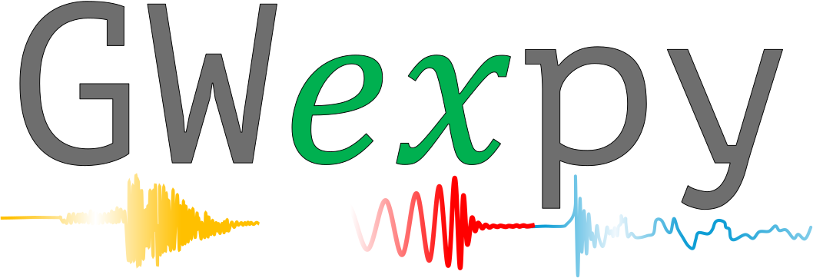

<p align="center">
  <a href="https://tatsuki-washimi.github.io/gwexpy/docs/web/en/">
    
  </a>
</p>

# gwexpy: GWpy Expansions for Experiments

[](https://github.com/tatsuki-washimi/gwexpy/actions/workflows/test.yml)
[](https://codecov.io/gh/tatsuki-washimi/gwexpy)
[](https://tatsuki-washimi.github.io/gwexpy/)
[](https://opensource.org/licenses/MIT)
[](https://www.python.org/downloads/)

**gwexpy** is an extension library for [GWpy](https://gwpy.github.io/) for experimental physics and gravitational-wave data analysis. It adds matrix-aware containers, field operations, fitting workflows, expanded I/O, and interoperability layers while staying close to GWpy-style analysis.

## Design Philosophy: Numerical Integrity

GWexpy is designed as a drop-in extension for GWpy. Our core promise is **Numerical Equivalence**:

- **Drop-in Replacement**: Replacing `import gwpy` with `import gwexpy` will yield bit-identical numerical results for all inherited methods.
- **No Silent Fixes**: We never implement "corrective" numerical changes that silently alter results, even if they improve accuracy. Any enhancements (e.g., improved stability or different normalizations) are strictly opt-in via keyword arguments or global options.
- **Scientific Continuity**: Your existing GWpy-based pipelines will produce the same scientific conclusions when switched to GWexpy.

## Install

```bash
git clone https://github.com/tatsuki-washimi/gwexpy.git
cd gwexpy
pip install -e .
```

For optional extras, external dependencies, and environment-specific setup, use the official installation guides:

- English: <https://tatsuki-washimi.github.io/gwexpy/docs/web/en/user_guide/installation.html>
- 日本語: <https://tatsuki-washimi.github.io/gwexpy/docs/web/ja/user_guide/installation.html>

## Documentation

The full documentation is maintained in the docs site and is the source of truth for usage details.

- Documentation hub: <https://tatsuki-washimi.github.io/gwexpy/docs/web/en/>
- ドキュメントハブ: <https://tatsuki-washimi.github.io/gwexpy/docs/web/ja/>
- Quick Start: <https://tatsuki-washimi.github.io/gwexpy/docs/web/en/user_guide/quickstart.html>
- Tutorials and case studies: <https://tatsuki-washimi.github.io/gwexpy/docs/web/en/user_guide/tutorials/>
- File formats and I/O: <https://tatsuki-washimi.github.io/gwexpy/docs/web/en/user_guide/io_formats.html>
- API reference: <https://tatsuki-washimi.github.io/gwexpy/docs/web/en/reference/>
- Examples gallery: <https://tatsuki-washimi.github.io/gwexpy/docs/web/en/examples/>

## Why gwexpy?

- **Matrix-native analysis**: `TimeSeriesMatrix`, `FrequencySeriesMatrix`, and `SpectrogramMatrix` support batch processing, transfer functions, and multichannel workflows.
- **Physics-oriented containers**: `ScalarField`, `VectorField`, and `TensorField` extend analysis beyond simple series into structured field data.
- **Practical workflows**: fitting, noise hunting, time-frequency analysis, and interoperability are exposed as user-facing workflows rather than isolated utilities.
- **Broad interoperability and I/O**: gwexpy bridges scientific Python tools and extends format coverage beyond core GWpy workflows.

## Quick Start

```python
import numpy as np
import gwexpy
from gwexpy.timeseries import TimeSeries, TimeSeriesList

gwexpy.register_all()

ts1 = TimeSeries(np.arange(8.0), dt=1.0, name="A")
ts2 = TimeSeries(np.arange(8.0) * 2.0, dt=1.0, name="B")
matrix = TimeSeriesList([ts1, ts2]).to_matrix()
asd = matrix.asd(fftlength=2.0)
print(matrix.shape)
```

For fitting, I/O, interoperability, and notebook-based workflows, start from the docs hub or the tutorial index above.

## More Resources

- Migration notes for GWpy users: <https://tatsuki-washimi.github.io/gwexpy/docs/web/en/user_guide/gwexpy_for_gwpy_users_en.html>
- Citation: <https://tatsuki-washimi.github.io/gwexpy/docs/web/en/user_guide/citation.html>
- Reproducibility notes: [docs/repro/README.md](docs/repro/README.md)
- Supported I/O matrix: [SUPPORTED_IO_MATRIX.md](SUPPORTED_IO_MATRIX.md)

## Support

- Issues: <https://github.com/tatsuki-washimi/gwexpy/issues>
- Discussions: <https://github.com/tatsuki-washimi/gwexpy/discussions>
- Contributions: pull requests are welcome on GitHub
