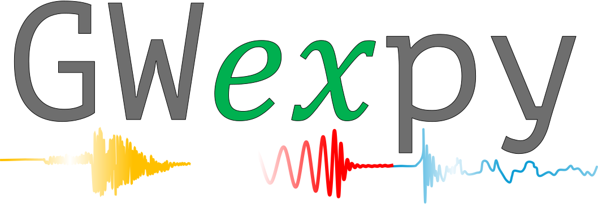

<p align="center">
  <a href="https://tatsuki-washimi.github.io/gwexpy/docs/">
    
  </a>
</p>

# gwexpy: GWpy Expansions for Experiments

[](https://github.com/tatsuki-washimi/gwexpy/actions/workflows/pr-fast.yml)
[](https://codecov.io/gh/tatsuki-washimi/gwexpy)
[](https://tatsuki-washimi.github.io/gwexpy/)
[](https://opensource.org/licenses/MIT)
[](https://www.python.org/downloads/)

**gwexpy** is an extension library for [GWpy](https://gwpy.github.io/) for experimental physics and gravitational-wave data analysis. It adds matrix-aware containers, field operations, fitting workflows, expanded I/O, and interoperability layers while staying close to GWpy-style analysis.

GWexpy is an independent package built on top of GWpy. It is not an official component of the GWpy project.

## Install

GWexpy v0.2.0 is available from both PyPI and conda-forge.

```bash
python -m pip install gwexpy
# or
conda install -c conda-forge gwexpy
```

The experimental GUI app is not part of the supported package surface.

For optional extras, external dependencies, and environment-specific setup, use the official installation guides:

- English: <https://tatsuki-washimi.github.io/gwexpy/docs/tutorials/installation.html>
- 日本語: <https://tatsuki-washimi.github.io/gwexpy/docs/ja/tutorials/installation.html>

## Documentation

The full documentation is maintained in the docs site and is the source of truth for usage details.

- Documentation hub: <https://tatsuki-washimi.github.io/gwexpy/docs/>
- ドキュメントハブ: <https://tatsuki-washimi.github.io/gwexpy/docs/ja/>
- Installation: <https://tatsuki-washimi.github.io/gwexpy/docs/tutorials/installation.html>
- Tutorials: <https://tatsuki-washimi.github.io/gwexpy/docs/tutorials/>
- How-to guides: <https://tatsuki-washimi.github.io/gwexpy/docs/how-to/>
- API reference: <https://tatsuki-washimi.github.io/gwexpy/docs/reference/>

## Why gwexpy?

- **Matrix-native analysis**: `TimeSeriesMatrix`, `FrequencySeriesMatrix`, and `SpectrogramMatrix` support batch processing, transfer functions, and multichannel workflows.
- **Physics-oriented containers**: `ScalarField`, `VectorField`, and `TensorField` extend analysis beyond simple series into structured field data.
- **Practical workflows**: fitting, noise hunting, time-frequency analysis, and interoperability are exposed as user-facing workflows rather than isolated utilities.
- **Broad interoperability and I/O**: gwexpy bridges scientific Python tools and extends format coverage beyond core GWpy workflows.

## Where gwexpy Fits

gwexpy occupies the layer between GWpy and the workflow packages built on top of it. GWpy
provides the standard gravitational-wave data objects; gwexpy adds matrix-aware containers,
typed analysis results, broad I/O, and external-tool conversion; detector-characterization,
search, and inference pipelines consume those products.

It is complementary to, not a replacement for, packages such as spicypy (signal processing and
control systems) and GWDama (HDF5-first data preparation). Site-specific operational
pipelines, operator-facing reports, job orchestration, and trigger generation are deliberately
out of scope.

For the full comparison, the ecosystem map, and the third-party code policy, see:

- Ecosystem positioning: <https://tatsuki-washimi.github.io/gwexpy/docs/explanation/ecosystem.html>
- エコシステムにおける位置付け: <https://tatsuki-washimi.github.io/gwexpy/docs/ja/explanation/ecosystem.html>

## Quick Start

```python
import numpy as np
import gwexpy
from gwexpy.timeseries import TimeSeries, TimeSeriesList

gwexpy.register_all()

ts1 = TimeSeries(np.arange(8.0), dt=1.0, name="A")
ts2 = TimeSeries(np.arange(8.0) * 2.0, dt=1.0, name="B")
matrix = TimeSeriesList([ts1, ts2]).to_matrix()
asd = matrix.asd(fftlength=2.0)
print(matrix.shape)
```

This example explicitly registers the full supported surface. Supported public I/O
entry points can register their required handlers on demand.

For fitting, I/O, interoperability, and notebook-based workflows, start from the docs hub or the tutorial index above.

## More Resources

- Migration notes for GWpy users: <https://tatsuki-washimi.github.io/gwexpy/docs/how-to/migration.html>
- Citation: <https://tatsuki-washimi.github.io/gwexpy/docs/about/citation.html>
- Reproducibility notes: [docs/repro/README.md](docs/repro/README.md)
- Supported I/O matrix: [SUPPORTED_IO_MATRIX.md](SUPPORTED_IO_MATRIX.md)

## Support

- Lightweight bug reports and feature requests: <https://forms.gle/Ewx5K69KqDvzrJp57>
- Security reports: see [SECURITY.md](SECURITY.md); do not use the form or
  public issues for vulnerability details.
- Issues: <https://github.com/tatsuki-washimi/gwexpy/issues>
- Discussions: <https://github.com/tatsuki-washimi/gwexpy/discussions>
- Contributions: pull requests are welcome on GitHub
