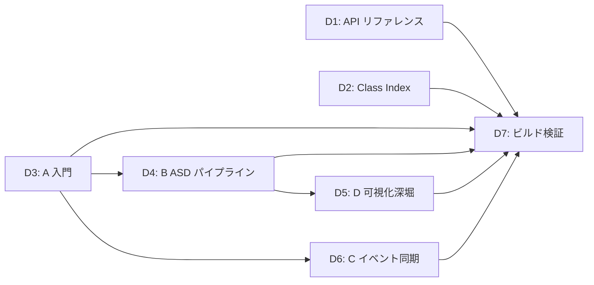

# `SegmentTable` ドキュメント整備計画（v2）

**作成日:** 2026-03-26  
**前提:** `SegmentTable` v0.1 実装は完了済み

---

## 現状分析

### 既に存在するもの

| 種別 | ファイル | 内容 |
|------|---------|------|
| 仕様書 | [SegmentTable.md](file:///home/washimi/work/gwexpy/docs/developers/plans/SegmentTable.md) | 草案版 + 簡潔版 + 描画仕様 |
| 実装計画 | [SegmentTable_implementation_plan.md](file:///home/washimi/work/gwexpy/docs/developers/plans/SegmentTable_implementation_plan.md) | フェーズ分割計画 |
| コード内 docstring | `segment_cell.py`, `segment_table.py`, `segment_plot.py` | NumPy スタイル docstring |

### 欠落しているもの

| 種別 | 状態 |
|------|------|
| API リファレンス (.rst) | ❌ `table.rst` がない |
| Class Index への登録 | ❌ `classes.rst` に未登録 |
| チュートリアルノートブック | ❌ 項目なし |
| ケーススタディ | ❌ 項目なし |
| 日本語版ドキュメント | ❌ 未同期 |

---

## フェーズ構成（改訂版）

| Phase | 内容 | 成果物 | 推定時間 |
|-------|------|--------|----------|
| **D1** | API リファレンス (.rst) | `table.rst` EN/JA + index 登録 | 15 min |
| **D2** | Class Index 追加 | `classes.rst` EN/JA 更新 | 5 min |
| **D3** | ノートブック A: 入門チュートリアル | `intro_segment_table.ipynb` | 30 min |
| **D4** | ノートブック B: ASD 解析パイプライン | `segment_asd_pipeline.ipynb` | 45 min |
| **D5** | ノートブック D: `overlay_spectra()` 深堀 | `segment_visualization.ipynb` | 30 min |
| **D6** | ケーススタディ C: イベント同期ワークフロー | `case_segment_analysis.ipynb` | 60 min |
| **D7** | Sphinx ビルド検証 | ビルドログ確認 | 10 min |
| **合計** | | | **~195 min** |

> [!NOTE]
> パターン E（並列・キャッシュ）と F（合成校正）は v0.1 で `parallel` や `persist()` が未実装のため、**v0.2 以降に延期**する。

---

## Phase D1: API リファレンス

### [NEW] `docs/web/en/reference/api/table.rst`

```rst
Table
=====

.. currentmodule:: gwexpy.table

Overview
--------

.. autosummary::
   :toctree: _autosummary
   :nosignatures:

   SegmentTable
   SegmentCell

SegmentTable Class
------------------

.. autoclass:: gwexpy.table.segment_table.SegmentTable
   :no-index:
   :members:
   :undoc-members:
   :show-inheritance:
   :member-order: bysource

   .. rubric:: Factory Methods

   .. autosummary::
      :nosignatures:

      ~SegmentTable.from_segments
      ~SegmentTable.from_table

   .. rubric:: Column Management

   .. autosummary::
      :nosignatures:

      ~SegmentTable.add_column
      ~SegmentTable.add_series_column

   .. rubric:: Row-wise Processing

   .. autosummary::
      :nosignatures:

      ~SegmentTable.apply
      ~SegmentTable.map
      ~SegmentTable.crop
      ~SegmentTable.asd

   .. rubric:: Selection & Conversion

   .. autosummary::
      :nosignatures:

      ~SegmentTable.select
      ~SegmentTable.fetch
      ~SegmentTable.materialize
      ~SegmentTable.to_pandas
      ~SegmentTable.copy

   .. rubric:: Drawing (Representative APIs)

   .. autosummary::
      :nosignatures:

      ~SegmentTable.segments
      ~SegmentTable.overlay_spectra
      ~SegmentTable.plot
      ~SegmentTable.scatter
      ~SegmentTable.hist
      ~SegmentTable.overlay

SegmentCell Class
-----------------

.. autoclass:: gwexpy.table.segment_cell.SegmentCell
   :no-index:
   :members:
   :undoc-members:
   :show-inheritance:
```

### [MODIFY] `docs/web/en/reference/api/index.rst` / `docs/web/ja/reference/api/index.rst`

toctree に `table` を追加。

### [NEW] `docs/web/ja/reference/api/table.rst`

英語版と同構造、見出しのみ日本語化。

---

## Phase D2: Class Index 追加

### [MODIFY] `docs/web/en/reference/classes.rst` / `docs/web/ja/reference/classes.rst`

```diff
    SeriesMatrix
+   SegmentTable
+   SegmentCell
```

---

## Phase D3: ノートブック A — 入門チュートリアル

**対象:** 新規ユーザ（`Segment` / GWpy を知っている）  
**目的:** `SegmentTable` の基本操作を理解する  
**ファイル:** `docs/web/en/user_guide/tutorials/intro_segment_table.ipynb`

### セル構成

| # | 種別 | 内容 |
|---|------|------|
| 1 | MD | 概要 — `SegmentTable` の位置づけ、`EventTable` との違い |
| 2 | Code | 環境準備（imports, 合成セグメント 5 本生成） |
| 3 | Code | `SegmentTable.from_segments(segs, label=...)` で作成 |
| 4 | Code | `add_series_column(loader=...)` で遅延登録（ダミー `TimeSeriesDict` loader） |
| 5 | MD+Code | `row(i)` を使った単一行アクセス（`row["span"]`, `row["raw"]`） |
| 6 | Code | `apply()` で duration / tag を計算 |
| 7 | Code | `fetch()` vs `materialize()` の挙動比較 |
| 8 | Code | `to_pandas(meta_only=True)` + `_repr_html_` の確認 |
| 9 | MD | 小結 — 次は B（ASD パイプライン）へ |

### キーメソッド

`from_segments`, `add_series_column`, `row`, `apply`, `fetch`, `materialize`, `to_pandas`

### 期待出力

- `SegmentTable` の summary 表示
- `apply()` 結果の DataFrame 表示

### toctree 追加

```diff
+VI. Segment Analysis
+--------------------
+
+.. toctree::
+   :maxdepth: 1
+   :caption: Segment Analysis
+
+   SegmentTable Basics <intro_segment_table>
+   ASD Analysis Pipeline <segment_asd_pipeline>
+   Visualization Deep Dive <segment_visualization>
```

---

## Phase D4: ノートブック B — ASD 解析パイプライン

**対象:** 解析者（観測データの短時間解析を繰り返す人）  
**目的:** `crop()` → `asd()` → スペクトル重ね描きの一連のパイプラインを学ぶ  
**前提:** A を完了  
**ファイル:** `docs/web/en/user_guide/tutorials/segment_asd_pipeline.ipynb`

### セル構成

| # | 種別 | 内容 |
|---|------|------|
| 1 | MD | シナリオ説明 — 複数 ch の ASD を各 segment で計算 |
| 2 | Code | データ準備 — 合成時系列の loader を用意 |
| 3 | Code | `add_series_column("raw", loader=..., kind="timeseriesdict")` |
| 4 | Code | `crop("raw", out_col="cropped")` — 各行の span で切り出し |
| 5 | Code | `asd("cropped", out_col="asd", fftlength=...)` — 行ごとの ASD |
| 6 | Code | `map("asd", summary_fn, out_col="asd_peak")` — ピーク周波数やバンド積分 |
| 7 | Code | `overlay_spectra("asd", channel="CH1", color_by="t0")` — 重ね描き |
| 8 | Code+MD | 結果の要約テーブルと考察 |

### キーメソッド

`crop`, `asd`, `map`, `overlay_spectra`

### 期待出力

- 各 segment の ASD 保存列
- 重ね描きプロット（色グラデーション）
- peak / band RMS のサマリテーブル

---

## Phase D5: ノートブック D — `overlay_spectra()` 可視化深堀

**対象:** 研究者（発表用プロットを作る人）  
**目的:** 色付け・ハイライト・品質調整テクニックを学ぶ  
**前提:** B を完了  
**ファイル:** `docs/web/en/user_guide/tutorials/segment_visualization.ipynb`

### セル構成

| # | 種別 | 内容 |
|---|------|------|
| 1 | MD | 目的 — 比較観点（時間変動、SNR、距離） |
| 2 | Code | `overlay_spectra("asd", channel="CH1", color_by="t0", cmap="plasma")` 基本例 |
| 3 | Code | `color_by="snr"` — 数値基準での色付けとカラーバー |
| 4 | Code | `segments(color="label")` — 区間の俯瞰図 |
| 5 | Code | Figure 品質調整（linewidth, alpha, logscale, xlim/ylim） |
| 6 | Code | 複数チャネルの subplot + まとめ図 |
| 7 | MD | テンプレートと使い分けガイド |

### キーメソッド

`overlay_spectra`, `segments`, `plot`

### 期待出力

- 発表用のスペクトル重ね描き（色グラデーション + カラーバー）
- figsize / dpi 調整済みの出力例

---

## Phase D6: ケーススタディ C — イベント同期ワークフロー

**対象:** 運用解析者  
**目的:** イベント一覧 → 時計補正 → Event ごとの解析・プロット生成を `SegmentTable` で遂行する  
**ファイル:** `docs/web/en/user_guide/tutorials/case_segment_analysis.ipynb`

### セル構成

| # | 種別 | 内容 |
|---|------|------|
| 1 | MD | シナリオ — イベント同期解析の流れ |
| 2 | Code | イベントリスト・ロガーデータの読み込み（合成データ版） |
| 3 | Code | 時計補正関数の適用 |
| 4 | Code | 有効イベント抽出 → `from_table()` で `SegmentTable` 構築 |
| 5 | Code | `add_series_column("raw", loader=...)` |
| 6 | Code | `apply()` で行単位のプロット生成 + パスをメタ列に保存 |
| 7 | Code | `segments(color="event_type")` — 区間の俯瞰 |
| 8 | Code | `scatter("distance", "snr")` — イベント特性の散布図 |
| 9 | Code+MD | 結果の要約テーブル、出力ファイルの確認 |

### キーメソッド

`from_table`, `add_series_column`, `apply`, `segments`, `scatter`

### 期待出力

- 同期後のイベントテーブル
- 各イベントのプロット画像群
- 結果 CSV

### toctree 追加 (examples/index.rst)

```diff
    ../user_guide/tutorials/case_active_damping
+   ../user_guide/tutorials/case_segment_analysis
```

---

## Phase D7: Sphinx ビルド検証

```bash
sphinx-build -W -b html docs/web/en/ docs/_build/html/en/
sphinx-build -W -b html docs/web/ja/ docs/_build/html/ja/
```

### 検証チェックリスト

- [ ] `table.rst` が API リファレンスに表示
- [ ] `SegmentTable` / `SegmentCell` の autoclass が正しく展開
- [ ] Class Index に登録済み
- [ ] チュートリアル A/B/D のリンク機能
- [ ] ケーススタディ C のリンク機能
- [ ] EN/JA 両方でビルドが `-W` で通る

---

## 日本語版対応

全ノートブック（D3〜D6）は **EN 版を先行作成** し、その後 **コードセルは共有、Markdown セルのみ翻訳** する方針とする。

---

## 延期した項目（v0.2 以降）

| パターン | 理由 |
|---------|------|
| **E: 並列・キャッシュ・永続化** | `parallel=True` は v0.1 で逐次フォールバック、`persist()` は未実装 |
| **F: 合成データ・装置シミュレーション** | TF 校正は `SegmentTable` 固有ではなく、別の計画で扱う方が適切 |

---

## 実装上の注意点

1. **段階的に並べる**: A → B → D → C の順にユーザが成長できるよう toctree を配置
2. **実行可能な合成データ**: 全ノートブックは外部データ不要で実行可能にする
3. **出力パス管理**: `outputs/` 下に保存、末尾に `!ls outputs` 確認セルを入れる
4. **CI 組み込み**: ノートブックの自動実行テスト（exit code=0 確認）を用意する
5. **サンプルコード参照**: 各ノートブック冒頭に gwpy のサンプル参照を明記する

---

## モデル・スキル推奨

| Phase | 推奨スキル | 推定時間 |
|-------|-----------|----------|
| D1-D2 | `manage_docs` | 20 min |
| D3-D6 | `make_notebook`, `manage_docs` | 165 min |
| D7 | `manage_docs` | 10 min |

### 工数見積

| 項目 | 見積 |
|------|------|
| **推定総時間** | ~195 分（AI 実行時間） |
| **推定クォータ消費** | **Medium-High**（4 ノートブック + rst 整備） |

---

## 依存関係


