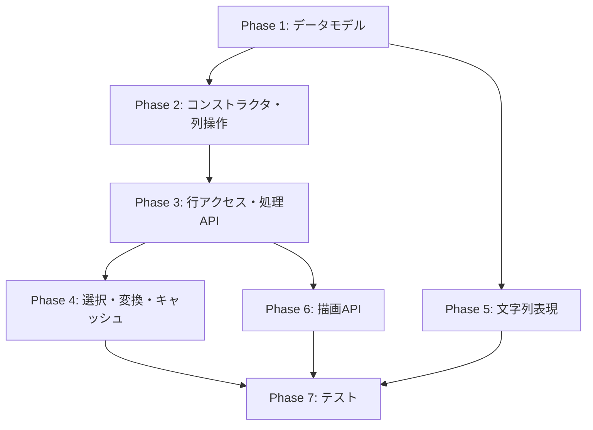

# `SegmentTable` v0.1 実装計画書

**作成日:** 2026-03-25  
**ベース仕様:** [SegmentTable.md](file:///home/washimi/work/gwexpy/docs/developers/plans/SegmentTable.md)  
**対象バージョン:** v0.1

---

## 概要

`SegmentTable` は、GWpy の `Segment` を行の主キーとした解析実行用テーブルコンテナ。  
時系列・周波数系列などの重い payload を lazy load で管理し、`apply()` による行単位バッチ処理を提供する。

---

## フェーズ構成

| Phase | 内容 | 新規ファイル | 難易度 | 推定時間 |
|-------|------|-------------|--------|----------|
| **Phase 1** | コアデータモデル | 2 | Medium | 20 min |
| **Phase 2** | コンストラクタと列操作 | 0 | Medium | 15 min |
| **Phase 3** | 行アクセスと処理 API | 0 | High | 25 min |
| **Phase 4** | 選択・変換・キャッシュ | 0 | Medium | 15 min |
| **Phase 5** | 文字列表現・表示 | 0 | Medium | 15 min |
| **Phase 6** | 描画 API | 1 | High | 30 min |
| **Phase 7** | テスト | 2 | Medium | 30 min |
| **合計** | | **5 新規ファイル** | | **~150 min** |

---

## Phase 1: コアデータモデル

### 目的
`SegmentCell` と `SegmentTable` の骨格を作る。

### 新規ファイル

#### [NEW] [segment_cell.py](file:///home/washimi/work/gwexpy/gwexpy/table/segment_cell.py)

```python
@dataclass
class SegmentCell:
    value: object | None = None
    loader: Callable[[], object] | None = None
    cacheable: bool = True

    def get(self) -> object: ...
    def is_loaded(self) -> bool: ...
    def clear(self) -> None: ...
```

**実装ポイント:**
- `get()`: `value` → `loader()` → `ValueError` のフォールバック順
- `cacheable=True` の場合、`loader()` の結果を `value` に保持
- Python 3.9 互換: `Union[X, None]` を使用（`X | None` は不可）

#### [NEW] [segment_table.py](file:///home/washimi/work/gwexpy/gwexpy/table/segment_table.py)

```python
class SegmentTable:
    _meta: pd.DataFrame           # span + 軽量列
    _payload: Dict[str, List[SegmentCell]]  # payload列
    _schema: Dict[str, str]       # 列名 → kind

    def __init__(self, meta: pd.DataFrame) -> None: ...
    def __len__(self) -> int: ...

    @property
    def columns(self) -> List[str]: ...

    @property
    def schema(self) -> Dict[str, str]: ...
```

**バリデーション:**
- `span` 列の存在確認 → `ValueError`
- `span` の各要素が `gwpy.segments.Segment` であることの確認 → `TypeError`
- `_schema` の自動生成: `span` → `"segment"`, その他 → `"meta"`

#### [MODIFY] [\_\_init\_\_.py](file:///home/washimi/work/gwexpy/gwexpy/table/__init__.py)

`SegmentTable`, `SegmentCell` を `__all__` に追加。

---

## Phase 2: コンストラクタと列操作

### 目的
テーブルの生成と列の追加 API を実装する。

### [MODIFY] [segment_table.py](file:///home/washimi/work/gwexpy/gwexpy/table/segment_table.py)

#### ファクトリメソッド

```python
@classmethod
def from_segments(cls, segments, **meta_columns) -> "SegmentTable": ...

@classmethod
def from_table(cls, table, span="span") -> "SegmentTable": ...
```

#### 列追加

```python
def add_column(self, name: str, data, kind: str = "meta") -> None: ...
def add_series_column(self, name: str, data=None, loader=None, kind: str = "timeseries") -> None: ...
```

**実装ポイント:**
- `add_column`: 長さ検証、kind は `"meta"` / `"object"` のみ許可、重複列名は `ValueError`
- `add_series_column`: `data` / `loader` のどちらか必須、各行を `SegmentCell` に変換
- `loader` が単一 callable の場合（factory パターン）と、行ごとの loader リストの場合を区別

**許可 kind 一覧:**

| API | 許可 kind |
|-----|----------|
| `add_column` | `meta`, `object` |
| `add_series_column` | `timeseries`, `timeseriesdict`, `frequencyseries`, `frequencyseriesdict`, `object` |

---

## Phase 3: 行アクセスと処理 API

### 目的
`row()`, `apply()`, `map()`, `crop()` を実装する。これが `SegmentTable` の中核。

### [MODIFY] [segment_table.py](file:///home/washimi/work/gwexpy/gwexpy/table/segment_table.py)

#### RowProxy

```python
class RowProxy:
    """dict-like な行アクセスプロキシ"""
    def __getitem__(self, key: str) -> object: ...
    def keys(self) -> List[str]: ...
```

- meta 列 → 即値返却
- payload 列 → `SegmentCell.get()` 経由

#### 行単位処理

```python
def row(self, i: int) -> RowProxy: ...
def apply(self, func, in_cols=None, out_cols=None, parallel=False, inplace=False): ...
def map(self, column: str, func, out_col=None, inplace=False): ...
```

#### Sugar API

```python
def crop(self, column: str, out_col=None, span_col: str = "span", inplace: bool = False): ...
def asd(self, column: str, out_col=None, **kwargs): ...
```

**実装ポイント:**
- `apply()`: `func(row)` → `dict` を検証、`out_cols` 整合性チェック
- `parallel=True` は v0.1 では逐次実行にフォールバック（`NotImplementedError` にはしない）
- `crop()`: 対象が `TimeSeries` / `TimeSeriesDict` でなければ `TypeError`
- `asd()`: 内部で `.asd(**kwargs)` を呼ぶ sugar

---

## Phase 4: 選択・変換・キャッシュ

### [MODIFY] [segment_table.py](file:///home/washimi/work/gwexpy/gwexpy/table/segment_table.py)

```python
def select(self, mask=None, **conditions) -> "SegmentTable": ...
def fetch(self, columns=None) -> None: ...
def materialize(self, columns=None, inplace=True): ...
def to_pandas(self, meta_only: bool = True) -> pd.DataFrame: ...
def copy(self, deep: bool = False) -> "SegmentTable": ...
def clear_cache(self) -> None: ...
```

**実装ポイント:**
- `select(mask=...)`: bool 配列で行フィルタ、payload も対応する行を slice
- `select(**conditions)`: 単純な `column == value` 条件
- `fetch()`: 指定 payload 列の全行で `SegmentCell.get()` を呼ぶ
- `materialize()`: `fetch()` と同等（v0.1）
- `to_pandas(meta_only=False)`: payload を object 列として埋め込み

---

## Phase 5: 文字列表現・表示

### [MODIFY] [segment_table.py](file:///home/washimi/work/gwexpy/gwexpy/table/segment_table.py)

```python
def __repr__(self) -> str: ...
def __str__(self) -> str: ...
def _repr_html_(self) -> str: ...
def display(self, max_rows=20, max_cols=8, meta_only=False) -> object: ...
```

**payload 列の表示規則:**

| 状態 | 表示 |
|------|------|
| 未ロード | `<lazy: timeseriesdict>` |
| ロード済（TimeSeries） | `<timeseries: N samples>` |
| ロード済（TimeSeriesDict） | `<timeseriesdict: N ch>` |
| ロード済（FrequencySeries） | `<frequencyseries: N bins>` |
| 任意 object | `repr()` を 30 文字で切る |

---

## Phase 6: 描画 API

### [NEW] [segment_plot.py](file:///home/washimi/work/gwexpy/gwexpy/table/segment_plot.py)

描画ロジックを `SegmentTable` 本体と分離して管理するモジュール。

#### 必須代表 API の明記
- `overlay_spectra()` は `SegmentTable` の代表描画 API とする。
- `plot()` は汎用入口、`overlay_spectra()` は周波数系列（ASD等）の高頻度専用 API とする。
- `segments()` と並び、`SegmentTable` の時間区間ベースの特性を最も活かす API として優先的に実装・テストする。

#### overlay_spectra() 引数仕様
実装者が迷わないよう、以下のシグネチャを固定とする：

```python
def overlay_spectra_segment_table(
    st,
    column,
    *,
    channel=None,
    rows=None,
    color_by=None,
    sort_by=None,
    cmap="viridis",
    alpha=0.7,
    linewidth=0.8,
    colorbar=True,
    colorbar_label=None,
    xscale="log",
    yscale="log",
    xlim=None,
    ylim=None,
    ax=None,
) -> Plot: ...
```

#### その他の描画関数
```python
def plot_segment_table(st, column=None, row=None, mode=None, **kwargs) -> Plot: ...
def scatter_segment_table(st, x, y, color=None, **kwargs) -> Plot: ...
def hist_segment_table(st, column, bins=10, **kwargs) -> Plot: ...
def segments_segment_table(st, y=None, color=None, **kwargs) -> Plot: ...
def overlay_segment_table(st, column, rows, separate=False, **kwargs) -> Plot: ...
```

### [MODIFY] [segment_table.py](file:///home/washimi/work/gwexpy/gwexpy/table/segment_table.py)

`SegmentTable` に以下の thin wrapper メソッドを追加:

```python
def plot(self, column=None, *, row=None, mode=None, **kwargs) -> Plot: ...
def scatter(self, x, y, color=None, **kwargs) -> Plot: ...
def hist(self, column, *, bins=10, **kwargs) -> Plot: ...
def segments(self, *, y=None, color=None, **kwargs) -> Plot: ...
def overlay(self, column, rows, *, separate=False, **kwargs) -> Plot: ...
def overlay_spectra(self, column, *, channel=None, rows=None, ...) -> Plot: ...
```

**共通ルール:**
- すべて `gwpy.plot.Plot` を返す
- 内部で `show()` は呼ばない
- payload 列の暗黙展開はしない

---

## Phase 7: テスト

### [NEW] [test_segment_cell.py](file:///home/washimi/work/gwexpy/tests/table/test_segment_cell.py)

```
TestSegmentCell:
  - test_get_with_value       : value が設定済みならそのまま返す
  - test_get_with_loader      : value=None で loader ありなら loader() 結果を返す
  - test_get_caches           : cacheable=True なら再呼び出しで loader が呼ばれない
  - test_get_no_cache         : cacheable=False なら毎回 loader 呼ばれる
  - test_get_empty_raises     : 両方 None なら ValueError
  - test_is_loaded            : ロード状態の判定
  - test_clear                : キャッシュ消去
```

### [NEW] [test_segment_table.py](file:///home/washimi/work/gwexpy/tests/table/test_segment_table.py)

```
TestSegmentTableInit:
  - test_init_basic           : span 列ありの DataFrame から生成
  - test_init_no_span_raises  : span 列なしで ValueError
  - test_init_bad_span_type   : span 要素が Segment でなければ TypeError

TestSegmentTableFactory:
  - test_from_segments        : segments + meta 列から生成
  - test_from_segments_length_mismatch : 長さ不一致で ValueError
  - test_from_table           : pandas DataFrame から生成

TestSegmentTableColumns:
  - test_add_column           : meta 列追加
  - test_add_column_duplicate : 重複列名で ValueError
  - test_add_series_column_data : 実体データで payload 列追加
  - test_add_series_column_loader : loader で payload 列追加
  - test_add_series_column_no_data_no_loader : ValueError

TestSegmentTableAccess:
  - test_len                  : 行数
  - test_columns              : 列名一覧
  - test_schema               : kind マッピング
  - test_row_meta             : meta 列のアクセス
  - test_row_payload          : payload 列の lazy ロード
  - test_row_out_of_range     : IndexError
  - test_row_unknown_key      : KeyError

TestSegmentTableApply:
  - test_apply_basic          : 基本的な apply
  - test_apply_returns_non_dict : TypeError
  - test_apply_out_cols_mismatch : ValueError
  - test_apply_inplace        : inplace=True
  - test_map_basic            : 単列変換

TestSegmentTableSugar:
  - test_crop_timeseries      : TimeSeries の crop
  - test_crop_timeseriesdict  : TimeSeriesDict の crop
  - test_crop_invalid_type    : 不正型で TypeError
  - test_asd                  : ASD 計算

TestSegmentTableSelect:
  - test_select_mask          : bool mask
  - test_select_condition     : column=value 条件
  - test_select_preserves_span : 選択後も span 維持

TestSegmentTableConversion:
  - test_to_pandas_meta_only  : meta のみ DataFrame
  - test_to_pandas_full       : payload 込み
  - test_copy_shallow         : shallow copy
  - test_copy_deep            : deep copy

TestSegmentTableDisplay:
  - test_repr                 : __repr__ の形式確認
  - test_str                  : __str__ の出力確認
  - test_repr_html            : HTML 表示が文字列を返す

TestSegmentTablePlot:
  - test_plot_returns_plot
  - test_scatter_returns_plot
  - test_hist_returns_plot
  - test_segments_returns_plot
  - test_overlay_returns_plot
  - test_overlay_spectra_returns_plot
  - test_overlay_spectra_requires_channel_for_dict
  - test_overlay_spectra_invalid_kind_raises
  - test_overlay_spectra_color_by_row
  - test_overlay_spectra_color_by_column
  - test_plot_methods_do_not_call_show
```

---

## 検証計画

### 自動テスト

```bash
# Phase 1-5 のテスト
pytest tests/table/test_segment_cell.py tests/table/test_segment_table.py -v

# 既存テストの regression チェック
pytest tests/table/ -v

# 型チェック
mypy gwexpy/table/segment_cell.py gwexpy/table/segment_table.py

# lint
ruff check gwexpy/table/segment_cell.py gwexpy/table/segment_table.py gwexpy/table/segment_plot.py
```

### 手動検証

Phase 6（描画 API）の動作確認は、Jupyter Notebook 上で仕様書のユースケース例（§15, §7: 最小使用例）を実行し、プロットが正しく返ることを目視確認する。

---

## モデル・スキル推奨

### 推奨モデル

| Phase | 推奨モデル | 理由 |
|-------|-----------|------|
| Phase 1-5 | **Claude Sonnet / Antigravity** | 構造化されたクラス設計、仕様が明確なため高速実装可能 |
| Phase 6 | **Claude Sonnet / Antigravity** | GWpy Plot 連携が必要、matplotlib 経験が活きる |
| Phase 7 | **Claude Sonnet / Antigravity** | テスト記述は定型作業 |

### 推奨スキル

| スキル | 使用タイミング |
|--------|-------------|
| `extend_gwpy` | GWpy クラス（Segment, Plot）との連携パターン確認 |
| `lint_check` | 各 Phase 完了時の品質チェック |
| `run_tests` | テスト実行 |
| `verify_physics` | crop/asd の物理量整合性確認 |
| `finalize_work` | 全 Phase 完了後の最終検証・コミット |

### 工数見積

| 項目 | 見積 |
|------|------|
| **推定総時間** | ~150 分（AI実行時間） |
| **推定クォータ消費** | **High**（複数ファイル新規作成 + 大量テスト） |
| **リスク要因** | Phase 6 の GWpy Plot 連携で予期しない互換性問題の可能性 |

---

## 依存関係



---

## 不変条件チェックリスト

実装完了時に以下をすべて満たすこと:

- [ ] 全行は `span` を持つ
- [ ] 全列は `schema` に登録される
- [ ] 列長は常に行数と一致する
- [ ] payload 列の各セルは `SegmentCell` として扱える
- [ ] `select()` 後も `span` は維持される
- [ ] `__repr__`, `__str__`, `_repr_html_` が例外なく動作する
- [ ] 描画メソッドはすべて `Plot` を返し、`show()` を呼ばない
