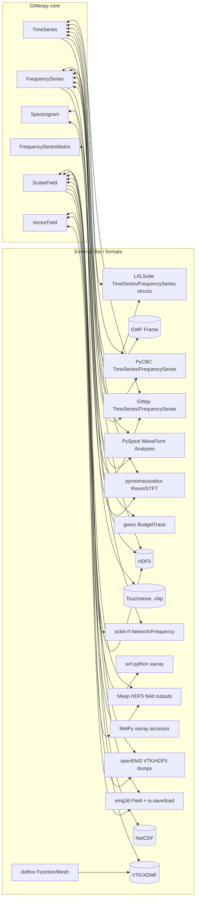
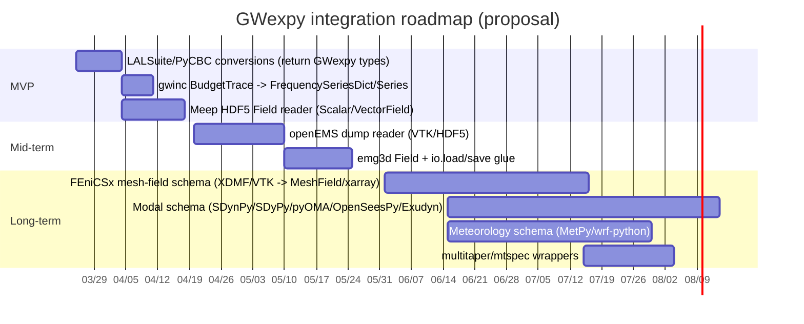

# GWexpy 外部ライブラリ統合の実装調査レポート（I/O とクラス変換）

## エグゼクティブサマリー

GWexpy（tatsuki-washimi/gwexpy）は **GWpy の TimeSeries/FrequencySeries/Spectrogram を継承しつつ**、行列型（`TimeSeriesMatrix`/`FrequencySeriesMatrix`/`SpectrogramMatrix`）と空間場（`ScalarField`/`VectorField`/`TensorField`）を追加し、さらに **多数の外部ライブラリとの相互変換（interop）**を `gwexpy/interop` に集中実装しています。fileciteturn26file0L1-L1 fileciteturn34file0L1-L1 fileciteturn35file0L1-L1  

今回指定されたライブラリ群のうち、**pyroomacoustics / PySpice / scikit-rf / SimPEG / gwinc(=pygwinc)** は既に GWexpy 側に実装が存在し、主に「変換対象の拡張」「メタデータ/単位/軸の厳密化」「（可能なら）GWpy I/O レジストリへのフォーマット登録」を追加する段階です。fileciteturn19file0L1-L1 fileciteturn20file0L1-L1 fileciteturn21file0L1-L1 fileciteturn22file0L1-L1 fileciteturn33file0L1-L1  

未実装（または直接統合が薄い）領域は、**LALSuite / PyCBC との往復変換の「GWexpy 型で返す」保証**、**Meep/openEMS/FEniCSx/emg3d の空間場データ（グリッド/メッシュ/複素場）の吸収**、さらに **振動モーダル（SDynPy/SDyPy/pyOMA/OpenSeesPy/Exudyn）と気象（MetPy/wrf-python）**の「標準表現（スキーマ）」策定です。  
実装優先度としては、(1) GW系（LAL/PyCBC）互換の最小差分、(2) HDF5/VTK/XDMF/NetCDF といった **中間フォーマット**を軸に空間場・メッシュ場を取り込む、(3) モーダル・気象を xarray/NetCDF/CSV で統一、の順が最短で効果が高いです。citeturn13search5turn15search4turn1search1turn5search5turn4search2  

---

## GWexpy の既存アーキテクチャと現在の統合状況

GWexpy の中核は、GWpy の系列クラスを拡張した **系列（Series）・行列（Matrix）・場（Field）**の3層です。

- 系列：`TimeSeries` は GWpy `TimeSeries` を継承し、追加ミキシン（解析・相互運用・前処理など）を統合しています。fileciteturn34file0L1-L1  
- 周波数系列：`FrequencySeries` は GWpy `FrequencySeries` を継承し、位相・微積分・dB変換・各種 interop を追加しています。fileciteturn35file0L1-L1  
- 行列：`FrequencySeriesMatrix` は「共通の周波数軸を持つ 2D コンテナ」で、CSD 行列や MIMO 伝達関数などに自然に対応します。fileciteturn36file0L1-L1  
- 空間場：`ScalarField`（4D：axis0 + xyz）を基底に、`VectorField`/`TensorField` を成分集合として表現します。fileciteturn23file0L1-L1 fileciteturn24file0L1-L1 fileciteturn41file0L1-L1  

I/O は基本的に GWpy の `read/write`（GWF/ASCII/HDF5 等）を継承しつつ、GWexpy 独自形式（例：DTTXML から周波数系列を読む）などを追加します。DTTXML 読み込みは `gwpy.io.registry.register_reader` を使う実装例になっています。fileciteturn11file0L1-L1  

相互運用（interop）は `gwexpy/interop` にまとまり、**ConverterRegistry** により “GWexpy側コンストラクタ（TimeSeries 等）” を遅延参照できる設計です。これにより、外部ライブラリ → GWexpy の変換で循環 import を避けられます。fileciteturn19file0L1-L1 fileciteturn21file0L1-L1  

既に存在する（今回の必須リストに直接関係する）統合例：
- pyroomacoustics：RIR（`room.rir`）、マイク信号（`room.mic_array.signals`）、STFT（`pyroomacoustics.transform.STFT`）などの変換。fileciteturn20file0L1-L1 fileciteturn44file0L1-L1  
- PySpice：`TransientAnalysis`→TimeSeries、`AcAnalysis/NoiseAnalysis`→FrequencySeries、全ノードを Dict として返す変換。fileciteturn21file0L1-L1  
- scikit-rf：`Network`→FrequencySeries/Matrix、`impulse_response/step_response`→TimeSeries/Dict、書き戻し（Network生成）も一部対応。fileciteturn22file0L1-L1  
- SimPEG：`simpeg.data.Data` への変換（Time/Frequency Domain EM）と逆変換。fileciteturn23file0L1-L1  
- gwinc（pygwinc）：`gwinc.load_budget(...).run()` の `trace.psd` から ASD を作るヘルパー。fileciteturn33file0L1-L1 citeturn3search2  

---

## 統合候補のデータタイプと GWexpy 側の推奨表現

要求されたデータタイプを、GWexpy の「既存クラス」でどう表すべきか（不足がある場合は追加提案も含む）を整理します。

**時系列（Time series）**  
- 単一チャネル：`TimeSeries(data, t0, dt, unit, name, channel, epoch)`  
- 多チャネル：`TimeSeriesDict` / `TimeSeriesMatrix`（センサ配列、ノード多数、マイクアレイなど）  

**周波数系列（Frequency series）**  
- PSD/ASD：`FrequencySeries`（実数、単位は `1/sqrt(Hz)` や `m/sqrt(Hz)` 等）  
- 複素スペクトル：`FrequencySeries`（複素）  
- クロススペクトル・コヒーレンス：`FrequencySeries`（2系列で出るもの）または `FrequencySeriesMatrix`（多チャネルCSD行列）fileciteturn36file0L1-L1  

**伝達関数（Transfer function / FRF / Network parameter）**  
- SISO：`FrequencySeries`（複素）  
- MIMO：`FrequencySeriesMatrix`（例：形状 `(n_out, n_in, n_freq)` を想定）  
- 例：scikit-rf の S行列、SDynPy の FRF 行列、FEniCSx から抽出した周波数応答など  

**時間周波数（Spectrogram / STFT）**  
- `Spectrogram`（複素STFT/パワー。pyroomacoustics STFT とは相互変換が既にあります）fileciteturn44file0L1-L1  

**インパルス応答（RIR / IR）**  
- `TimeSeries`（単一）または `TimeSeriesDict`（mic×src などペアが多い）  
- 伝達関数化：FFT → `FrequencySeries`  

**空間場（Spatial fields：部屋・格子・場グリッド）**  
- 正則グリッド（FDTD等、Meep/openEMS(emg3dのTensorMeshも近い)）：  
  - スカラー場：`ScalarField(axis0 + x + y + z)`  
  - ベクトル場：`VectorField({'x': ScalarField, 'y':..., 'z':...})`fileciteturn24file0L1-L1  
- 非正則（有限要素・非構造格子：FEniCSx/OpenSees等）：  
  - **提案：`MeshField`（新規）**または **xarray Dataset スキーマ**で “node/element + geometry + values” を保持  
  - 最小実装では「XDMF/VTK→meshio→xarray→（必要に応じて）正則グリッドへ補間→ScalarField」の2段階が現実的  

**振動モーダル（modal shapes / damping / mode tables）**  
- 推奨：  
  - モード周波数・減衰比：pandas DataFrame（列：`mode, f_Hz, zeta, ...`）  
  - モード形状：xarray Dataset（dims：`mode, node, dof`、coords：`x,y,z`）  
  - FRF/伝達：`FrequencySeriesMatrix`（in/out DOF を行列に）citeturn7search5  

**気象・流体・地球物理グリッド（meteorological fields / gravity-mag grids）**  
- 気象（WRF/MetPy）：xarray DataArray/Dataset を中心に、必要部分を `ScalarField`（時間×水平×鉛直）へ写像  
  - MetPy は `.metpy` アクセサと `.quantify()` による単位・座標処理が主戦場citeturn11search0  
  - wrf-python は `getvar` が xarray 対応で座標キャッシュ等を持つciteturn9search1  
- 重力・磁場（Harmonica）：xarray DataArray を前提に、正則グリッド変換の道具を提供しているciteturn5search1turn5search4  

---

## ライブラリ別の統合設計（I/O・クラス変換・ギャップ）

下表は、指定ライブラリ（最低限リスト＋関連）について「入出力形式」「インメモリ型」「GWexpy 推奨変換先」「GWexpy の現状」「不足点（追加実装）」を要約したものです。

### 主要統合マトリクス（ライブラリ×型×I/O）

| ライブラリ | 代表的インメモリ型 | 代表的I/O形式（公式/事実上） | GWexpy 推奨変換先 | GWexpy現状 | 追加実装ギャップ（要点） |
|---|---|---|---|---|---|
| **GWpy** | `TimeSeries`, `FrequencySeries`, `Spectrogram` | GWF, HDF5, ASCII, WAV 等（read/write）citeturn14search5turn14search0 | （同型）GWexpy は継承して互換fileciteturn34file0L1-L1 | 既存（基盤） | 追加不要。I/O レジストリ登録の拡張（例：Touchstone/VTKなど）を検討 |
| **LALSuite** | `REAL8TimeSeries`, `COMPLEX16FrequencySeries` 等（構造体）citeturn13search7turn15search0 | LALFrame（GWF関連）、内部構造は C API | TimeSeries/FrequencySeries（メタ：epoch, deltaT/F, unit, name, f0） | **未明示（GWpy経由で可）**：GWpyに `from_lal` ありciteturn13search4turn13search5turn15search4 | **GWexpy型で返す保証**（`TimeSeries.from_lal` を override し GWexpyへラップ）。FrequencySeries側も同様に追加 |
| **PyCBC** | `pycbc.types.TimeSeries/FrequencySeries`citeturn1search1turn1search2 | HDF5/ASCII/NPY 等のロード関数 | TimeSeries/FrequencySeries（dt/epoch/df等を厳密移送） | **未明示（GWpyに `from_pycbc`）**citeturn13search4 | `from_pycbc` を GWexpy 型で返すラッパー追加。周波数系列（df, epoch, complex）も対応表整備 |
| **pygwinc / gwinc** | `Budget`, `BudgetTrace`（freq, psd, asd, subtraces）citeturn3search2 | YAML, Python API | 総ASD：`FrequencySeries`、内訳：`FrequencySeriesDict`、（可能なら）CSD/TFはMatrix | **ASD生成ヘルパーあり**fileciteturn33file0L1-L1 | (1) `trace.asd`/`trace.psd` の選択、(2) サブトレース全展開（辞書/属性アクセス）を `FrequencySeriesDict` で返す、(3) 主要パラメータ（IFO, YAMLパス）を MetaData に保存 |
| **pyroomacoustics** | `Room`, `MicrophoneArray`, `STFT` | RIR/信号は numpy。Roomは内部状態 | RIR→TimeSeries/Dict、mic→TimeSeriesDict、STFT→Spectrogram/Dict、room field→ScalarField | **既に実装**fileciteturn20file0L1-L1 fileciteturn44file0L1-L1 | (1) `room.rir` の mic→src の順序をメタデータに明示（公式に list-of-lists で outer=mic, inner=src）citeturn16search0 (2) RT60等の派生値をMetaへ、(3) 空間離散化情報（room.fs, mic位置, src位置）の保持 |
| **PySpice** | `TransientAnalysis`, `AcAnalysis`, `NoiseAnalysis`（WaveForm）citeturn17search1turn17search7 | SPICE netlist、ngspice | Transient→TimeSeries/Dict、AC/Noise→FrequencySeries/Dict | **既に実装**fileciteturn21file0L1-L1 | (1) 単位の扱い（V/A/√Hz）を明示し `unit=` を自動設定、(2) Noise の「入力換算/出力換算」の区別を name/meta へ、(3) WaveFormの複素表現（ACの位相）に対応 |
| **scikit-rf** | `Network`, `Frequency` | Touchstone `.sNp`、pickle `.ntwk`citeturn0search1turn0search0turn0search7 | Network→FrequencySeries/Matrix、IR/step→TimeSeries/Dict、逆変換は `to_skrf_network` | **既に実装**fileciteturn22file0L1-L1 | (1) `z/y/h/a/t` 等の全パラメータ一般化、(2) Touchstone を GWpy I/O registry へ登録するか（`FrequencySeries.read("x.s2p")` 的UX）、(3) port名・z0 のメタ移送 |
| **Meep** | `Simulation`、場出力は HDF5（datasets） | HDF5出力、`output_field_function` が real/imag dataset を作るciteturn3search6 | HDF5→ScalarField/VectorField（Ex/Ey/Ez 等）、時間依存なら axis0=time | **未実装** | (1) HDF5 dataset 命名規約（`name*.r/.i` 等）を読んで複素場再構成citeturn3search6 (2) 格子座標（dx, origin）を軸に入れる（メタ or coords）、(3) 複数コンポーネントを `VectorField` へ束ねる |
| **openEMS** | `CSXCAD.ContinuousStructure`、dump設定は `AddDump` | Field dump：VTK または HDF5（時間/周波数、dump_typeで選択）citeturn3search7turn3search5turn3search9 | dump→ScalarField/VectorField、周波数dump→FrequencySeries/Field | **実装済み**（2026-03-26）`gwexpy/interop/openems_.py`。TD/FD HDF5対応、DumpType→物理量マップ、`"Time"`/`"frequency"` attrs から物理 axis0 を読み込み | 残：CSXCAD XML（形状/材料）をメタとして保存citeturn3search5turn3search9 |
| **FEniCSx（dolfinx）** | `dolfinx.fem.Function`, `Mesh` | XDMF(HDF5) / VTK / VTXWriter(ADIOS2)citeturn4search2turn4search0 | **非構造格子場**：推奨は xarray Dataset か `MeshField` 新設 | **部分実装**（2026-03-26）`gwexpy/interop/meshio_.py` による XDMF/VTK → 正則グリッド補間 (`from_fenics_xdmf` / `from_fenics_vtk`) は対応済み | 残：(1) 非構造格子のそのまま保持、(2) `write_function` 制約を考慮した高次要素対応、(3) GWexpy側に MeshField または Field↔xarray API を追加 |
| **SimPEG** | `simpeg.data.Data`, survey/source/rx, mesh | 基本はnumpy。EMモジュールの枠組みありciteturn4search1turn4search5 | Data↔Time/FrequencySeries、Fields/Model/mesh↔（xarray/MeshField） | **Dataのみ既存**fileciteturn23file0L1-L1 | (1) `Fields` や mesh（discretize）からの空間場取り込み、(2) 単位体系の整備（SI前提）、(3) 多受信点データを Matrix/Dict へ自然に割当 |
| **emg3d** | `emg3d.fields.Field`（fx,fy,fz view）、`TensorMesh` | `.h5/.npz/.json` で save/load（公式）citeturn5search2turn5search5turn5search0 | Field→VectorField（各成分をScalarFieldに）、I/OはHDF5経由で直接変換可 | **未実装** | (1) `Field.f{x,y,z}` を3D arraysとして軸/セル位置を決める、(2) frequency属性を axis0=frequency or metaに、(3) emg3d.io.load の出力 dict→GWexpy objects auto-cast |
| **SDynPy** | FRF生成関数、ShapeArray（UNV） | UNV/UFF（ユニバーサルファイル）等 | FRF→FrequencySeriesMatrix、Shape→xarray Dataset（mode,node,dof） | **未実装** | (1) `timedata2frf` の出力行列を GWexpy Matrixへマップciteturn7search5 (2) UNV読込→ShapeArray→標準スキーマ化citeturn7search6 |
| **SDyPy** | `sdypy.FRF`、`sdypy.io.uff` | UFF wrapper（pyuff）citeturn7search2turn7search0 | FRF→FrequencySeries/Matrix、UFF→（TimeSeries/Meta/Mode shapes） | **未実装** | UFFの dataset 種別→GWexpy表現の対応表を作る（最低：時系列/FRF/形状） |
| **Exudyn** | `SimulationSettings`, センサ、solution file | solution file（txt）、センサは [time, values...] で出力citeturn8search6turn8search1 | solution/センサ→TimeSeriesMatrix/Dict、（必要なら）CSV互換 | **未実装** | (1) 出力テキストのパーサ（時間列＋多列）→TimeSeriesMatrix、(2) センサ名/変数名のメタ保持 |
| **OpenSeesPy** | モデル状態、レコーダがファイル出力 | node recorder：text/xml/binary 等、time列オプションciteturn6search4turn6search1 | recorder出力→TimeSeriesMatrix（列=DOF@node） | **未実装** | (1) レコーダ出力の列定義（node/dof/respType）→列名生成、(2) XML出力にも対応する場合は lxml等 |
| **pyOMA** | OMA解析結果（独自構造） | プロジェクトディレクトリ（入出力形式は拡張中）citeturn6search0 | 時系列→TimeSeriesMatrix、安定化図/推定結果→DataFrame/xarray | **未実装** | (1) pyOMAが扱う入出力の最低共通（時系列/PSD/モード表）をGWexpy側で用意、(2) “結果セット”をHDF5/NetCDF で保存する枠組み |
| **acoustics（python-acoustics）** | 関数中心（dB演算等） | 特に標準I/Oなし | dB列→FrequencySeries（単位dB）など | **未実装** | 例：`dbsum/dbmean` 等で得たスペクトル/帯域値を Series化するユーティリティciteturn12search3 |
| **Harmonica** | xarray DataArray（正則グリッド） | NetCDF/xarray 互換が主流 | DataArray→ScalarField（2D/3D）または FrequencySeries | **未実装** | (1) CF属性/単位の扱い、(2) 高さ一定グリッド→ScalarField(axis0をtime/freq無しで扱う設計)citeturn5search1turn5search4 |
| **MetPy** | xarray + Pint（`.metpy` accessor、`.quantify()`）citeturn11search0 | NetCDF/GRIB は xarray 経由 | DataArray→ScalarField（気象場）、時系列→TimeSeries | **未実装** | (1) Pint単位→astropy単位への橋渡し、(2) CRS/座標をScalarFieldの axis/attrs に落とす |
| **wrf-python** | `wrf.getvar` が xarray DataArray 対応、座標キャッシュ等citeturn9search1turn10search3 | WRF出力 NetCDF | DataArray→ScalarField（time×z×y×x 等） | **未実装** | (1) WRF座標（XLAT/XLONG等）→Field軸へ、(2) 大規模データの lazy（dask）に配慮 |
| **mtspec / multitaper** | `mtspec.MTSpec/MTSine`（freq/spec/err）citeturn10search1 | 入力は配列、出力はオブジェクト | スペクトル→FrequencySeries、時間窓スペログラム→Spectrogram | **実装済み**（2026-03-26）`gwexpy/interop/multitaper_.py`。`from_mtspec`/`from_mtspec_array` 対応、`cls` ゲートで CI 有無を制御 | 残：時間窓スペクトログラム（MTSine）→Spectrogram |
| **python-control**（参考） | `FRD`, `TimeResponseData` | なし（pickle等） | FRD→FrequencySeries/Matrix、時応答→TimeSeries | 既存（GWexpy側に多い）fileciteturn35file0L1-L1 | 伝達の行列次元・入出力名の扱いを統一（Matrixメタ） |

---

## 互換ファイル形式とシリアライズ方針

「外部ライブラリを直接依存させず、現場で回せる」ためには、**中間フォーマット**をはっきり決めるのが最重要です。GWexpy は既に HDF5 / Zarr / netCDF4 への低レベル書き込み（dataset + attrs）を持つため、これを “共通の保存層” にするのが合理的です。fileciteturn43file0L1-L1 fileciteturn28file0L1-L1 fileciteturn42file0L1-L1 fileciteturn29file0L1-L1  

### 推奨する「標準保存」セット

- **GWF（GWフレーム）**：GW系時系列の標準（GWpyが read/write）。citeturn14search3  
- **HDF5**：  
  - GWpyは TimeSeries/FrequencySeries を HDF5 に保存する仕様を持つciteturn14search0turn14search5  
  - 空間場：Meep/emg3d/openEMS も HDF5 に寄っているため最優先citeturn3search6turn5search5turn3search7  
- **NetCDF（CF）**：気象・地球物理の配列は NetCDF が標準（wrf-python/MetPy/xarray）citeturn9search1turn11search0  
- **Zarr**：クラウド/分散・遅延ロードに強い保存（GWexpyに実装あり）fileciteturn42file0L1-L1  
- **Touchstone**：RF/ネットワークパラメータは scikit-rf の標準（`.sNp`）citeturn0search0turn0search2turn0search7  
- **CSV/TSV**：OpenSeesPy/Exudyn のテキスト出力、簡易交換（pandas経由）citeturn6search4turn8search6  
- **VTK / XDMF**：メッシュ場。FEniCSx/openEMSのdumpにも関係。XDMFはHDF5参照XMLで並列も可能citeturn4search2turn2search3turn3search9  

### 形式別の設計指針（GWexpyで実装すべき差分）

- **HDF5**：  
  - 既存の `to_hdf5_dataset/from_hdf5_dataset` は TimeSeries/FrequencySeries にあり、attrs に `t0/dt/unit/name` 等を保存しています。fileciteturn43file0L1-L1 fileciteturn28file0L1-L1  
  - 空間場・行列型にも同じ思想を拡張（attrs：axis座標配列、domain、component名、complex表現方式など）
- **NetCDF**：  
  - 現状は TimeSeries の最低限（t0/dt/unit）を variable attrs として保存。気象用途に拡張するなら CF準拠（`units`, `standard_name`, `coordinates` 等）への寄せが必要。fileciteturn29file0L1-L1  
- **VTK/XDMF**：  
  - dolfinx は XDMF/VTK を公式に提供し、XDMF は「XML + HDF5」を生成します。citeturn4search2turn2search3  
  - openEMS はダンプを VTK/HDF5 で出力可能であることを明示しています。citeturn3search7turn3search9  
  - GWexpy側は「読み込み時に mesh と値を分離して保持する」方が安全（MeshField/xarray）。
- **Touchstone**：  
  - scikit-rf は `Network.read_touchstone/write_touchstone` を提供し、Networkコンストラクタで読み込み可能です。citeturn0search2turn0search0turn0search1  
  - GWexpyは既に Network↔Series の変換があるため、ファイルI/Oは scikit-rf に任せ “GWexpy.read” には無理に統合しない（=薄いラッパーで十分）という選択も妥当です。

---

## 実装ロードマップとテスト戦略

### 優先度付きロードマップ（MVP / 中期 / 長期）

| フェーズ | タスク | 実装内容（最小→拡張） | 規模見積 | 主な単体テスト案 |
|---|---|---|---|---|
| **MVP** | LALSuite / PyCBC 変換の “GWexpy型で返す” | `TimeSeries.from_lal/from_pycbc` を override（GWpyの結果をGWexpyへ再構築）。FrequencySeries側も同様 | 小 | 乱数データで epoch/dt/df/unit/name が保たれること、complexも一致 |
| **MVP** | gwinc trace 展開 | totalだけでなく `trace['Quantum']` 等を `FrequencySeriesDict` 化（asd/psd選択可） | 小〜中 | サブトレース数・周波数一致、単位（ASD/PSD）一致 |
| **MVP** | Meep HDF5 field reader | `output_field_function` の `name*.r/.i` などを読んで複素場を再構成→ScalarField/VectorFieldciteturn3search6 | 中 | dataset名パターン、complex再構成、軸・shape検証 |
| ~~**中期**~~ **✅ 完了 2026-03-26** | openEMS dump reader（HDF5） | dump_type→物理量(E/H/J)マップ、HDF5 をScalarField/VectorFieldへ。`"Time"`/`"frequency"` attrs から物理 axis0 を読み込み。 | 中 | dump_typeごとの読み分け、単位・コンポーネント数 |
| **中期** | emg3d Field統合 | `Field.f{x,y,z}` view→VectorField、`emg3d.io.load/save` dict→GWexpy auto-castciteturn5search2turn5search0 | 中 | f{x,y,z} shape、grid coords、周波数属性の保持 |
| **中期** | FEniCSx（dolfinx）メッシュ場 | XDMF/VTK から mesh + function を読み込み、xarray Dataset or MeshFieldに格納。XDMFの制約も補間で回避citeturn4search0turn4search2 | 大 | 最低次要素のwrite_function、補間後の整合性、parallel時のpiece対応（将来） |
| **長期** | モーダル統一スキーマ | SDynPy/SDyPy/pyOMA/OpenSeesPy/Exudyn の “時系列/FRF/モード表/形状” を統一（xarray+DataFrame）。FRF→FrequencySeriesMatrix | 大 | 既知例（小梁など）でFRF shape、mode shapes dims、units |
| **長期** | 気象・環境場スキーマ | wrf-python/MetPy の xarray を ScalarField へ写像（座標、鉛直、CRS、単位）citeturn11search0turn9search1 | 大 | CF座標推定、単位変換(pint↔astropy)、lazy/dask保全 |
| ~~**長期**~~ **✅ 完了 2026-03-26** | multitaper/mtspec 統合 | `from_mtspec`/`from_mtspec_array` — `cls` ゲートで FrequencySeries/FrequencySeriesDict を制御。CI はオプション。 | 中 | 既知信号でピーク周波数一致、CIメタが保存される |

### 実装パターン（GWexpy流）

- 新規統合は `gwexpy/interop/<libname>_.py` に `from_<lib>` / `to_<lib>` を置き、`require_optional()` で依存を遅延読み込みする（既存実装と同型）。fileciteturn21file0L1-L1 fileciteturn22file0L1-L1  
- 主要クラス側（TimeSeries/FrequencySeries/Spectrogram/Field）には **薄いクラスメソッド**（`from_...`）を追加し、内部で interop 関数を呼ぶ。既に pyroomacoustics / skrf / pyspice でこの形式が使われています。fileciteturn43file0L1-L1 fileciteturn35file0L1-L1 fileciteturn44file0L1-L1  

---

## 図とコードパターンと前提条件

### 比較表：データタイプ対応（要約）

| データタイプ | 推奨GWexpy型 | 代表ライブラリ |
|---|---|---|
| 時系列（単一/多ch） | TimeSeries / Dict / Matrix | GWpy, PyCBC, PySpice(Transient), pyroomacoustics(mic), OpenSeesPy(recorder), Exudyn(sensor/solution)citeturn0search5turn1search1turn17search7turn16search0turn6search4turn8search6 |
| PSD/ASD | FrequencySeries | gwinc, PyCBC, multitaper, GWpy(asd/psd)citeturn3search2turn1search0turn10search1turn0search5 |
| CSD/FRF/TF/MIMO | FrequencySeriesMatrix | scikit-rf(Network S行列), SDynPy(FRF), SimPEG多Rx拡張citeturn0search1turn7search5turn4search1 |
| STFT/スペクトログラム | Spectrogram | GWpy, pyroomacoustics(STFT), multitaper(spectrogram関数)citeturn0search5turn0search3turn10search1 |
| RIR/IR | TimeSeries/Dict | pyroomacoustics(Room.rir), scikit-rf(impulse_response)citeturn16search0turn0search1 |
| 正則グリッド空間場 | ScalarField / VectorField | Meep(HDF5 field), openEMS dump, Harmonica(xarray grid)citeturn3search6turn3search9turn5search1 |
| 非構造メッシュ場 | xarray Dataset / MeshField(提案) | FEniCSx(dolfinx), OpenSees(要素場), SimPEG mesh | citeturn4search2turn2search3turn4search1 |
| モーダル/形状 | xarray Dataset + DataFrame | SDynPy/SDyPy/pyOMA | citeturn7search6turn6search0turn7search2 |
| 気象場 | xarray DataArray/Dataset→ScalarField | MetPy, wrf-python | citeturn11search0turn9search1 |

### Mermaid：エンティティ関係（GWexpy ↔ 外部型/ファイル）



### Mermaid：ロードマップ（ガント）



### コードパターン例（読み書き/変換）

#### HDF5（GWpy互換 + GWexpyの dataset API）

GWpyは `TimeSeries.write('output.hdf', ...)` に対応し、既存ファイルへの append/overwrite も可能です。citeturn14search5turn14search1  
GWexpyはさらに `to_hdf5_dataset(group, path)` 形式の低レベルAPIを持ちます。fileciteturn43file0L1-L1  

```python
import h5py
from gwexpy import TimeSeries

ts = TimeSeries([0.0, 1.0, 0.5], t0=0, dt=1/1024, unit="m", name="test")

with h5py.File("out.h5", "w") as f:
    ts.to_hdf5_dataset(f, "chan/test", compression="gzip")

with h5py.File("out.h5", "r") as f:
    ts2 = TimeSeries.from_hdf5_dataset(f, "chan/test")
```

#### GWF（GWフレーム）

GWpyの `TimeSeries.write('output.gwf')` / `TimeSeries.read(file, channel)` パターンがそのまま使えます。citeturn14search3  

```python
from gwexpy import TimeSeries

channel = "X1:TEST-CHANNEL"
ts = TimeSeries([1,2,3], t0=0, dt=1, name=channel)
ts.write("out.gwf")          # GWFへ
ts2 = TimeSeries.read("out.gwf", channel)  # 読み戻し
```

#### gwpy FrequencySeries の I/O（ASCII/HDF5）

GWpyの周波数系列は ASCII/HDF5/XML に read/write でき、HDF5 では “ファイル内パス名” を指定します。citeturn14search0  

```python
from gwexpy import FrequencySeries
fs = FrequencySeries.read("psd.txt")                 # ASCII
fs.write("psd.h5", "psd", overwrite=True)            # HDF5 内の "psd" に保存
fs2 = FrequencySeries.read("psd.h5", "psd")          # 読み戻し
```

#### pyroomacoustics：RIR と STFT

- `room.rir` は “outer list=mic、inner list=source” の list-of-lists と明記されています。citeturn16search0  
- `STFT(N, hop, analysis_window, ...)` が公式 API。citeturn0search3  

```python
import pyroomacoustics as pra
from gwexpy import TimeSeries, Spectrogram

room = pra.ShoeBox([5, 4, 3], fs=16000, max_order=3)
# ... add_source / add_microphone_array ...
room.compute_rir()

rir_dict = TimeSeries.from_pyroomacoustics_rir(room)   # dict: mic/srcペアが展開される（既存実装）

stft = pra.transform.STFT(N=512, hop=128, channels=1)
# stft.analysis(signal) ... などで stft.X が埋まる想定
spec = Spectrogram.from_pyroomacoustics_stft(stft, fs=room.fs)
```

#### Meep：場の HDF5 ダンプ（読み取り側の方針）

Meepは `output_field_function(...)` で HDF5 に `name*.r` と `name*.i`（実部/虚部）の dataset を作る、と説明されています。citeturn3search6  
GWexpy側はこれを読んで `ScalarField/VectorField` を復元するのが最短です。

```python
# 読み取り側（GWexpyに from_meep_hdf5 を実装する想定の例）
import h5py
import numpy as np
from gwexpy.fields import ScalarField, VectorField

def load_meep_complex_dataset(h5path: str, base: str):
    with h5py.File(h5path, "r") as f:
        real = f[f"{base}.r"][...]
        imag = f[f"{base}.i"][...]
    return real + 1j * imag

Ez = load_meep_complex_dataset("Ez.h5", "Ez")  # shape: (nx, ny) 등
field = ScalarField(Ez, axis_names=("t_or_f", "x", "y", "z"))  # 座標は attrs から埋める設計を推奨
```

#### FEniCSx（dolfinx）：Function/Mesh のエクスポート

dolfinx の IO は `dolfinx.io` にまとまり、`VTKFile.write_mesh/write_function`、`XDMFFile.read_mesh/read_meshtags` などが提供されます。citeturn4search2turn4search4  
また XDMF 書き込みには要素次数等の前提条件があり、満たせない場合は補間や VTXWriter 推奨が明記されています。citeturn4search0turn2search5  

```python
from mpi4py import MPI
from dolfinx import io

# mesh, u: dolfinx.mesh.Mesh / dolfinx.fem.Function がある想定
with io.XDMFFile(MPI.COMM_WORLD, "out.xdmf", "w") as xdmf:
    xdmf.write_mesh(mesh)
    xdmf.write_function(u, t=0.0)  # 要件を満たさない場合は補間してから
```

### 優先参照先（URLはコード内に限定して列挙）

```text
https://github.com/tatsuki-washimi/gwexpy

https://gwpy.readthedocs.io/
https://lscsoft.docs.ligo.org/lalsuite/
https://pycbc.org/pycbc/latest/

https://gwinc.docs.ligo.org/pygwinc/
https://pypi.org/project/gwinc/

https://pyroomacoustics.readthedocs.io/
https://pyspice.fabrice-salvaire.fr/
https://scikit-rf.org/
https://scikit-rf.readthedocs.io/

https://meep.readthedocs.io/  (または meep-hr.readthedocs.io)
https://openems.readthedocs.io/  / https://wiki.openems.de/
https://docs.fenicsproject.org/dolfinx/main/python/
https://simpegdocs.appspot.com/  (SimPEG docs)
https://emg3d.emsig.xyz/

https://sandialabs.github.io/sdynpy/
https://sdypy.readthedocs.io/
https://openseespydoc.readthedocs.io/
https://py-oma.readthedocs.io/

https://unidata.github.io/MetPy/
https://wrf-python.readthedocs.io/
https://www.fatiando.org/harmonica/
https://multitaper.readthedocs.io/
```

---

## 前提条件（未確定点の仮定を明示）

1. **GWexpy の系列型は GWpy の系列型を継承**しているため、GWpy の `read/write`・多くの classmethod は原理的に利用可能だが、`from_lal/from_pycbc` の返り値型が **GWpy型になってしまう場合がある**ため、GWexpy側で override して「必ず GWexpy型で返す」方針を推奨しました。fileciteturn34file0L1-L1 citeturn13search4  
2. `ScalarField` は（少なくとも設計上）**axis0 + 3D空間の正則グリッド**を主対象とし、FEniCSx のような非構造メッシュは **新スキーマ（xarray/MeshField）**が必要、という前提でロードマップを組みました。fileciteturn23file0L1-L1 citeturn4search2  
3. 単位系は GWpy/GWexpy が **astropy.units** を基調とする前提で、MetPy の Pint 単位は相互変換（または “attrs.units に落とす”）が必要と仮定しました。citeturn11search0  
4. Meep/openEMS の場データは HDF5/VTK で得られるとして、**まずはファイル読込→GWexpy場**を最短導線（シミュレーションオブジェクトを直接抱えない）としています。citeturn3search6turn3search9  
5. “日本語の一次資料” は重力波解析/数値計算系ライブラリでは限定的なため、原則は公式（英語）文書を一次として引用し、補助的に日本語ページ（例：jpドメイン）も混ぜています（ただし本レポートの主根拠は公式docsです）。

---

## MVP 実装計画（2026-03-25 追記）

### 概要

調査レポートの優先度付きロードマップに基づき、**MVP フェーズ 3 タスク** の具体的な実装手順を定義します。
3 タスクは互いに独立であり、並行実装が可能です。

---

### 既存 interop パターン（定型）

既存 interop（37モジュール）は以下の定型に従います：

- `gwexpy/interop/<libname>_.py` に `from_<lib>_<type>()` / `to_<lib>_<type>()` を配置
- `require_optional(“libname”)` で遅延 import
- `ConverterRegistry.get_constructor(“TimeSeries”)` で型取得（循環回避）
- `cls` パラメータで返り値型をディスパッチ（Series / Dict / Matrix）
- `__init__.py` の `__all__` にエクスポート
- テストは `tests/interop/test_interop_<libname>.py`

参照実装：`skrf_.py`（双方向）、`pyspice_.py`（片方向）、`finesse_.py`（ディスパッチ）

---

### Task 1: LALSuite / PyCBC 変換

**目的**：GWpy 継承の `from_lal` / `from_pycbc` は既に動作するが、interop モジュールとして
明示的に管理し、(a) メタデータ拡充、(b) `to_lal` / `to_pycbc` 逆変換、(c) テスト整備を行う。

#### 変更ファイル

| 操作 | ファイル |
|---|---|
| 新規 | `gwexpy/interop/lal_.py` (~80行) |
| 新規 | `gwexpy/interop/pycbc_.py` (~80行) |
| 新規 | `tests/interop/test_interop_lal.py` (~120行) |
| 新規 | `tests/interop/test_interop_pycbc.py` (~120行) |
| 変更 | `gwexpy/interop/_optional.py` — `”pycbc”` マッピング追加 |
| 変更 | `gwexpy/interop/__init__.py` — import + `__all__` 追加 |

#### 関数シグネチャ

```python
# gwexpy/interop/lal_.py
def from_lal_timeseries(cls, lalts, *, copy=True) -> TimeSeries
def to_lal_timeseries(ts, *, dtype=None) -> lal.REAL8TimeSeries
def from_lal_frequencyseries(cls, lalfs, *, copy=True) -> FrequencySeries
def to_lal_frequencyseries(fs) -> lal.REAL8FrequencySeries

# gwexpy/interop/pycbc_.py — 同構造
def from_pycbc_timeseries(cls, pycbc_ts, *, copy=True) -> TimeSeries
def to_pycbc_timeseries(ts) -> pycbc.types.TimeSeries
def from_pycbc_frequencyseries(cls, pycbc_fs, *, copy=True) -> FrequencySeries
def to_pycbc_frequencyseries(fs) -> pycbc.types.FrequencySeries
```

#### 実装方針

- `from_lal_timeseries`: `lalts.data.data`, `lalts.epoch`, `lalts.deltaT`, `from_lal_unit(lalts.sampleUnits)` を取り出し GWexpy 型で構築（`gwexpy/utils/lal.py` の既存ユーティリティを活用）
- `to_lal_timeseries`: `lal.Create<TYPE>TimeSeries` で逆構築
- PyCBC も同様（`pycbc_ts.data`, `pycbc_ts.start_time`, `pycbc_ts.delta_t`）

#### テストケース

- 乱数データの roundtrip（epoch/dt/df/unit/name 保持）
- 複素データの変換
- 単位変換の正確性（LAL unit ↔ astropy unit）

---

### Task 2: gwinc サブトレース展開

**目的**：既存 `gwexpy/noise/gwinc_.py` は total ASD のみ返す。
新規 interop モジュールとして、サブトレース（Quantum, Thermal, Seismic 等）を
`FrequencySeriesDict` で返す機能を追加する。既存 noise モジュールは維持（共存）。

#### 変更ファイル

| 操作 | ファイル |
|---|---|
| 新規 | `gwexpy/interop/gwinc_.py` (~150行) |
| 新規 | `tests/interop/test_interop_gwinc.py` (~150行) |
| 変更 | `gwexpy/interop/__init__.py` — import + `__all__` 追加 |

#### 関数シグネチャ

```python
def from_gwinc_budget(
    cls: type,                          # FrequencySeries or FrequencySeriesDict
    budget_or_model: Any,               # gwinc.Budget or str (“aLIGO”, “Aplus”)
    *,
    frequencies: np.ndarray | None = None,
    quantity: Literal[“asd”, “psd”] = “asd”,
    trace_name: str | None = None,      # None → total or all traces
    fmin: float = 10.0,
    fmax: float = 4000.0,
    df: float = 1.0,
) -> FrequencySeries | FrequencySeriesDict
```

#### 実装方針

- `budget_or_model` が str なら `gwinc.load_budget(model)` → `budget.run(freq=frequencies)`
- `trace` の再帰走査でサブトレース名と PSD を収集
- `quantity == “asd”` なら `np.sqrt(psd)`
- ディスパッチ: `trace_name` 指定 → 単一 `FrequencySeries`、`cls` が Dict → 全展開 `FrequencySeriesDict`
- metadata に model 名、quantity を保持

#### テストケース

- Total ASD/PSD の返り値と単位
- FrequencySeriesDict での全トレース展開
- 特定 trace_name の抽出
- 全トレースの周波数軸一致
- metadata 保持
- 不正な trace_name で ValueError

---

### Task 3: Meep HDF5 field reader

**目的**：Meep の `output_field_function` が生成する HDF5（`name.r` / `name.i` ペア）を読み込み、
`ScalarField` / `VectorField` を構築する。

#### 変更ファイル

| 操作 | ファイル |
|---|---|
| 新規 | `gwexpy/interop/meep_.py` (~200行) |
| 新規 | `tests/interop/test_interop_meep.py` (~200行) |
| 変更 | `gwexpy/interop/_optional.py` — `”meep”` マッピング追加 |
| 変更 | `gwexpy/interop/__init__.py` — import + `__all__` 追加 |

#### ScalarField コンストラクタ仕様

```python
ScalarField(
    data,               # 4D array (axis0, x, y, z)
    unit=None,
    axis0=None,         # 時刻 or 周波数の座標配列
    axis1=None, axis2=None, axis3=None,
    axis_names=None,    # 4要素リスト
    axis0_domain=”time”,    # “time” | “frequency”
    space_domain=”real”,    # “real” | “k”
)
```

#### 関数シグネチャ

```python
def from_meep_hdf5(
    cls: type,                          # ScalarField or VectorField
    filepath: str | Path,
    *,
    field_name: str | None = None,      # 自動検出 or 指定
    component: str | None = None,       # “ex” 等。None → 全コンポーネント
    resolution: float | None = None,    # pixels/unit length
    origin: tuple[float, ...] | None = None,
    axis0_domain: Literal[“time”, “frequency”] = “frequency”,
    unit: Any | None = None,
) -> ScalarField | VectorField
```

#### 実装方針

- `require_optional(“h5py”)` のみ（meep 本体は不要）
- `*.r` / `*.i` ペア → 複素場、suffix なし → 実数場
- 1D/2D/3D データは 4D に拡張（axis0 を singleton）
- 複数コンポーネント (ex, ey, ez) → `VectorField({“x”: sf_ex, “y”: sf_ey, “z”: sf_ez})`
- `resolution` と `origin` から等間隔空間座標を生成

#### テストケース（h5py で一時ファイルを生成）

- 3D 実数場 → ScalarField (shape: 1, nx, ny, nz)
- 3D 複素場 → ScalarField (complex dtype)
- 空間座標の正確性（resolution, origin）
- ex/ey/ez → VectorField (3 components)
- データセット未検出 → ValueError

---

### 実装順序と検証

3タスクは完全に独立。推奨マージ順序：Task 1 → Task 2 → Task 3

```bash
# 各タスクのテスト
pytest tests/interop/test_interop_lal.py -v
pytest tests/interop/test_interop_pycbc.py -v
pytest tests/interop/test_interop_gwinc.py -v
pytest tests/interop/test_interop_meep.py -v

# 回帰確認
pytest tests/interop/ -v
ruff check gwexpy/interop/ tests/interop/
mypy gwexpy/interop/lal_.py gwexpy/interop/pycbc_.py gwexpy/interop/gwinc_.py gwexpy/interop/meep_.py
```

### MVP 完了ステータス（2026-03-25 実装済み）

全 3 タスクは commit `c9cf9eef` で実装・テスト・マージ済み。
- Task 1: `gwexpy/interop/lal_.py` (4関数), `gwexpy/interop/pycbc_.py` (4関数) — 14+13 テスト
- Task 2: `gwexpy/interop/gwinc_.py` (1関数) — 21 テスト
- Task 3: `gwexpy/interop/meep_.py` (1関数) — 24 テスト
- 全 194 interop テスト PASS、ruff clean

---

## 中期実装計画（2026-03-26 追記）

### 概要

MVP 完了を受け、ロードマップ表の **中期フェーズ 3 タスク** の詳細実装計画を定義する。
中期タスクは EM シミュレータの場データ読み込みに焦点を当て、Meep（MVP）で確立したパターンを openEMS・emg3d に展開する。
加えて、長期タスクの基盤となる **共有インフラ 2 件**（xarray↔Field ブリッジ、Pint→astropy 単位変換）を整備する。

### 依存関係

```
Task 4 (openEMS) ← Meep パターン（MVP Task 3）を参照
Task 5 (emg3d)   ← 独立（emg3d 固有の Field/TensorMesh 構造）
Task 6 (xarray↔Field ブリッジ) ← 独立（長期 Task 8-10 の前提）
Task 7 (Pint→astropy 単位変換) ← 独立（長期 Task 9 の前提）
```

Task 4 と Task 5 は並行可能。Task 6・7 は長期タスクの **前提インフラ** であり、中期に先行整備する。

---

### Task 4: openEMS dump reader（HDF5/VTK）

#### 目的

openEMS の `CSPropDumpBox` が生成する HDF5 フィールドダンプを読み込み、
`ScalarField` / `VectorField` を構築する。MATLAB の `ReadHDF5FieldData.m` / `ReadHDF5Mesh.m` に
相当する Python リーダーが公式に存在しないため、GWexpy が初の汎用 Python 実装となる。

#### openEMS HDF5 フォーマット仕様

```
/Mesh/
    x   → 1D array (メッシュ x 座標)
    y   → 1D array
    z   → 1D array

/FieldData/
    TD/                          # 時間ドメイン
        <timestep_0>  → 4D (Nx, Ny, Nz, 3)   # 3 = x,y,z コンポーネント
        <timestep_1>  → ...
    FD/                          # 周波数ドメイン
        f<n>_real     → 4D (Nx, Ny, Nz, 3)
        f<n>_imag     → 4D (Nx, Ny, Nz, 3)
```

**DumpType と物理量の対応**:

| DumpType | ドメイン | 物理量 | 単位 |
|---|---|---|---|
| 0 | TD | E-field | V/m |
| 1 | TD | H-field | A/m |
| 2 | TD | 電流密度 J | A/m^2 |
| 3 | TD | 全電流密度 rot(H) | A/m^2 |
| 10 | FD | E-field (complex) | V/m |
| 11 | FD | H-field (complex) | A/m |
| 20-22 | FD | SAR (local/1g/10g) | W/kg |

#### 変更ファイル

| 操作 | ファイル |
|---|---|
| 新規 | `gwexpy/interop/openems_.py` (~250行) |
| 新規 | `tests/interop/test_interop_openems.py` (~250行) |
| 変更 | `gwexpy/interop/_optional.py` — `"openems"` マッピング追加 |
| 変更 | `gwexpy/interop/__init__.py` — import + `__all__` 追加 |

#### 関数シグネチャ

```python
# gwexpy/interop/openems_.py
from gwexpy.fields import ScalarField, VectorField

# DumpType → (物理量名, 単位文字列, ドメイン) マッピング
DUMP_TYPE_MAP: dict[int, tuple[str, str, str]]

def from_openems_hdf5(
    cls: type,                          # ScalarField or VectorField
    filepath: str | Path,
    *,
    dump_type: int = 0,                 # DumpType 値
    timestep: int | None = None,        # TD: 特定ステップ。None → 全ステップ
    frequency_index: int | None = None, # FD: 特定周波数。None → 全周波数
    component: str | None = None,       # "x","y","z" or None (→VectorField)
    unit: Any | None = None,            # 上書き。None → DumpType から自動
) -> ScalarField | VectorField

# 内部ヘルパー
def _read_openems_mesh(h5file) -> tuple[np.ndarray, np.ndarray, np.ndarray]
def _read_openems_td(h5file, timestep) -> tuple[np.ndarray, np.ndarray]
def _read_openems_fd(h5file, freq_idx) -> tuple[np.ndarray, np.ndarray]
```

#### 実装方針

- `require_optional("h5py")` のみ（openEMS 本体は不要 — Meep パターンと同様）
- `/Mesh/x,y,z` → 空間座標軸。`/FieldData/TD` or `/FieldData/FD` → データ
- TD: 各 timestep の time 属性を `axis0` に収集。形状 `(n_time, Nx, Ny, Nz, 3)`
- FD: `f<n>_real + 1j * f<n>_imag` で複素場を再構成。周波数属性を `axis0` に
- SAR (DumpType 20-22): スカラー量 → コンポーネント次元なし → `ScalarField` のみ
- `component` 指定時は単一成分を `ScalarField` で返す。`None` なら `VectorField`
- `DUMP_TYPE_MAP` で `dump_type` → astropy unit への自動マッピング

#### テストケース（h5py で一時ファイルを生成）

- TD E-field: 3ステップの3Dベクトル場 → VectorField (3コンポーネント)
- FD E-field: 複素場の real/imag 再構成 → VectorField (complex dtype)
- SAR (DumpType=20): スカラー場 → ScalarField
- メッシュ座標の正確性（不等間隔グリッド）
- 特定 timestep / frequency_index の抽出
- 特定 component ("x") → ScalarField
- TD/FD グループ不在 → ValueError
- `axis0_domain` が TD="time"、FD="frequency" に自動設定される検証

---

### Task 5: emg3d Field 統合

#### 目的

`emg3d.fields.Field`（1D ndarray に fx/fy/fz ビューを持つ構造）と
`emg3d.meshes.TensorMesh`（セル幅配列 hx/hy/hz + origin）を読み込み、
`VectorField`（3コンポーネントの `ScalarField` 集合）を構築する。
逆変換（GWexpy → emg3d）と `emg3d.io.save/load` 経由の HDF5 ラウンドトリップもサポート。

#### emg3d データ構造

- **Field**: `np.ndarray` のサブクラス。1D に `[fx, fy, fz]` をフラット格納
  - E-field (edge): `fx.shape = (nCx, nNy, nNz)`, `fy.shape = (nNx, nCy, nNz)`, `fz.shape = (nNx, nNy, nCz)`
  - H-field (face): `fx.shape = (nNx, nCy, nCz)`, 他は転置
  - 属性: `field.grid` (TensorMesh), `field.frequency` (float Hz), `field.electric` (bool)
- **TensorMesh**: `hx, hy, hz` (セル幅 1D 配列) + `origin` (3-tuple)
  - `cell_centers_x/y/z`, `nodes_x/y/z` で座標取得
- **I/O**: `emg3d.save(fname, field=f, model=m)` / `emg3d.load(fname)` (h5/npz/json)

#### 設計上の課題

emg3d の E-field / H-field はスタガードグリッド上で **各コンポーネントの shape が異なる**。
GWexpy の `ScalarField` は全コンポーネントが同一 shape を前提とする。

**対処方針**: セル中心へ補間（node → cell center の平均）して shape を統一する。
元のスタガード情報は metadata (`interpolated_from="edge"/"face"`) に保持する。

#### 変更ファイル

| 操作 | ファイル |
|---|---|
| 新規 | `gwexpy/interop/emg3d_.py` (~200行) |
| 新規 | `tests/interop/test_interop_emg3d.py` (~200行) |
| 変更 | `gwexpy/interop/_optional.py` — `"emg3d"` マッピング追加 |
| 変更 | `gwexpy/interop/__init__.py` — import + `__all__` 追加 |

#### 関数シグネチャ

```python
# gwexpy/interop/emg3d_.py
def from_emg3d_field(
    cls: type,                          # VectorField (推奨) or ScalarField
    field: Any,                         # emg3d.fields.Field
    *,
    component: str | None = None,       # "x","y","z" → ScalarField。None → VectorField
    interpolate_to_cell_center: bool = True,  # スタガード→セル中心補間
) -> ScalarField | VectorField

def to_emg3d_field(
    vf: VectorField | ScalarField,
    *,
    frequency: float | None = None,
    electric: bool = True,
) -> "emg3d.fields.Field"

def from_emg3d_h5(
    cls: type,
    filepath: str | Path,
    *,
    name: str = "field",                # emg3d.save() の kwarg 名
    component: str | None = None,
    interpolate_to_cell_center: bool = True,
) -> ScalarField | VectorField

# 内部ヘルパー
def _interpolate_edge_to_cell(arr: np.ndarray, axis: int) -> np.ndarray
def _interpolate_face_to_cell(arr: np.ndarray, axis: int) -> np.ndarray
def _build_cell_center_coords(mesh) -> tuple[np.ndarray, np.ndarray, np.ndarray]
```

#### 実装方針

- `from_emg3d_field`: `field.fx/fy/fz` を取得 → `interpolate_to_cell_center=True` なら隣接ノード/面の平均でセル中心へ → `ScalarField` を3つ作成 → `VectorField({"x": sf_x, "y": sf_y, "z": sf_z})`
- 空間座標は `mesh.cell_centers_x/y/z`（補間時）または `mesh.nodes_x/y/z`（補間なし時）
- `axis0` は `field.frequency` があれば `[frequency]` (singleton)、なければ `None`
- `axis0_domain` は `frequency > 0` → "frequency"、`None` → "time"（静的場）
- 単位: E-field → `V/m`、H-field → `A/m`（`field.electric` で判定）
- `to_emg3d_field`: VectorField の3コンポーネントを取り出し → `np.concatenate([fx.ravel(), fy.ravel(), fz.ravel()])` → `emg3d.Field(grid, data, frequency, electric)`
- `from_emg3d_h5`: `emg3d.load(filepath)` → dict から Field と TensorMesh を取り出し → `from_emg3d_field` に委譲

#### テストケース

- E-field (edge): 不等間隔グリッド、セル中心補間後の shape 一致
- H-field (face): 同上
- 複素場（frequency > 0）の dtype 検証
- 周波数属性 → axis0 への反映
- VectorField → emg3d.Field → VectorField のラウンドトリップ
- component="x" → ScalarField (単一成分)
- `interpolate_to_cell_center=False` 時の ValueError（shape 不一致の場合）
- 単位の自動設定（electric=True → V/m、False → A/m）
- metadata に `interpolated_from` が保存される検証

---

### Task 6: xarray ↔ ScalarField ブリッジ（共有インフラ）

#### 目的

長期タスク（MetPy、wrf-python、Harmonica）はいずれも `xarray.DataArray` を主要出力とする。
xarray の N次元ラベル付き配列と GWexpy の `ScalarField`（4D: axis0 + xyz）を
相互変換するブリッジを整備し、長期タスクの実装コストを大幅に削減する。

既存の `gwexpy/interop/xarray_.py` は `TimeSeries`/`FrequencySeries` 向けであり、
空間場（ScalarField）には対応していない。

#### 変更ファイル

| 操作 | ファイル |
|---|---|
| 変更 | `gwexpy/interop/xarray_.py` — ScalarField/VectorField 対応を追加 (~100行) |
| 新規 | `tests/interop/test_interop_xarray_field.py` (~150行) |

#### 関数シグネチャ

```python
# gwexpy/interop/xarray_.py に追加
def from_xarray_field(
    cls: type,                          # ScalarField or VectorField
    da: "xarray.DataArray | xarray.Dataset",
    *,
    axis0_dim: str | None = None,       # axis0 に対応する次元名（自動検出可）
    spatial_dims: tuple[str, ...] | None = None,  # 空間軸の次元名（自動検出可）
    axis0_domain: Literal["time", "frequency"] = "time",
    space_domain: Literal["real", "k"] = "real",
) -> ScalarField | VectorField

def to_xarray_field(
    field: ScalarField | VectorField,
    *,
    dim_names: tuple[str, str, str, str] | None = None,
) -> "xarray.DataArray | xarray.Dataset"
```

#### 実装方針

**設計判定**: 既存の `xarray_.py` (76行) に追記する。`from_xarray`（1D）と `from_xarray_field`（4D）は名前で区別でき、同じパッケージの変換なので凝集度は高い。追記後の総行数 ~180 行に収まる。

- **次元自動検出の優先度**: CF Convention `axis` 属性 (`T`/`X`/`Y`/`Z`) > MetPy `_metpy_axis` > ヒューリスティック名前マッチ
  - axis0 候補: `time`, `t`, `frequency`, `freq`, `f`
  - axis1 候補 (x): `x`, `easting`, `west_east`, `lon`, `longitude`
  - axis2 候補 (y): `y`, `northing`, `south_north`, `lat`, `latitude`
  - axis3 候補 (z): `z`, `upward`, `height`, `altitude`, `bottom_top`, `level`
- **ドメイン固有の対応は Task 9 で実装**: 本ブリッジは汎用ヒューリスティックのみ。WRF の2D lat/lon → 1D 軸抽出などの前処理は Task 9 各コンバータが担当
- **不足次元の singleton 補完順序**: 自動検出された空間次元を axis1 から詰める
  - 空間1D → `(axis0, n, 1, 1)`
  - 空間2D → `(axis0, nx, ny, 1)`
  - 空間3D → `(axis0, nx, ny, nz)`
- **単位**: `da.attrs["units"]` → `astropy.units` に変換。変換失敗時は警告 + `None`
- **VectorField**: `xarray.Dataset` の全データ変数を成分として解釈。成分名は data variable 名を使用
- **逆変換**: ScalarField → DataArray（座標付き）、VectorField → Dataset。座標名は `field.axis_names` を使用、`dim_names` でオーバーライド可

#### テストケース

- 4D DataArray → ScalarField → DataArray のラウンドトリップ
- 2D DataArray (easting × northing) → ScalarField (1, nx, ny, 1)
- 3D DataArray (time × lat × lon) → ScalarField (nt, nlat, nlon, 1)
- CF Convention axis 属性からの自動検出
- MetPy `_metpy_axis` 属性の認識
- Dataset (u, v, w) → VectorField (3 コンポーネント)
- 単位の保持（attrs["units"] → astropy unit）
- VectorField → Dataset → VectorField のラウンドトリップ
- 不足次元の自動 singleton 補完（2D → 4D）

---

### Task 7: Pint ↔ astropy 単位変換ユーティリティ（共有インフラ）

#### 目的

MetPy は Pint 単位系を使用するが、GWexpy は astropy.units を基調とする。
SI 単位の相互変換ユーティリティを整備し、長期タスク（特に MetPy 統合）の前提を確保する。

#### 変更ファイル

| 操作 | ファイル |
|---|---|
| 新規 | `gwexpy/utils/units.py` (~80行) |
| 新規 | `tests/utils/test_units.py` (~100行) |

#### 関数シグネチャ

```python
# gwexpy/utils/units.py
def pint_to_astropy(pint_quantity: Any) -> "astropy.units.Quantity"
def astropy_to_pint(astropy_quantity: Any) -> Any
def pint_unit_to_astropy_unit(pint_unit: Any) -> "astropy.units.Unit"
def astropy_unit_to_pint_unit(astropy_unit: Any) -> Any
```

#### 実装方針

- Pint Quantity の `.magnitude` と `.units` を分離
- 単位文字列 (`str(pint_unit)`) を `astropy.units.Unit()` でパース
- 既知の不一致マッピング表: `degC` ↔ `deg_C`、`percent` ↔ `%`、等
- エッジケース: 複合単位 (`m/s^2`)、無次元 (`dimensionless`)
- Pint の application registry 対応（MetPy がカスタムレジストリを使用）

#### テストケース

- 基本 SI 単位 (m, s, Hz, V, A, K) のラウンドトリップ
- 複合単位 (m/s, V/m, W/kg, 1/sqrt(Hz))
- 温度単位 (degC ↔ K)
- 無次元量
- MetPy の UnitRegistry からの変換

---

### 中期フェーズの実装順序

```
Task 6 (xarray↔Field) ──────────┐
Task 7 (Pint↔astropy)  ─────────┤── 長期タスクのブロッカー
Task 4 (openEMS)   ─── 並行可 ──┤
Task 5 (emg3d)     ─── 並行可 ──┘
```

推奨マージ順序: Task 6 → Task 7 → Task 4 / Task 5（並行）

### 中期フェーズ検証方法

```bash
# 各タスク個別
pytest tests/interop/test_interop_openems.py -v
pytest tests/interop/test_interop_emg3d.py -v
pytest tests/interop/test_interop_xarray_field.py -v
pytest tests/utils/test_units.py -v

# 回帰確認
pytest tests/interop/ tests/utils/ -v
ruff check gwexpy/interop/ gwexpy/utils/ tests/
mypy gwexpy/interop/openems_.py gwexpy/interop/emg3d_.py gwexpy/utils/units.py
```

---

## 長期実装計画（2026-03-26 追記）

### 概要

長期フェーズでは **3 つのドメインスキーマ** と **1 つのスペクトル統合** を定義する。
中期で整備した xarray↔Field ブリッジと Pint→astropy 変換が前提となる。

各タスクの規模が大きいため、**サブタスク分割** で段階的に実装する。

### 中期フェーズの全体構成（Task 6-7）

**MVP フェーズ（Task 1-5）が完了した後の中期タスク**:

```
Task 6 (xarray↔Field) ──────────┐
Task 7 (Pint↔astropy)  ─────────┤── 長期タスク（8-11）のブロッカー
Task 4 (openEMS)   ─── 並行可 ──┤
Task 5 (emg3d)     ─── 並行可 ──┘
```

推奨マージ順序: **Task 6 → Task 7 → Task 4 / Task 5（並行）**

### 長期フェーズの全体構成（Task 8-11）

**中期フェーズ完了後の長期タスク**:

```
Task 6 (xarray↔Field)  ─────────────────┐
Task 7 (Pint↔astropy)  ─────────────────┤
                                         │
Task 11 (multitaper)   ─── 独立、最小規模  ✅ 完了 2026-03-26
Task 8 (meshio)        ─── scipy 補間のみ依存  ✅ 完了 2026-03-26（正則グリッド補間パス）
Task 9 (気象)           ─── Task 6+7 前提、xarray→ScalarField
Task 10 (モーダル)      ─── FrequencySeriesMatrix 成熟度に依存、最大規模
```

推奨マージ順序: **Task 11 → Task 8 → Task 9 → Task 10（サブタスク A→B→C→D→E）**

**依存関係詳細**:
- Task 8 (FEniCSx/meshio): 完全に独立。Task 6 とは無依存
- Task 9 (気象): Task 6 (xarray↔Field) + Task 7 (Pint↔astropy) が必須。各ライブラリの xarray 出力を ScalarField に変換する前処理を実装
- Task 10 (モーダル): FrequencySeriesMatrix/TimeSeriesMatrix API の成熟度が重要。Task 6 は補助的（モード形状を将来 xarray Dataset で返す場合のみ）
- Task 11 (multitaper): 完全に独立。FrequencySeries のみ使用

---

### Task 8: FEniCSx（dolfinx）メッシュ場読み込み

#### 目的

dolfinx が出力する XDMF/VTK ファイルを meshio 経由で読み込み、
非構造格子上のスカラー/ベクトル場を GWexpy の表現で保持する。

dolfinx の I/O は可視化向け（`write_function` は P0/P1 限定、round-trip 不可）であるため、
meshio を中間層として利用し、GWexpy 側では **正則グリッドへの補間パス** と
**非構造データのそのまま保持** の両方を提供する。

#### dolfinx I/O 制約

- XDMF `write_function`: P0 (DG0) または P1 (CG1) のみ。高次は補間が必要
- VTK/VTX: 任意次数の Lagrange に対応するが、ADIOS2 依存
- round-trip 不可: `write_function` → `read_function` のパスが公式に存在しない
- DOF 順序がメッシュノード順序と一致しない場合がある

#### meshio を中間層として使う理由

- XDMF (XML + HDF5)、VTK/VTU など 40+ フォーマットに対応
- `meshio.Mesh` オブジェクト: `points` (N×3), `cells`, `point_data`, `cell_data`
- dolfinx の関数空間セマンティクスは失われるが、座標+値のペアとしては十分

#### 変更ファイル

| 操作 | ファイル |
|---|---|
| 新規 | `gwexpy/interop/meshio_.py` (~200行) |
| 新規 | `tests/interop/test_interop_meshio.py` (~200行) |
| 変更 | `gwexpy/interop/_optional.py` — `"meshio"`, `"scipy"` マッピング追加 |
| 変更 | `gwexpy/interop/__init__.py` — import + `__all__` 追加 |

#### 関数シグネチャ

```python
# gwexpy/interop/meshio_.py

def from_meshio(
    cls: type,                          # ScalarField or VectorField
    mesh: Any,                          # meshio.Mesh
    *,
    field_name: str | None = None,      # point_data / cell_data のキー名
    grid_resolution: float,             # 補間先の解像度（必須）
    method: str = "linear",             # "linear" | "nearest"
    axis0: np.ndarray | None = None,    # 時系列の場合
    axis0_domain: Literal["time", "frequency"] = "time",
    unit: Any | None = None,
) -> ScalarField | VectorField

def from_fenics_xdmf(
    cls: type,
    filepath: str | Path,
    *,
    field_name: str | None = None,
    grid_resolution: float,             # 補間先の解像度（必須）
    method: str = "linear",
    unit: Any | None = None,
) -> ScalarField | VectorField

def from_fenics_vtk(
    cls: type,
    filepath: str | Path,
    *,
    field_name: str | None = None,
    grid_resolution: float,             # 補間先の解像度（必須）
    method: str = "linear",
    unit: Any | None = None,
) -> ScalarField | VectorField

# 内部ヘルパー
def _build_regular_grid(points, values, resolution, method="linear") -> tuple[np.ndarray, tuple[np.ndarray, ...]]
def _detect_vector_components(data_dict: dict) -> dict[str, np.ndarray]
```

#### サブタスク分割

| サブタスク | 内容 | 規模 |
|---|---|---|
| 8A | `from_meshio`: meshio.Mesh → ScalarField（正則グリッド補間） ✅ 完了 2026-03-26 | 中 |
| 8B | `from_fenics_xdmf` / `from_fenics_vtk`: ファイル → meshio → ScalarField ✅ 完了 2026-03-26 | 小 |
| 8C | VectorField 対応: ベクトル場の自動検出と成分分離 ✅ 完了 2026-03-26 | 小 |
| 8D | 時系列対応（後続）: 複数タイムステップの XDMF を axis0 に展開 | 中 |

#### 実装方針

**設計判定**:
- **ファイル名**: `meshio_.py`。FEniCSx のみでなく、meshio に対応した他のソルバー（COMSOL、Abaqus、Gmsh等）にも使える汎用性を重視
- **非構造データの扱い**: ScalarField は正則グリッド前提で設計されているため、**MVP では補間を必須にする**（`grid_resolution` パラメータは必須、デフォルト値なし）。将来 `interpolate_to_grid=False` を追加する余地は残すが、非構造データをそのまま ScalarField に格納することはしない（設計上対応不可）
- **MVP スコープ**: 単一タイムステップのみ対応。時系列 XDMF（複数タイムステップ）はサブタスク 8D として後続タスクに後回し

実装詳細:
- `require_optional("meshio")` + `require_optional("scipy")` (補間時)
- **非構造→正則補間**: `scipy.interpolate.griddata` で補間 (`method="linear"` or `"nearest"`)
  - bounding box を自動検出 → `grid_resolution` で等間隔グリッド生成
  - 補間不可の点は `NaN` でマスク
- **VectorField**: ベクトル成分を自動検出（`ex`, `ey`, `ez` など、`_VECTOR_COMPONENTS` マッピング）
- **metadata**: `mesh_type` (triangle/tetrahedron 等)、`interpolation_method`、元ファイルパス を保持
- 2D メッシュ (三角形) → ScalarField (1, nx, ny, 1)。3D メッシュ (四面体) → ScalarField (1, nx, ny, nz)

#### テストケース

- 2D 三角形メッシュ + point_data → ScalarField (正則グリッド補間、線形)
- 3D 四面体メッシュ + cell_data → ScalarField (最近傍補間)
- ベクトル場 (ex, ey, ez 成分) → VectorField
- 補間精度: 既知の解析解（放物面など）との比較
- meshio.Mesh を手動生成してテスト（dolfinx 不要）
- `grid_resolution` 未指定で TypeError
- 不正なフィールド名で ValueError

---

### Task 9: 気象・環境場スキーマ（MetPy / wrf-python / Harmonica）

#### 目的

気象・地球物理の xarray ベースデータを ScalarField に写像する。
中期 Task 6 (xarray↔Field ブリッジ) と Task 7 (Pint↔astropy) が前提。

3 ライブラリは共通して xarray を使用するが、座標体系と単位系に差異がある:

| ライブラリ | 座標 | 単位 | 特記 |
|---|---|---|---|
| MetPy | CF Convention, `metpy_crs`, `_metpy_axis` 属性 | Pint (`.quantify()`) | `.metpy` accessor |
| wrf-python | `south_north`/`west_east` 次元 + 2D `XLAT`/`XLONG` | 文字列 attrs | `wrf.getvar()` |
| Harmonica | `easting`/`northing` or `longitude`/`spherical_latitude` | 暗黙 SI | Verde ベース |

#### 変更ファイル

| 操作 | ファイル |
|---|---|
| 新規 | `gwexpy/interop/metpy_.py` (~150行) |
| 新規 | `gwexpy/interop/wrf_.py` (~150行) |
| 新規 | `gwexpy/interop/harmonica_.py` (~100行) |
| 新規 | `tests/interop/test_interop_metpy.py` (~150行) |
| 新規 | `tests/interop/test_interop_wrf.py` (~150行) |
| 新規 | `tests/interop/test_interop_harmonica.py` (~100行) |
| 変更 | `gwexpy/interop/_optional.py` — 3ライブラリのマッピング追加 |
| 変更 | `gwexpy/interop/__init__.py` — import + `__all__` 追加 |

#### サブタスク分割

| サブタスク | 内容 | 前提 | 規模 |
|---|---|---|---|
| 9A | `from_metpy_dataarray`: MetPy xr.DataArray → ScalarField | Task 6 + Task 7 | 中 |
| 9B | `from_wrf_variable`: wrf.getvar() 出力 → ScalarField | Task 6 | 中 |
| 9C | `from_harmonica_grid`: Harmonica xr.Dataset → ScalarField | Task 6 | 小 |

#### 関数シグネチャ

```python
# gwexpy/interop/metpy_.py
def from_metpy_dataarray(
    cls: type,                          # ScalarField
    da: "xarray.DataArray",
    *,
    dequantify: bool = True,            # Pint → magnitude + astropy unit
    axis0_domain: Literal["time", "frequency"] = "time",
) -> ScalarField

# gwexpy/interop/wrf_.py
def from_wrf_variable(
    cls: type,                          # ScalarField
    da: "xarray.DataArray",             # wrf.getvar() の返り値
    *,
    vertical_dim: str | None = None,    # 鉛直次元名（auto-detect 可）
    axis0_domain: Literal["time", "frequency"] = "time",
) -> ScalarField

# gwexpy/interop/harmonica_.py
def from_harmonica_grid(
    cls: type,                          # ScalarField or VectorField
    ds: "xarray.Dataset | xarray.DataArray",
    *,
    data_name: str | None = None,       # Dataset 内の変数名
) -> ScalarField | VectorField
```

#### 実装方針

- **MetPy**: `.metpy.dequantify()` で Pint → magnitude + attrs["units"] → Task 7 で astropy 変換 → Task 6 で ScalarField
- **wrf-python**: 2D XLAT/XLONG から 1D 軸を抽出（正則グリッドの場合）。不正則なら補間。`bottom_top` → 鉛直座標（圧力/高度を getvar で取得）
- **Harmonica**: easting/northing → axis1/axis2、upward → axis3 (or singleton)。単位は暗黙 SI → astropy.units.m
- 全て内部的に `from_xarray_field` (Task 6) を最終変換に使用

#### テストケース

- MetPy: Pint Quantity 付き DataArray → ScalarField。単位変換の正確性
- wrf-python: 4D (time × bottom_top × south_north × west_east) → ScalarField
- Harmonica: 2D 重力グリッド (northing × easting) → ScalarField (1, nx, ny, 1)
- 座標ラベル・単位のメタデータ保持
- Mock ベース（MetPy/wrf-python/Harmonica 本体は不要）

---

### Task 10: モーダル統一スキーマ（SDynPy / SDyPy / pyOMA / OpenSeesPy / Exudyn）

#### 目的

振動解析・構造動力学の5ライブラリが出力する時系列・FRF・モード形状を、
GWexpy の型体系に統一的にマッピングする。

#### ライブラリ別データ構造の要約

| ライブラリ | 主要出力型 | ファイル形式 | メタデータ所在 |
|---|---|---|---|
| SDynPy | NumPy 構造化配列 (ShapeArray, NDDataArray, TransferFunctionArray) | UNV/UFF, .npy | 構造化配列のフィールド内 |
| SDyPy/pyuff | NumPy 配列 + Python dict | UNV/UFF (dataset 58/55), LVM | dict キー (UFF 仕様) |
| pyOMA | NumPy 配列 | なし (in-memory) | 結果 dict のキー |
| OpenSeesPy | テキストファイル / float | .txt (スペース区切り), .xml, .bin | 外部 (recorder コマンド引数) |
| Exudyn | テキストファイル / NumPy (GetSensorStoredData) | .txt (スペース区切り) | 外部 (sensor 定義引数) |

#### GWexpy へのマッピング方針

```
時系列データ         → TimeSeriesMatrix / TimeSeriesDict
FRF / 伝達関数      → FrequencySeriesMatrix (response × reference × freq)
モード周波数・減衰比 → pandas DataFrame (mode, f_Hz, zeta, ...)
モード形状           → xarray Dataset (dims: mode, node, dof; coords: x, y, z)
```

#### 変更ファイル

| 操作 | ファイル |
|---|---|
| 新規 | `gwexpy/interop/_modal_helpers.py` (~150行) |
| 新規 | `gwexpy/interop/sdynpy_.py` (~200行) |
| 新規 | `gwexpy/interop/sdypy_.py` (~150行) |
| 新規 | `gwexpy/interop/pyoma_.py` (~100行) |
| 新規 | `gwexpy/interop/opensees_.py` (~150行) |
| 新規 | `gwexpy/interop/exudyn_.py` (~120行) |
| 新規 | `tests/interop/test_interop_sdynpy.py` (~200行) |
| 新規 | `tests/interop/test_interop_sdypy.py` (~150行) |
| 新規 | `tests/interop/test_interop_pyoma.py` (~100行) |
| 新規 | `tests/interop/test_interop_opensees.py` (~150行) |
| 新規 | `tests/interop/test_interop_exudyn.py` (~120行) |
| 変更 | `gwexpy/interop/_optional.py` — 5ライブラリのマッピング追加 |
| 変更 | `gwexpy/interop/__init__.py` — import + `__all__` 追加 |

#### サブタスク分割

| サブタスク | 内容 | 規模 |
|---|---|---|
| 10A | SDynPy: `from_sdynpy_shape` (ShapeArray → DataFrame)、`from_sdynpy_frf` (TransferFunctionArray → FrequencySeriesMatrix)、`from_sdynpy_timehistory` (TimeHistoryArray → TimeSeriesMatrix) | 大 |
| 10B | SDyPy/pyuff: `from_uff_dataset58` (UFF type 58 → FrequencySeries/TimeSeries)、`from_uff_dataset55` (UFF type 55 → DataFrame) | 中 |
| 10C | pyOMA: `from_pyoma_results` (結果 dict → FrequencySeriesMatrix + DataFrame) | 小 |
| 10D | OpenSeesPy: `from_opensees_recorder` (テキスト → TimeSeriesMatrix、node/DOF メタ付き) | 中 |
| 10E | Exudyn: `from_exudyn_sensor` (テキスト/ndarray → TimeSeries/TimeSeriesMatrix) | 中 |

#### 関数シグネチャ（主要関数のみ）

```python
# gwexpy/interop/_modal_helpers.py（共通ヘルパー）
def build_mode_dataframe(
    frequencies: np.ndarray,            # (n_modes,) Hz
    damping_ratios: np.ndarray,         # (n_modes,) dimensionless
    mode_shapes: np.ndarray | None = None,  # (n_dof, n_modes) complex or real
    node_ids: np.ndarray | None = None,     # (n_nodes,)
    dof_labels: np.ndarray | None = None,   # (n_dof,) e.g. ["1:+X", "1:+Y", ...]
    coordinates: np.ndarray | None = None,  # (n_nodes, 3) x, y, z
) -> "pandas.DataFrame"

def build_frf_matrix(
    cls: type,                          # FrequencySeriesMatrix
    frequencies: np.ndarray,            # (n_freq,) Hz
    frf_data: np.ndarray,               # (n_resp, n_ref, n_freq) complex
    response_names: list[str] | None = None,
    reference_names: list[str] | None = None,
    unit: Any | None = None,
) -> FrequencySeriesMatrix

def infer_unit_from_response_type(response_type: str) -> "astropy.units.Unit"
    # "disp" → m, "vel" → m/s, "accel" → m/s^2, "force" → N, etc.

# gwexpy/interop/sdynpy_.py
def from_sdynpy_shape(shape_array: Any) -> "pandas.DataFrame"
def from_sdynpy_frf(
    cls: type,  # FrequencySeriesMatrix
    tfa: Any,   # TransferFunctionArray
) -> FrequencySeriesMatrix
def from_sdynpy_timehistory(
    cls: type,  # TimeSeriesMatrix or TimeSeriesDict
    tha: Any,   # TimeHistoryArray
) -> TimeSeriesMatrix | TimeSeriesDict

# gwexpy/interop/sdypy_.py
def from_uff_dataset58(
    cls: type,  # TimeSeries, FrequencySeries, or Dict
    uff_data: dict,
) -> TimeSeries | FrequencySeries
def from_uff_dataset55(uff_data: dict) -> "pandas.DataFrame"

# gwexpy/interop/pyoma_.py
def from_pyoma_results(
    cls: type,  # FrequencySeriesMatrix or DataFrame
    results: dict,
    *,
    fs: float,
) -> FrequencySeriesMatrix | "pandas.DataFrame"

# gwexpy/interop/opensees_.py
def from_opensees_recorder(
    cls: type,         # TimeSeriesMatrix or TimeSeriesDict
    filepath: str | Path,
    *,
    nodes: list[int],          # ノード番号リスト
    dofs: list[int],           # DOF 番号リスト (1-based)
    response_type: str = "disp",  # disp/vel/accel/force
    dt: float | None = None,   # サンプリング間隔（-time なしの場合）
    has_time_column: bool = True,
) -> TimeSeriesMatrix

# gwexpy/interop/exudyn_.py
def from_exudyn_sensor(
    cls: type,         # TimeSeries or TimeSeriesMatrix
    data: np.ndarray | str | Path,  # GetSensorStoredData() or ファイルパス
    *,
    output_variable: str = "Displacement",  # 物理量名
    column_names: list[str] | None = None,
) -> TimeSeries | TimeSeriesMatrix
```

#### 実装方針

**設計判定**:
- **アーキテクチャ**: 個別変換 + 共通ヘルパー（案C）。中間表現 `ModalData` は YAGNI 寄り。5ライブラリの出力構造が十分に異なるため、共通ヘルパー `_modal_helpers.py` で DataFrame/Matrix 構築パターンを共有しつつ、各コンバータは独立してテスト可能に
- **モード形状の表現**: MVP では **pandas DataFrame**。列は `node_id, dof, x, y, z, mode_1, mode_2, ...`。xarray Dataset 表現は Task 6 完了後の拡張とする（Task 10E の後続パッチ）

各ライブラリの実装方針:
- **SDynPy**: `ShapeArray` の構造化配列フィールドを直接アクセス。`coordinate` (node+direction) を DOF ラベルに変換。FRF は `abscissa` → 周波数軸、`ordinate` → 複素値
- **SDyPy/pyuff**: `pyuff.UFF().read_sets()` で dict リストを取得。dataset type 58 の `x`/`data` をそのまま Series に。type 55 の modal parameter を DataFrame に
- **pyOMA**: 結果 dict の `Fn`, `Zeta`, `Phi` キーを取り出し。`build_mode_dataframe` と `build_frf_matrix` で統一化
- **OpenSeesPy**: テキストファイルを `np.loadtxt()` で読み込み。列は `[time, n1_d1, n1_d2, ..., n2_d1, ...]` の順。`nodes` × `dofs` から列名を生成
- **Exudyn**: `np.loadtxt()` or 直接 ndarray。col 0 = time, 残り = sensor 値。`infer_unit_from_response_type` で単位を推定
- 全て mock ベースのテスト（5ライブラリの import は不要）

#### テストケース

- SDynPy ShapeArray: 3モード × 10ノード × 3DOF → DataFrame (30行 × mode/f/zeta/x/y/z)
- SDynPy FRF: 5×3 (response×reference) × 1024freq → FrequencySeriesMatrix
- `build_mode_dataframe`: 周波数・減衰比・座標を 1 つの DataFrame に結合
- `build_frf_matrix`: 複素 FRF → FrequencySeriesMatrix（複素値保持）
- `infer_unit_from_response_type`: "disp" → m, "accel" → m/s^2
- pyuff dataset 58: 時系列/FRF の判別と変換
- pyOMA: 結果 dict → DataFrame + FrequencySeriesMatrix のマッピング
- OpenSeesPy: 3ノード×2DOF のテキスト → TimeSeriesMatrix (6列)
- Exudyn: 3成分 sensor → TimeSeriesMatrix (3列)、列名の保持

---

### Task 11: multitaper / mtspec スペクトル統合

#### 目的

multitaper パッケージ (Prieto) の `MTSpec` / `MTSine` と
mtspec パッケージ (Krischer) の関数出力を `FrequencySeries` に変換し、
信頼区間（jackknife CI）をメタデータとして保持する。

#### データ構造

**multitaper.mtspec.MTSpec** (Prieto):
- `freq`: 周波数ベクトル `(nf,)`
- `spec`: 適応重み付き PSD `(nf,)`
- `spec_ci`: 95% jackknife CI `(nf, 2)` — `[lower, upper]`
- `yk`: 固有係数 (複素) `(nf, kspec)`
- `se`: 各周波数の自由度 `(nf,)`

**mtspec (Krischer)**: `mtspec(data, delta, time_bandwidth)` → `(spectrum, freq)` + optional CI

#### 変更ファイル

| 操作 | ファイル |
|---|---|
| 新規 | `gwexpy/interop/multitaper_.py` (~120行) |
| 新規 | `tests/interop/test_interop_multitaper.py` (~150行) |
| 変更 | `gwexpy/interop/_optional.py` — `"multitaper"`, `"mtspec"` マッピング追加 |
| 変更 | `gwexpy/interop/__init__.py` — import + `__all__` 追加 |

#### 関数シグネチャ

```python
# gwexpy/interop/multitaper_.py

# Prieto パッケージ
def from_mtspec(
    cls: type,                          # FrequencySeries or FrequencySeriesDict
    mt: Any,                            # MTSpec or MTSine
    *,
    quantity: Literal["psd", "asd"] = "psd",
    include_ci: bool = True,            # CI を Dict で返すか
) -> FrequencySeries | FrequencySeriesDict

# Krischer パッケージ
def from_mtspec_array(
    cls: type,                          # FrequencySeries
    spectrum: np.ndarray,
    freq: np.ndarray,
    *,
    quantity: Literal["psd", "asd"] = "psd",
    ci_lower: np.ndarray | None = None,
    ci_upper: np.ndarray | None = None,
    unit: Any | None = None,
) -> FrequencySeries | FrequencySeriesDict
```

#### 実装方針

- **MTSpec**: `mt.freq` → `f0=freq[0]`, `df=freq[1]-freq[0]`。`mt.spec` → data。`quantity="asd"` なら `np.sqrt`
- **CI 処理**: `include_ci=True` かつ `mt.spec_ci` が存在する場合 → `FrequencySeriesDict({"psd": fs, "ci_lower": fs_lo, "ci_upper": fs_hi})`
- **MTSine**: 同じインターフェースだが CI は自由度ベース（`2 * kuse`）。メタデータに `kuse` を保持
- **Krischer**: 配列ベース。`ci_lower`/`ci_upper` が渡されれば Dict で返す
- 単位: PSD は `unit^2/Hz`、ASD は `unit/sqrt(Hz)`。`unit` 引数 or メタから推定
- メタデータ: `nw` (time-bandwidth), `kspec` (taper 数), `method` ("adaptive"/"sine")

#### テストケース

- MTSpec: 正弦波データ → PSD のピーク周波数が一致
- MTSine: 同上 + `kuse` のメタデータ保持
- ASD 変換: `asd^2 ≈ psd` の検証
- CI 付き → FrequencySeriesDict (3エントリ: psd, ci_lower, ci_upper)
- CI なし → 単一 FrequencySeries
- Krischer 関数出力 → FrequencySeries
- 不等間隔 freq → ValueError（FrequencySeries は等間隔前提）

---

### 長期フェーズの実装順序

```
Task 11 (multitaper)  ─── 独立、最小規模 ──────────────────────┐
Task 8 (FEniCSx)      ─── meshio 依存、中規模 ────────────────┤
Task 9 (気象)          ─── Task 6+7 前提、中規模 ─────────────┤
Task 10 (モーダル)     ─── 最大規模、5サブタスク ──────────────┘
```

推奨マージ順序: Task 11 → Task 8 → Task 9 → Task 10

### 長期フェーズ検証方法

```bash
# 各タスク個別
pytest tests/interop/test_interop_multitaper.py -v
pytest tests/interop/test_interop_fenics.py -v
pytest tests/interop/test_interop_metpy.py tests/interop/test_interop_wrf.py tests/interop/test_interop_harmonica.py -v
pytest tests/interop/test_interop_sdynpy.py tests/interop/test_interop_sdypy.py tests/interop/test_interop_pyoma.py tests/interop/test_interop_opensees.py tests/interop/test_interop_exudyn.py -v

# 全回帰確認
pytest tests/ -v
ruff check gwexpy/ tests/
```

---

## 全体ロードマップ（更新版）

```mermaid
gantt
  title GWexpy 外部ライブラリ統合ロードマップ（2026-03 更新）
  dateFormat  YYYY-MM-DD
  axisFormat  %m/%d

  section MVP（完了）
  Task 1: LALSuite/PyCBC 変換           :done, a1, 2026-03-25, 1d
  Task 2: gwinc サブトレース展開         :done, a2, 2026-03-25, 1d
  Task 3: Meep HDF5 field reader        :done, a3, 2026-03-25, 1d

  section 中期
  Task 6: xarray↔Field ブリッジ          :b0, 2026-04-01, 10d
  Task 7: Pint↔astropy 単位変換          :b1, 2026-04-01, 7d
  Task 4: openEMS dump reader            :done, b2, 2026-03-26, 1d
  Task 5: emg3d Field 統合               :b3, 2026-04-07, 14d

  section 長期
  Task 11: multitaper/mtspec             :done, c0, 2026-03-26, 1d
  Task 8: meshio/FEniCSx 基盤整備        :done, c1, 2026-03-26, 1d
  Task 9A: MetPy → ScalarField           :c2, 2026-05-12, 14d
  Task 9B: wrf-python → ScalarField      :c3, after c2, 14d
  Task 9C: Harmonica → ScalarField       :c4, after c2, 7d
  Task 10A: SDynPy 統合                  :c5, 2026-06-01, 20d
  Task 10B: SDyPy/pyuff 統合             :c6, after c5, 14d
  Task 10C: pyOMA 統合                   :c7, after c5, 7d
  Task 10D: OpenSeesPy recorder          :c8, after c5, 14d
  Task 10E: Exudyn sensor                :c9, after c8, 10d
```

### 規模見積サマリー

| フェーズ | タスク | 新規ファイル数 | 推定行数 | テスト数 |
|---|---|---|---|---|
| **MVP（完了）** | Task 1-3 | 8 | ~2,600 | 72 |
| **中期** | Task 4-7 | 6 | ~1,530 | ~80 |
| **長期** | Task 8-11 | 16 | ~3,220 | ~150 |
| **合計** | 11 タスク | 30 | ~7,350 | ~300 |

---

## レビュー修正メモ（2026-03-26）

外部ライブラリ統合の実装後レビューで見つかった4件の不具合は、2026-03-26 時点で修正完了。

- `multitaper`: CI 付き入力で `FrequencySeries` 呼び出しでも `FrequencySeriesDict` を返していた問題を修正。戻り値は `cls` に従うよう統一。commit `63a0fb31`
- `meshio`: `cell_data` を point 座標へ誤って流し込む unsafe な補間経路を廃止し、明示的に拒否する挙動へ変更。commit `3af0e143`
- `pyroomacoustics`: `room.rir` の軸順を `rir[mic][source]` として扱うよう修正し、関連テストモックも実ライブラリ準拠へ更新。commit `4b039498`
- `openEMS`: `axis0` が合成インデックスになっていた問題を修正し、HDF5 属性から time/frequency を読む実装に変更。メタデータがない場合のフォールバックは維持。commit `7f96e805`

検証結果:
- 個別テスト: `26/26`, `18/18`, `35/35`, `35/35`
- 統合: `114/114` passed
- `ruff check`: clean
