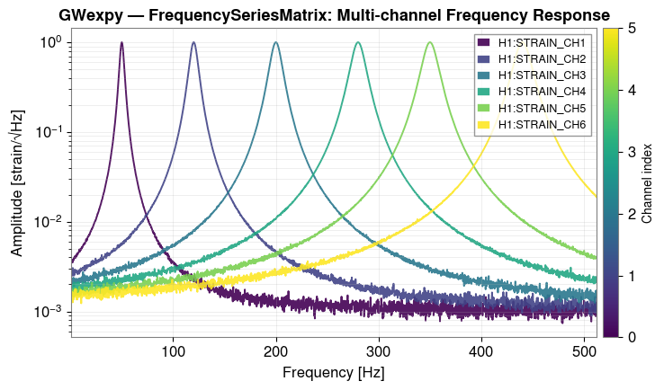

GWexpy
======

.. raw:: html

   

.. raw:: html

   

     

       Extended Python Toolkit for Gravitational-Wave Data Analysis
     

     

       A multi-dimensional data analysis library extending GWpy — 
       integrating matrices, fields, fitting, and advanced signal processing.
     

   

.. grid:: 2
   :gutter: 3
   :class-container: gw-cta-grid

   .. grid-item::

      .. button-ref:: web/en/index
         :ref-type: doc
         :color: primary
         :shadow:
         :expand:

         📖 English Documentation

   .. grid-item::

      .. button-ref:: web/ja/index
         :ref-type: doc
         :color: secondary
         :shadow:
         :expand:

         📖 日本語ドキュメント

----

Key Features
------------

.. grid:: 3
   :gutter: 3

   .. grid-item-card:: 🔬 Multidimensional Fields
      :text-align: center

      ``ScalarField`` / ``VectorField`` / ``TensorField``

      Uniform interface for multidimensional data across space and time.

   .. grid-item-card:: ⚡ Numerical Stability
      :text-align: center

      Safe Log / Zero-division protection / NaN propagation detection

      Automatic robustness for mission-critical scientific computing.

   .. grid-item-card:: 📊 Integrated Analysis Tools
      :text-align: center

      BrUCo / ARIMA / Fitting / MCMC

      Seamless transition from noise characterization to advanced fitting.

----

Quick Installation
------------------

.. code-block:: bash

   git clone https://github.com/tatsuki-washimi/gwexpy.git
   cd gwexpy && pip install -e .

Quick Demo
----------

.. code-block:: python

   from gwexpy.timeseries import FrequencySeriesMatrix
   fsmtx = FrequencySeriesMatrix.read("data.hdf5")
   fsmtx.fit(model="lorentzian").plot()

.. toctree::
   :hidden:

   web/en/index
   web/ja/index
