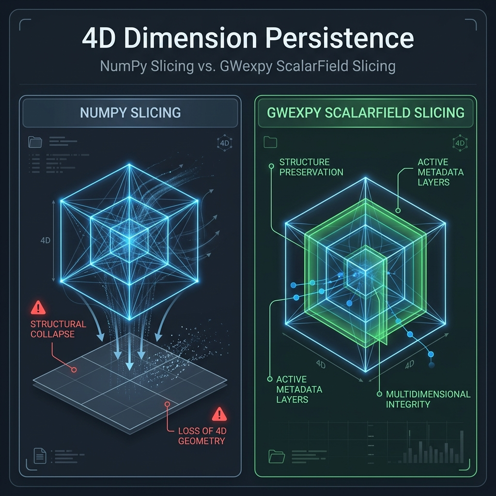

# Scalar Field Slicing Guide

> [!NOTE]
> **Who should read this page?**
> Refer to this guide if you use `ScalarField` and have the following questions:
> - Why does `field[0]` remain 4D instead of becoming a 1D array?
> - Why do I get `Shape Mismatch` errors during indexing operations?
> - When is it safe to use `squeeze()`, and when should it be avoided?

This guide explains why `ScalarField` **always maintains its 4-dimensional structure** during indexing operations. This differs from the standard behavior of NumPy or GWpy and is designed as an "invariant" to ensure the integrity of multidimensional physical data.

## Why Always Maintain "4D"?

A `ScalarField` represents a physical "field" with four axes: (time, frequency, x, y). The reasons for not reducing dimensions (Rank Loss) like NumPy does are based on the **Four Pillars of Persistence**:

1.  **Domain Protection**: Reducing dimensions causes the loss of metadata associated with those axes (e.g., `t0`, `f0`, `dx`), making it impossible to map back to the original physical space.
2.  **FFT/Transformation Consistency**: Always being 4D allows immediate multidimensional operations like `fft()`, `ifft()`, and `spatial_filter()` on any slice.
3.  **Stream Processing Safety**: The number of dimensions remains constant when passing objects between functions, improving program robustness.
4.  **Broadcast Consistency**: Dimensional alignment (`reshape`) intent becomes explicit in the code because the object is always 4D.

### NumPy vs GWexpy Slicing Behavior



| Operation Example | Result Shape (NumPy) | Result Shape (Field) | Physical Meaning |
| :--- | :---: | :---: | :--- |
| `field[5]` | 3D (Rank Loss) | **4D (1, F, X, Y)** | Snapshot at a specific time (metadata preserved) |
| `field[:, :, 3, 3]` | 2D (Rank Loss) | **4D (T, F, 1, 1)** | Time-series at a specific spatial point (metadata preserved) |
| `field[10:20]` | 4D (Maintained) | **4D (10, F, X, Y)** | Time interval extraction |

---

> [!CAUTION]
> **Critical Warning: Using `.squeeze()`**
> When you call `squeeze()` to reduce dimensions, **all metadata (coordinate information) associated with the removed axes is completely lost.**
> Since you can no longer reconstruct the correct physical axes for operations like `field.fft()`, we strongly recommend using `squeeze()` only at the "final output stage," such as for plotting or saving to CSV.

---

## Practical Operation Examples

### 1. Slicing Behavior

```python
from gwexpy.fields import ScalarField
import numpy as np

# (time, freq, x, y) = (100, 50, 10, 10)
field = ScalarField(np.zeros((100, 50, 10, 10)), ...)

# Extract a snapshot at a specific time
snapshot = field[50]
# Shape becomes (1, 50, 10, 10), preserving time axis information.

# Extract a spatial cross-section (x-y plane)
plane = field[:, :, :, 2]
# Shape becomes (100, 50, 10, 1), preserving y-axis information.
```

### 2. When to Reduce Dimensions (`squeeze`)

If you intentionally want to treat the data as 1D or 2D (e.g., for plotting or input to an external library), explicitly call `.squeeze()`.

```python
# Get time-series at a specific spatial point for plotting
point_ts = field[:, 2, 5, 5]      # (100, 1, 1, 1)
actual_ts = point_ts.squeeze()    # (100,) - compatible with TimeSeries
```

### 3. Broadcasting Considerations

Since `ScalarField` is always 4D, you must match the shape when adding or subtracting NumPy arrays.

```python
# ❌ Bad Example: Attempting to add a 1D array directly
field + np.array([1, 2, 3])  # Shape mismatch

# ✅ Good Example: Reshaping to the correct dimensions
calibration = np.array([1, 2, 3]).reshape(3, 1, 1, 1) # (freq, 1, 1, 1)
field + calibration
```

---

## FAQ

### Q: Isn't it inconvenient for 1D calculations if it's always 4D?
**A:** `ScalarField` is designed for handling data that has spatial and temporal extent as a "field." If you are working with simple, single-channel time-series data, we recommend using the `TimeSeries` class from the start.

### Q: What happens if I extract a scalar like `ScalarField[0, 0, 0, 0]`?
**A:** If all indices are scalars, a standard Python scalar or NumPy scalar is returned.

## Related Links

- {doc}`tutorials/field_scalar_intro` - ScalarField introduction tutorial
- {doc}`../reference/api/field` - Field module API reference
- {doc}`numerical_stability` - Numerical stability (precision management for 4D operations)
