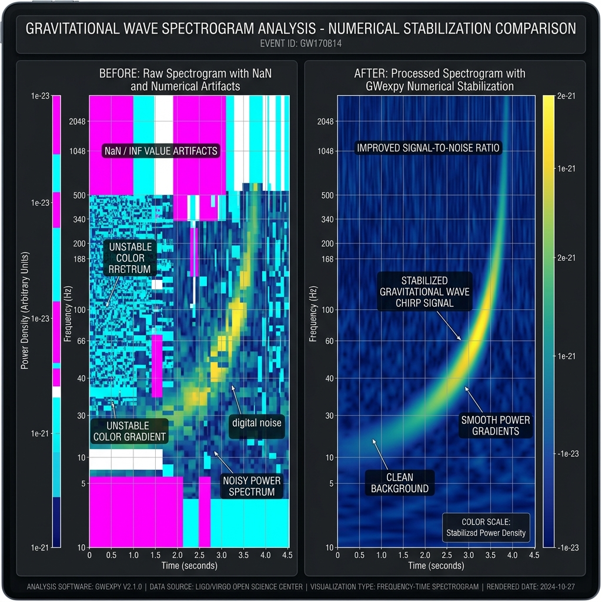

---
myst:
  html_meta:
    description: "GWexpy の数値安定性ガイドです。whiten の eps 処理、安全な対数表示、NaN / Inf の失敗モード、調整が必要な場面を整理します。"
---

# 数値的安定性と精度

**ページ種別:** ガイド

:::{note}
**このページを読むべき方**:
通常の解析では `gwexpy` のデフォルト設定で十分な安定性が確保されています。以下の状況に該当する場合のみ、この詳細ガイドを参照してください。
- プロット結果に `NaN` や `Inf` による「穴」や「異常な色」が現れた場合
- 非常に微小な信号（$10^{-23}$以下）や、逆に 1 を超える巨大な信号を同時に扱う場合
- 解析アルゴリズムの数値的な挙動を深く理解し、詳細パラメータ（`eps`, `tol`）を調整したい場合
:::

`gwexpy` は、重力波データ解析で頻繁に扱われる極めて広いダイナミックレンジを持つデータを、数値的な破綻なく処理できるように設計されています。

**検索のヒント:** `numerical stability`, `NaN`, `Inf`, `whiten`, `eps`, `safe log`, `tol`

## このページでわかること

| 項目 | 内容 |
| --- | --- |
| **ページ種別** | ガイド |
| **対象読者** | `NaN` / `Inf` に悩んでいる利用者、極端に小さい信号や大きい信号を同時に扱う利用者 |
| **前提** | 基本的な FFT / ASD / ホワイトニングの意味を知っていること |
| **こんなときに読む** | プロットに穴が空く、`eps` や `tol` の調整理由を知りたい、数値安定化の設計を把握したい |
| **検索キーワード** | numerical stability, `NaN`, `Inf`, `whiten`, `eps`, safe log, `tol` |

## このページの近道

- [まず結論だけ知りたい方へ](#まず結論だけ知りたい方へ)
- [可視化における安定化の効果](#可視化における安定化の効果-before--after)
- [主な安定化手法と API](#主な安定化手法と-api)
- [各機能の解説とコード例](#各機能の解説とコード例)
- [ユーザーへの推奨事項](#ユーザーへの推奨事項)

(numerical-stability-ja-tldr)=
## まず結論だけ知りたい方へ

- 通常の解析では、まず `gwexpy` のデフォルト設定をそのまま使ってください。
- プロット前に `+ 1e-20` のような手動オフセットを足す必要はありません。
- 調整が必要なのは、`NaN` / `Inf` が見える、極端に小さい信号を扱う、アルゴリズム検証をしたい場合に限られます。

(numerical-stability-ja-impact)=
## 可視化における安定化の効果 (Before & After)

標準的な手法（単純な `log10` や 固定 `eps`）と、`gwexpy` の数値安定化アルゴリズムを適用した結果の比較です。



| 項目 | 一般的な経路 | GWexpy の経路 |
| :--- | :--- | :--- |
| **ゼロ値の扱い** | `log10(0)` により `-inf` が発生し、図が白く抜ける | **Safe Log** により最大値から適切なフロアを自動設定 |
| **微小信号** | 固定 `eps=1e-12` 等で丸められ、信号消失 | **Adaptive Whitening** (`eps="auto"`) で信号感度を維持 |
| **計算不能点** | `NaN` が伝播し、全領域が計算不能になる | 演算前後のバリデーションにより属性を保護 |

---

(numerical-stability-ja-methods)=
## 主な安定化手法と API

| 対策手法 | 対象 API | 解決する問題 | 設定のヒント |
| :--- | :--- | :--- | :--- |
| **Adaptive Whitening** | `.whiten()` | ゼロ除算・信号埋没 | デフォルトの `eps="auto"` を推奨 |
| **Safe Log** | `.plot()`, `.spectrogram()` | `-inf` によるプロットの穴 | `dynamic_range=200` 等で調整可能 |
| **内部標準化 (ICA)** | `ica_fit()` | 振幅依存による不収束 | 入力振幅を気にせず実行可能 |
| **相対許容誤差** | 各種数値計算 | スケール違いによる早期終了 | データの分散に基づき `tol` を自動計算 |

---

(numerical-stability-ja-examples)=
## 各機能の解説とコード例

### 1. 適応的ホワイトニング (`whiten(eps="auto")`)

**目的:** 固定 `eps` による信号消失を避ける。
**入力:** 極小信号を含む `TimeSeries`。
**出力:** 自動スケーリングされたホワイトニング結果。

標準的なホワイトニングは、ゼロ除算を防ぐために固定の正規化パラメータ（`eps`）を使用しますが、これが大きすぎると微小な信号が埋もれます。

#### ❌ 悪い例: 固定 eps による信号消失
```python
# 1e-12 程度の固定 eps では 1e-21 の信号は 0 に丸められてしまう
whitened = data / (asd + 1e-12) 
```

#### ✅ 良い例: GWexpy の `eps="auto"`
`gwexpy` はデータのスケールに合わせて `eps` を相対的に調整し、かつ `SAFE_FLOOR` (1e-50) で特異点を防ぎます。

```python
from gwexpy.timeseries import TimeSeries
import numpy as np

data = TimeSeries(np.random.randn(1000) * 1e-21, sample_rate=1024)
whitened = data.whiten(eps="auto")  # 自動的に適切なスケーリングを適用
```

### 2. 安全な対数スケーリング (`plot()` / `spectrogram()`)

**目的:** `log10(0)` 由来の `-inf` による描画破綻を避ける。
**入力:** ゼロや静穏区間を含む ASD / PSD。
**出力:** 動的フロア付きの安定した可視化。

スペクトログラム等の可視化において、ゼロや極小値による `-inf` の発生を防ぎます。

#### ❌ 悪い例: 手動変換による数値エラー
```python
asd_db = 10 * np.log10(asd)  # 0 があると -inf になりプロットが崩れる
```

#### ✅ 良い例: 自動的な動的フロア適用
`gwexpy` では、データの最大値から逆算した安全なフロアを自動適用します。

```python
asd = data.asd()
plot = asd.plot()  # 内部で Safe Log が適用され、-inf のない綺麗な図になる
```

### 3. 計算機イプシロンへの配慮

パッケージ全体で使用される数値定数は、浮動小数点型（float32 vs float64）の機械精度（イプシロン）に基づいて導出されており、最適な精度を保証します。

---

(numerical-stability-ja-recommendations)=
## ユーザーへの推奨事項

- **手動オフセットの回避**: プロットの前に `data + 1e-20` のような恣意的な値を足す必要はありません。内部で適切に処理されます。
- **デフォルトを信頼する**: `whiten()` や `ica_fit()` のデフォルト値は、数値的な安全性を最優先に調整されています。
- **警告を確認する**: 真に不安定な操作（全区間ゼロのデータのホワイトニング等）に対しては、解決策を含む警告が出力されます。

## 次に読む

- [信号処理 API リファレンス](../reference/api/signal.rst)
- [検証済みアルゴリズム](validated_algorithms.md)
- [用語集](glossary.rst) — `NaN/Inf propagation` 等の用語定義
- [前提条件と規約](prerequisites_and_conventions.md) — FFT と数値計算の前提を先に整理する
