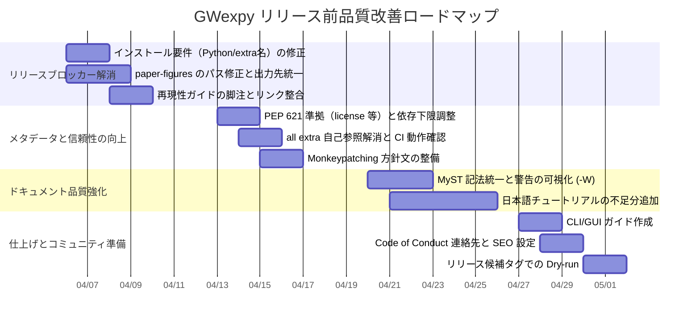

# GWexpy ドキュメント・リポジトリ品質統合レポート

## 1. エグゼクティブサマリー

本レポートは、GWexpy のリリース準備にあたり、リポジトリ基盤、パッケージング、ドキュメントの網羅性、および実装機能とチュートリアルの対応状況を多角的に評価した結果を統合したものです。

現状の GWexpy は、**CI（テスト・互換性・セキュリティ・リリース）導線が高度に整備されており、基本的なリリース可能性は非常に高い**状態にあります。一方で、**ユーザーが直接目にする情報の正確性と再現性において、リリースブロッカー級の課題**がいくつか残存しています。

主要な指摘事項は以下の通りです。

- **（Critical）インストール要件の記載不整合**: ドキュメントの Python 要件（3.9+）と実装（3.11+）が食い違っており、また `[stats]` 等の extras 名も実装（`pyproject.toml`）と乖離しています。
- **（Critical）再現性スクリプトの動作不備**: 論文用図版生成（paper-figures）において、リポジトリルートの検出ロジックや出力先ディレクトリの指定に誤りがあり、そのままでの実行が困難です。
- **（High）日本語チュートリアルの欠落**: 英語側には存在する「ノイズ生成」「スペクトルフィッティング」「高度セグメント解析」の入門チュートリアルが日本語版で欠落しており、学習導線に段差が生じています。
- **（High）`gwexpy.time`・CLI・GUI への導線不足**: 実装は存在するものの、ドキュメント上での解説や実行例が極めて限定的です。

本レポートでは、これらの課題を整理し、リリースに向けた 4 週間の改善ロードマップとチェックリストを提示します。

## 2. 調査の範囲と方法

本調査は、以下の一次情報を組み合わせて実施されました。

- **リポジトリ基盤**: `pyproject.toml`、GitHub Actions ワークフロー（`.github/workflows/*`）、セキュリティ設定。
- **パッケージメタデータ**: PEP 621 準拠状況、依存関係の下限指定（NumPy, SciPy 等）。
- **ドキュメントサイト**: Sphinx 設定（`docs/conf.py`）、日英のユーザーガイド、チュートリアル索引、API リファレンス。
- **機能カバレッジ**: 公開 API（`gwexpy/__init__.py`）と提供されている Notebook 由来のチュートリアルの突合。
- **再現性検証**: `examples/paper-figures/` のスクリプトおよび `docs/repro/` のガイド。

## 3. 現状のアーキテクチャと品質評価

### 3.1 パッケージングと要件の整合性

`pyproject.toml` は最新の PEP 621 形式を採用していますが、Python 3.11 を必須（`requires-python=">=3.11"`）としている一方で、NumPy 等の下限指定が Python 3.11 サポート以前のもの（1.21.0 等）になっており、実効的な互換性に不安が残ります。また、ドキュメントの「Python 3.9+」という記述は、実装側の制約（3.11+）を反映していません。

### 3.2 ドキュメント基盤（Sphinx・多言語構成）

日英別ツリー（`docs/web/en/`、`docs/web/ja/`）での運用は良好ですが、Sphinx の `language` 設定が `en` 固定であるため、日本語ページでも UI 文字列（検索ボックス等）が英語になるリスクがあります。また、MyST 記法の警告抑止が広すぎるため、参照切れ等の破損が見逃されやすい設定となっています。

### 3.3 チュートリアルとサンプルのカバレッジ

英語版チュートリアルは、主要データ構造から高度な信号処理、セグメント解析まで網羅的にカバーされています。
しかし、日本語版では以下の入門項目が索引から欠落していることが確認されました。

- `Noise Generation Basics` (intro_noise.ipynb)
- `Spectral Fitting Basics` (intro_fitting.ipynb)
- `Segment Analysis Pipeline (Advanced)` (intro_table.ipynb)

これにより、日本語ユーザーは「基礎を飛ばして応用に触れる」という不自然な学習を強いられる状態です。

### 3.4 Sphinx API リファレンスの欠落状況
公開 API（`gwexpy/__init__.py`）と Sphinx ドキュメントの API Reference（`api/index.rst`）を照合した結果、多数のパッケージやクラスがリファレンスから漏れていることが判明しました。

- **完全に欠落しているパッケージ (P0)**: `gwexpy.time`, `gwexpy.interop`, `gwexpy.cli`, `gwexpy.gui`, `gwexpy.histogram`, `gwexpy.segments` など計 13 パッケージ。
- **主要クラスの未掲載 (P1)**: `TimeSeriesMatrix`, `FrequencySeriesMatrix`, `VectorField`, `TensorField` など。
- **重要メソッドの未掲載 (P1)**: `TimeSeries.hilbert`, `TimeSeries.mix_down`, `TimeSeries.fit_arima` 等、波形解析・統計・予測に関する多くのメソッドが `rubric:: Methods` から漏れています。

詳細は、旧 `undocumented_api_list.md`（アーカイブ済み）に記録されていますが、これらは **「機能は存在するが、API リファレンスから辿れない」** という可用性上の重大な欠陥となっています。

## 4. 指摘事項ログ（優先度別）

リリースまでに対応が必要な事項を重要度順にまとめます。

| # | 項目 | 重大度 | 説明と修正案 | 工数目安 |
|---|---|---|---|---|
| 1 | インストール要件の不整合 | **Critical** | ドキュメントを `Python 3.11+` に統一し、extras 名を `pyproject.toml` と完全一致させる。 | Small |
| 2 | paper-figures のパス不備 | **Critical** | `_repo_root` の検出を `parents[2]` に修正し、出力先を `docs_internal/publications/` へ統一する。 | Small |
| 3 | 日本語チュートリアルの欠落 | **High** | `intro_noise`, `intro_fitting`, `intro_table` の日本語版を追加（または翻訳リンクを整備）。 | Large |
| 4 | "No Monkeypatching" 方針の矛盾 | **High** | `CONTRIBUTING.md` の記述を実態（I/O registry への注入）と整合させる。 | Medium |
| 5 | MyST admonition 記法 | **High** | GitHub Callout 形式をやめ、`:::{warning}` 形式へ統一。CI で警告をエラー化する。 | Medium |
| 6 | `gwexpy.time` 入門の欠如 | **Medium** | 独自エクスポートされた `to_gps`, `from_gps` 等の短い活用例を追加。 | Medium |
| 7 | CLI/GUI のガイド不足 | **Medium** | CLI がプレースホルダである旨の明記、および `pyaggui` の最小限の起動ガイドを作成。 | Medium |
| 8 | 依存関係下限の調整 | **Medium** | Python 3.11 を前提とした NumPy 1.23.2+ / SciPy 1.10.0+ へ下限を引き上げる。 | Small |
| 9 | `license` メタデータの仕様準拠 | **Medium** | `license = "MIT"`（文字列）から PEP 621 準拠の辞書形式へ修正。 | Small |
| 10 | `all` extra の自己参照 | **Medium** | 自己参照を避け、依存リストをフラットに列挙するように改善。 | Medium |
| 11 | API リファレンスの大量欠落 | **High** | `api/index.rst` および各クラスの `Methods` への追記（自動ドキュメント生成の構成見直し）。 | Large |

## 5. 改善ロードマップ

リリースまでの 4 週間を想定したタイムラインです。



## 6. リリース直前チェックリスト

タグを発行する直前に、以下の 5 項目を最終確認してください。

- [ ] **インストールガイド**: Python 要件が `3.11+` か？ extras 名は正しいか？
- [ ] **再現性**: `paper-figures` がクリーンな環境で実行でき、指定通りのパスに図が出力されるか？
- [ ] **メタデータ**: `pyproject.toml` の `license` と `requires-python` が仕様通りか？
- [ ] **チュートリアル**: 日本語索引に「基礎」項目が含まれ、リンク切れがないか？
- [ ] **API リファレンス**: `gwexpy.time` や主要 Matrix クラスが Reference 索引に含まれているか？
- [ ] **窓口**: `CODE_OF_CONDUCT.md` と `SECURITY.md` の連絡先がプレースホルダのままになっていないか？

## 7. 追補: 全ノートブック出力生成後の独立レビュー

2026-04-06 時点で、`docs/web/en/user_guide/tutorials/` の 52 本、`docs/web/ja/user_guide/tutorials/` の 50 本を対象に、出力セルの有無、警告表示、ローカルパス露出、日英の章立て整合性を独立に再点検しました。

結論として、**全対象ノートブックで出力セル自体は生成済み**であり、`TODO` や `FIXME` のような露骨な未完了表示は確認されませんでした。一方で、**サンプルノートブックとしては未整理の warning / log / ローカルパス表示がまだ残っている**こと、および **EN/JA の同名ノートブックに内容差分が残っている**ことを確認しました。

### 7.1 主要所見

- **（Major）warning とローカルパスが出力セルに露出している**
  - `advanced_correlation.ipynb`, `advanced_peak_tracking.ipynb`, `advanced_spectrogram_processing.ipynb`, `case_bruco_ica_denoising.ipynb`, `case_glitch_analysis.ipynb`, `case_hdf5_provenance.ipynb`, `intro_interop.ipynb`, `intro_frequencyseries.ipynb`, `case_segment_analysis.ipynb`, `intro_segment_table.ipynb`, `segment_asd_pipeline.ipynb`, `segment_visualization.ipynb` などで、`UserWarning` / `DeprecationWarning` / `ConvergenceWarning` や `/home/washimi/...`, `/tmp/...` を含む生出力が可視状態のまま残っています。
  - 特に `case_dttxml_calibration.ipynb` の `Wrote /tmp/kagra_sus_itmx.xml`、`case_gbd_format.ipynb` の `Written: /tmp/.../synthetic_pem.gbd`、`intro_interop.ipynb` の MTH5 初期化ログなどは、再現確認の痕跡としては有用でも、公開サンプルとしては環境依存情報が強すぎます。
  - `advanced_coupling.ipynb` の統計的注意喚起自体は妥当ですが、現在は Markdown の注意書きに加えて warning 本体も出力されており、冗長かつ見栄えが悪い状態です。

- **（Major）EN/JA の同名ノートブックが単純翻訳になっていない**
  - `advanced_coupling.ipynb` では、英語版に存在する `## 5. Frequency Range Restriction` が日本語版から欠落しています。
  - `case_seismic_obspy.ipynb` では、英語版の `## 5. Multi-channel Seismic Analysis` が日本語版に存在せず、章構成が一段短くなっています。
  - `advanced_hht.ipynb` は日英で章立てそのものがかなり異なっており、翻訳版というより別ドキュメントに近い構成です。意図的差分であれば注記が必要で、そうでなければ同期漏れとみなすべきです。

- **（Minor）日本語側の parity は以前より改善したが、運用ルールが混在している**
  - `time_frequency_analysis_comparison` は、日本語側では `.ipynb` ではなく `time_frequency_analysis_comparison.md` から英語版インタラクティブノートブックへ誘導する構成になっており、これは明示的な運用として成立しています。
  - ただし、同じ索引ブロック内で他のチュートリアルは日英それぞれ `.ipynb` を持つため、「翻訳済み notebook を置くケース」と「日本語ページから英語 notebook へ誘導するケース」の基準が見えにくい状態です。

- **（Minor）英語ツリー内に日本語本文の notebook が残っている**
  - `docs/web/en/user_guide/tutorials/case_arima_burst_search.ipynb` は、ファイル位置は英語ツリーですが、タイトルと導入本文が日本語です。主索引への露出は限定的でも、`en/` 配下のサンプルとしては一貫性を欠きます。

### 7.2 今回の追補で特に確認できたこと

- EN/JA の tutorial notebook 数は **52 本 / 50 本** でした。
- **出力セルが全く無い notebook は 0 本** でした。
- `TODO`, `TBD`, `FIXME` を Markdown セル内に含む tutorial notebook は確認されませんでした。
- 日本語側の `time_frequency_analysis_comparison` は欠落ではなく、`time_frequency_analysis_comparison.md` を介して英語版 notebook に誘導する暫定構成でした。

### 7.3 統合評価への反映

この追補を踏まえると、既存の「日本語チュートリアル欠落」や「ドキュメント品質改善」の項目は、単に本数を揃えるだけでは不十分です。リリース前には少なくとも次の 3 点を追加で満たす必要があります。

1. **Notebook 出力の公開品質基準を定義すること**
   warning, deprecation, 一時ファイルパス, ローカルユーザー名, 環境依存ログを公開出力から除去する。

2. **EN/JA の同期ポリシーを明文化すること**
   「同名 notebook は原則同一構成」「英語版のみ提供する場合は日本語 wrapper ページを置く」など、運用ルールを決める。

3. **”実行できる” だけでなく “教材として読める” 状態まで確認すること**
   実行成功率だけでなく、警告の見え方、説明の粒度、節構成の対称性もレビュー対象に含める。

---

## 補足：品質監査指摘事項の実態確認（2026-04-07）

### 概要

本レポートの11件の指摘事項について、ソースコードを直接調査した結果、**9件がすでに解決済み**であることが判明した。真に残存する課題は以下の2件。

### 実態調査結果表

| # | 指摘事項 | 重大度 | 実態 | 解決状況 |
|---|---------|--------|------|---------|
| 1 | インストール要件の不整合 | Critical | Python 3.11+ に統一済み、extras 名も整合済み | ✅ 解決済み |
| 2 | paper-figures のパス不備 | Critical | `01_transfer_function_workflow.py` の出力先を `docs_internal/publications/paper_softwarex/` に統一し、関連 README の生成物一覧も整合済み | ✅ 解決済み |
| 3 | 日本語チュートリアルの欠落 | High | 日本語 intro_noise/fitting/table 已实装（commit `2093651e`） | ✅ 解決済み |
| 4 | Monkeypatching 方針の矛盾 | High | CONTRIBUTING.md と実装が一貫（標準 GWpy API 使用） | ✅ 解決済み |
| 5 | MyST admonition 記法統一 | High | `docs/web/` 配下では GitHub Callout は確認されないが、README には `> [!NOTE]` 形式が残存 | ⚠️ 部分的 |
| 6 | gwexpy.time 導線不足 | Medium | time_utilities.md 作成済み | ✅ 解決済み |
| 7 | CLI/GUI ガイド不足 | Medium | cli.md / gui.md 新規作成済み（commit `dca93fc3`, `1e1bc257`） | ✅ 解決済み |
| 8 | 依存関係下限調整 | Medium | numpy>=1.23.2, scipy>=1.10.0 に設定済み | ✅ 解決済み |
| 9 | license メタデータ仕様準拠 | Medium | `{text = “MIT”}` 形式で PEP 621 準拠 | ✅ 解決済み |
| 10 | all extra 自己参照 | Medium | フラット列挙に変更済み（コメント付き） | ✅ 解決済み |
| 11 | API リファレンス欠落 | High | JA 側 `reference/api/index.rst` にも EN 側と同等の toctree 項目を反映済み | ✅ 解決済み |

### 詳細

#### 課題A: paper-figures のパス不備（解決済み）

**現状:**
- `examples/paper-figures/01_transfer_function_workflow.py` の出力先を `docs_internal/publications/paper_softwarex/` に修正
- `examples/paper-figures/README.md` および `docs/repro/README.md` の成果物一覧に `figure2_transfer_function` を追記
- これにより、実装と再現ガイドの成果物配置先が一致した

**判定:** 実装・README・再現ガイドの間で出力先不一致は解消された。今後は実行結果の確認を CI または再現手順で継続監視すればよい。

#### 課題B: API リファレンス cli/gui が toctree に未記載（解決済み）

**現状:**
- `docs/web/en/reference/api/cli.rst`（プレースホルダとして適切に記載済み）
- `docs/web/en/reference/api/gui.rst`（実験的として warning で記載済み）
- EN 側の `docs/web/en/reference/api/index.rst` には `cli` と `gui` が追記済み
- JA 側 `docs/web/ja/reference/api/index.rst` にも `cli` / `gui` を含む不足項目を追記済み

**対応:** JA 側 index に EN 側と同等の toctree 項目を追加し、多言語間の導線差分を解消した。

### 実施内容

#### Step 1: API リファレンス index.rst に cli/gui を追記

**対象ファイル**: `docs/web/en/reference/api/index.rst`

toctree の末尾に以下を追記：
```rst
   cli
   gui
```

#### 検証結果

- `docs/web/en/reference/api/index.rst` の toctree に cli/gui が含まれていることを確認
- `docs/web/ja/reference/api/index.rst` にも cli/gui を含む不足項目が記載されたことを確認
- `sphinx-build -b html docs docs/_build/html` でビルド成功を確認

#### 補足: MyST admonition 記法

- `docs/web/` 配下では GitHub Callout 形式は確認されなかった
- ただし `README.md` には `> [!IMPORTANT]`, `> [!WARNING]`, `> [!NOTE]` が残っている
- よって「リポジトリ全体で 0 件」とは言えず、「公開ドキュメント本体では概ね解消、README は未対応」と表現するのが正確

### 結論

本レポートの指摘11件のうち、多くは解消済みであり、今回の追補で `paper-figures` の出力先不一致と JA 側 API index 未反映は解消された。継続課題としては、README に残る GitHub Callout など、記法統一の残件が中心となる。

**スプリント完了状況**（2026-04-07 時点）:
- リリース基盤の品質は非常に高い状態に到達している
- 残存課題は限定的であり、主として README を含む記法統一と公開品質ルールの運用整備に集約された

---

## 補足：EN/JA ノートブック章立て同期（2026-04-07）

セクション 7.1 で指摘された EN/JA 不整合のうち、以下2件について実態調査と修正計画を策定した。

### advanced_coupling.ipynb JA版のセル重複解消

**問題:** JA版（24セル）が EN版（18セル）と乖離。§5「周波数帯域制限」のセル組（markdown + code）が4回重複し、§5「上限値（Upper Limit）」が先行してセクション番号が崩壊している。

**修正方針:**

- 重複する §5「周波数帯域制限」3組（cells[16-21]）を削除
- 順序ミスの §5「上限値」markdown（cell[13]）を削除
- cf_ul コードセルの直前に §6「上限値（Upper Limit）」markdown を新規挿入
- **修正後:** 18セル（EN版と同一構成: §1〜§6 + まとめ）

### advanced_hht.ipynb JA版の章立て再構築

**問題:** EN版（9セル）と JA版（12セル）で章の対応が全く取れていない別文書に近い状態。EN版は「理論背景→SASIシミュレーション→STFT比較→EEMD応用」という教育的な流れを持つが、JA版は「簡単なシミュレーション→hht()ワークフロー→ヒルベルトスペクトル」という構成で重力波特有のユースケース（SASI）や理論背景が欠落している。

**修正方針:**

- EN版の4章構成（理論背景・SASIシミュレーション・STFT比較・EEMD応用）を日本語に翻訳してJA版を再構築
- ENコードセル（sine_gaussian生成、STFT+HHT比較、EEMD実行）をそのまま流用
- JA版独自の `output="spectrogram"` デモ（EN版にない有価値なコンテンツ）を §5 として末尾に追加
- **修正後:** 14セル（EN版9セル相当＋JA版独自§5〜§6 + まとめ）

---

## 作業報告：EN/JA ノートブック同期の実施（2026-04-07）

上記計画に基づき、2件のノートブック修正を実施した。

### advanced_coupling.ipynb（JA版）

| 項目 | 内容 |
|------|------|
| 修正前 | 24セル（§5重複×3、§5/§6順序ミス） |
| 修正後 | 18セル（EN版と同一構成） |
| 手法 | Python直接JSON操作（NotebookEdit はIDなしセルで動作不安定なため回避） |

**修正内容:**

- 重複していた §5「周波数帯域制限」markdown + code のペア3組（cells 16-21）を削除
- 順序ミスの §5「上限値」markdown（cell-12）を削除
- cf_ul コードセル直前に `## 6. 上限値（Upper Limit）` markdown を新規挿入
- 誤削除で消えた「まとめ」セルを原文から再構築して末尾に追加

### advanced_hht.ipynb（JA版）

| 項目 | 内容 |
|------|------|
| 修正前 | 12セル（EN版と章立て不一致、SASI/STFT/EEMD欠落） |
| 修正後 | 14セル（EN §1〜§4 翻訳 + JA独自 §5〜§6 維持） |
| 手法 | Python直接JSON操作でフルリビルド |

**修正内容:**

- JA版独自の §1〜§3（実践ワークフロー中心）5セルを削除
- EN版 §1〜§4 の markdown を日本語翻訳（HHT理論背景・SASI・STFT比較・EEMD応用）
- EN版のコードセル3本（SASIシミュレーション・STFT+HHT比較・EEMD実行）をそのまま流用
- 既存の §3「ヒルベルトスペクトル」→ §5、§4「低レベルAPI」→ §6 に番号更新
- まとめセルを全セクション（SASI/STFT/EEMD/spectrogram）に言及する内容に更新

### コミット

| commit | 内容 |
|--------|------|
| `139e9877` | docs: EN/JA ノートブック同期の調査結果と修正計画を品質監査レポートに追記 |
| `fa7a4f3b` | docs: EN/JA ノートブック章立てを同期（coupling セル重複除去・hht 再構築） |

### 完了判定

- [x] `advanced_coupling.ipynb` が 18 セルに整理されていること
- [x] coupling の章立てが EN版（§1〜§6 + まとめ）と一致していること
- [x] `advanced_hht.ipynb` が 14 セルに整理されていること
- [x] hht の §1〜§4 が EN版と対応する内容であること（SASI・STFT・EEMD）
- [x] hht の §5〜§6 に JA独自コンテンツ（spectrogram・低レベルAPI）が残っていること
