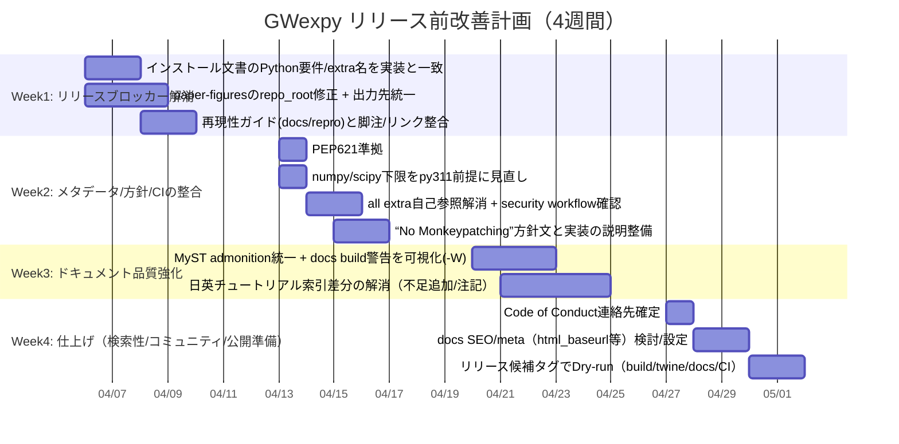

# GWexpyリリース準備のためのドキュメント・リポジトリ品質監査レポート

## エグゼクティブサマリー

本調査は、`tatsuki-washimi/gwexpy` リポジトリと、同リポジトリで構築される Sphinx ドキュメント（英語・日本語）を対象に、**リリース直前の品質監査**として、内容の網羅性・技術的正確性・可用性（導線/検索/可読性）・再現可能性・CI/CD・APIリファレンス品質・テスト/ベンチマーク・互換性/要件・セキュリティ/ライセンス・国際化/アクセシビリティ・SEO/メタデータ・貢献者向けドキュメントの観点で、問題点の洗い出しと改善計画を提示します。一次情報は、リポジトリ内ファイル（`pyproject.toml`、Sphinx設定、各言語のユーザーガイド、ワークフロー、再現性ガイド、例示スクリプト等）です。 fileciteturn77file0L1-L1 fileciteturn94file0L1-L1 fileciteturn102file0L1-L1

結論として、リポジトリは **CI（テスト/互換性/セキュリティ/ドキュメント/リリース）導線が整備されており、リリース可能性は高い**一方、**ドキュメントの技術的正確性と再現性の一部が“リリースブロッカー級”に破綻**しています。とくに重大なのは次の3点です。

- **（Critical）インストール文書が `pyproject.toml` の実態と不整合**：Python要件が `3.9+` と書かれているが、パッケージ要件は `>=3.11`、さらに extras 名が実装と大きくズレています（`[stats]` 等）。結果としてユーザーがそのままコマンドを実行すると失敗する可能性が高いです。 fileciteturn98file0L1-L1 fileciteturn97file0L1-L1 fileciteturn77file0L1-L1
- **（Critical）論文再現（paper-figures）スクリプトの“リポジトリルート検出”と“出力先”が誤っている**：`examples/paper-figures/*.py` で `_repo_root` が `examples/` までしか遡らず `gwexpy/` を参照できない可能性があり、さらに図の出力先が再現性ガイドの記述と不一致です。 fileciteturn92file0L1-L1 fileciteturn93file0L1-L1 fileciteturn91file0L1-L1
- **（High）“No Monkeypatching”方針との齟齬がドキュメント/実装間で存在**：`CONTRIBUTING.md` で import 時に外部を変更しない方針を掲げつつ、`gwexpy/__init__.py` では `gwpy.io.registry` に `setattr` する互換性shimや import 時 `register_all()` 実行があり、説明不足のままでは信頼性リスクになります。 fileciteturn104file0L1-L1 fileciteturn105file0L1-L1

本レポートでは、上記を含む問題を **場所（URL/パス）・重大度・説明・具体的修正案・工数**つきで整理し、4週間の実装計画（Mermaid Gantt）とリリースチェックリストを提示します。

## 調査範囲と方法

対象は (1) GitHub リポジトリ `tatsuki-washimi/gwexpy`、(2) 同リポジトリの Sphinx ドキュメントソース（`docs/` 配下の `web/en`・`web/ja`）です。調査は、リポジトリのパッケージ定義（`pyproject.toml`）、Sphinx 設定（`docs/conf.py`）、主要ガイド（インストール、チュートリアル索引）、再現性ガイドと paper-figures、GitHub Actions（テスト/互換性/セキュリティ/リリース）を一次情報として精査しました。 fileciteturn77file0L1-L1 fileciteturn94file0L1-L1 fileciteturn83file0L1-L1

また、依存関係・互換性根拠の確認（例：NumPy/SciPy/GWpy の Python サポート）には、公式のリリースノートや PyPI ページを用いました（一次/公式を優先）。 citeturn22search0turn23search2turn25search0turn20search1

重要な制約として、GitHub Pages ドキュメントの**実際のレンダリング結果（HTML）を本環境から直接取得できない**ため、UI/UX（検索ボックス、パンくず、言語スイッチ等）の最終見た目については、Sphinx 設定・ソースからの推定と、リポジトリ内に明記された構成に基づいて評価しています。 fileciteturn94file0L1-L1 fileciteturn102file0L1-L1

## 現状アーキテクチャ評価

### パッケージングと要件の整合性

`pyproject.toml` は PEP 621 形式でメタデータを持ち、`requires-python=">=3.11"`、必須依存として `numpy`, `scipy`, `astropy`, `gwpy` 等を定義しています。 fileciteturn77file0L1-L1  
一方で、**下限バージョン指定が Python 3.11 との整合性を欠く**点が目立ちます（例：`scipy>=1.7.0`、`numpy>=1.21.0` は Python 3.11 では現実的に選べない/互換が薄い）。NumPy 1.23.2 で Python 3.11 wheels が提供され、サポート対象が 3.8–3.11 と明記されています。 citeturn22search0  
SciPy も `1.10.0` で CPython 3.11 wheel が提供されています。 citeturn23search2  
このため、現状の下限指定は「理論上の最小」というより「過去の残骸」に近く、依存解決時の説明可能性（ユーザーが環境構築で詰まる時の調査容易性）を下げます。

さらに `license = "MIT"` が文字列で書かれていますが、PEP 621 は `license` を `file` または `text` で表現する設計で、単純文字列値は意図的に採用しない方針が明記されています。 citeturn20search1  
ここは **PyPI 公開前に仕様準拠へ修正**するのが無難です。

### CI/CD とリリースワークフロー

GitHub Actions は少なくとも以下が存在し、リリース前の体裁としては非常に良い構成です。

- **通常テスト**（Linux/Windows/macOS + Python 3.11/3.12、pytest + mypy + build + codecov 等） fileciteturn10file0L1-L1
- **GWpy互換性ゲート**（固定依存で互換テストを集中実行） fileciteturn90file0L1-L1
- **セキュリティ**（pip-audit / bandit / CodeQL、週次スケジュール） fileciteturn80file0L1-L1 fileciteturn103file0L1-L1
- **ドキュメント**（Sphinx + nbsphinx） fileciteturn11file0L1-L1
- **PyPI 公開**（タグ `v*` で build→twine check→Trusted Publishing） fileciteturn83file0L1-L1

一方で、（ドキュメント・再現性・要件の）**人間が読む情報の不整合が残ったまま PyPI 公開が実行されうる**点が最大リスクです。

### ドキュメント基盤（Sphinx 設定/多言語構成）

Sphinx は `sphinx_rtd_theme`、`myst_parser`、`nbsphinx` を採用し、ノートブックページへの `.ipynb` ダウンロードリンクも自動挿入するなど、学習導線はよく設計されています。 fileciteturn94file0L1-L1  
多言語は翻訳カタログではなく、`docs/web/en/` と `docs/web/ja/` を**別ツリーとして管理**するスタイルです（language switch 用の `html_context["languages"]` 定義あり）。 fileciteturn94file0L1-L1

ただし `language="en"` 固定のため、日本語ページでも UI 部分（テーマの固定文言など）が英語のままになる可能性が高く、国際化品質としては課題が残ります。 fileciteturn94file0L1-L1

## 指摘事項ログ（網羅・場所/重大度/修正案/工数）

下表は、今回の監査で確認できた問題を「リリース前に潰すべき順」に**可能な限り網羅的**に列挙したものです（Critical→High→Medium→Low）。  
工数は **Small（〜半日）/ Medium（数日）/ Large（1週以上）**の目安です。

| # | 項目 | 場所（URL/パス） | 重大度 | 説明（何が問題か） | 具体的な修正案 | 工数 |
|---|---|---|---|---|---|---|
| 1 | インストール要件が誤り（Python 3.9+ と記載） | `docs/web/en/user_guide/installation.md` / `docs/web/ja/user_guide/installation.md` | **Critical** | ドキュメントは「Python 3.9+」と記載する一方、実装の `requires-python` は `>=3.11`。ユーザーが 3.9/3.10 環境で試すと失敗する可能性が高い。 fileciteturn97file0L1-L1 fileciteturn98file0L1-L1 fileciteturn77file0L1-L1 | ドキュメントを `Python 3.11+` に統一。加えて「GWpy 4.x は Python>=3.11」が根拠になるため明記。 citeturn25search0 | Small |
| 2 | Optional extras 名が実装と不一致 | `docs/web/*/user_guide/installation.md` | **Critical** | docs は `.[stats]`, `.[astro]`, `.[geophysics]`, `.[interop]`, `.[plot]` 等を挙げるが、`pyproject.toml` の extras は `analysis/fitting/control/seismic/gw/io/plotting/audio/gui/dev/all`。docs 記載どおりに `pip install .[stats]` を実行すると失敗しうる。 fileciteturn97file0L1-L1 fileciteturn98file0L1-L1 fileciteturn77file0L1-L1 | ドキュメントの extras 一覧を `pyproject.toml` と完全一致させる。旧名称が必要なら「旧→新の対応表」を載せ、旧は deprecate と明言。 | Medium |
| 3 | paper-figures の `_repo_root` が誤っており、ローカル実行時に import が壊れる可能性 | `examples/paper-figures/02_coherence_ranking.py` / `03_gwosc_case_study.py` | **Critical** | `_repo_root = Path(__file__).resolve().parent.parent` は `examples/` までしか遡らず、リポジトリ直下の `gwexpy/` を指さない（コメント目的とズレ）。結果として「インストールせずにスクリプトだけ実行」すると import が失敗しやすい。 fileciteturn92file0L1-L1 fileciteturn93file0L1-L1 | `_repo_root = Path(__file__).resolve().parents[2]`（= repo root）等に修正。加えて「推奨は `pip install -e .`」と明記すれば sys.path hack 自体を削除可能。 | Small |
| 4 | paper-figures の出力先が再現性ガイドと不一致 | `docs/repro/README.md` と `examples/paper-figures/*` | **Critical** | 再現性ガイドは `docs_internal/publications/paper_softwarex/...` へ出力と書く一方、スクリプトは `Path(__file__).parent.parent / "docs" / "gwexpy-paper"`（= `examples/docs/gwexpy-paper`）へ出力しており齟齬。 fileciteturn91file0L1-L1 fileciteturn92file0L1-L1 fileciteturn93file0L1-L1 | 「正」を一つに統一。推奨：`docs_internal/publications/paper_softwarex/` を採用し、スクリプト側を repo-root 基準で出力。CI が参照するパスも合わせる。 | Medium |
| 5 | “No Monkeypatching”方針と実装が矛盾（外部レジストリへ setattr） | `CONTRIBUTING.md` / `gwexpy/__init__.py` | **High** | CONTRIBUTING は import 副作用を避ける方針（外部を変更しない）を掲げるが、実装では `gwpy.io.registry` に属性を注入する互換 shim があり、方針と整合しない（少なくとも説明不足）。 fileciteturn104file0L1-L1 fileciteturn105file0L1-L1 | 方針文を「GWpy型（`gwpy.types.Series` 等）を monkeypatch しない」に限定し、I/O registry への登録/互換 shim を例外として明示。もしくは shim を import 時ではなく `register_all()` 呼び出し時へ遅延。 | Medium |
| 6 | import 時に `register_all()` を自動実行（副作用） | `gwexpy/__init__.py` / README Quick Start 注意書き | **High** | README は「`import gwexpy` が constructors/I-O formats を自動登録」と明記している。これは便利だが副作用が大きく、トラブル時の切り分けが難しくなる。 fileciteturn105file0L1-L1 fileciteturn102file0L1-L1 | `GWEXPY_AUTO_REGISTER=0` のような環境変数で抑止できる設計を追加、または “自動登録は安定した仕様である” と明文化。 | Medium |
| 7 | docs の admonition 記法が MyST と不整合（表示崩れリスク） | 例：`docs/web/ja/reference/TimeSeries.md`、その他 md | **High** | MyST の有効拡張は `colon_fence` 等で、GitHub Callout（`> [!WARNING]`）は MyST 標準ではレンダリングされない可能性が高い。 fileciteturn94file0L1-L1 | すべて `:::{warning}` / `:::{note}` 形式へ統一。CI の docs build を `-W` で警告をエラー化し崩れ検出。 | Medium |
| 8 | 日英チュートリアルの項目差分（“両言語で25+”主張の検証困難） | `docs/web/en/user_guide/tutorials/index.rst` / `docs/web/ja/user_guide/tutorials/index.rst` / README | **High** | 英語は “Noise generation / spectral fitting basics / Segment analysis pipeline”等を含むが、日本語索引は少なくとも `intro_noise`、`intro_fitting`、`intro_table` 等が欠ける。README は「両言語で 25+」と述べるため、現状は誤認リスク。 fileciteturn99file0L1-L1 fileciteturn100file0L1-L1 fileciteturn102file0L1-L1 | 日本語側に不足ページを追加（翻訳が難しければ「翻訳未完」ラベルと英語リンクを明示）。README の表現も「一部は英語のみ」等へ正確化。 | Large |
| 9 | docs の `language="en"` 固定で、日本語UIが英語表示になり得る | `docs/conf.py` | Medium | 日英別ツリー運用だが Sphinx の `language` は en 固定。UI文字列（検索/ナビ等）が英語のままになる可能性。 fileciteturn94file0L1-L1 | 日本語ビルド時に `language="ja"` を注入するビルド分割（2ビルド）か、`sphinx-intl`/gettext を使う方針を明確化。 | Large |
| 10 | `license` メタデータが PEP 621 仕様に非準拠の可能性 | `pyproject.toml` | Medium | `license="MIT"` は PEP 621 が採用しない設計。ツールによっては警告/エラーになり得る。 fileciteturn77file0L1-L1 citeturn20search1 | `license = {file = "LICENSE.txt"}`（または `{text="MIT"}`）へ修正し、sdist に LICENSE が必ず入ることを確認。 | Small |
| 11 | 依存関係下限が Python 3.11 と整合しない | `pyproject.toml` | Medium | `numpy>=1.21`、`scipy>=1.7` は 3.11 を想定した下限としては不適切。NumPy は 1.23.2 以降で 3.11 をサポート。SciPy は 1.10.0 で cp311 wheels が確認できる。 fileciteturn77file0L1-L1 citeturn22search0turn23search2 | `python>=3.11` に合わせて下限を調整（例：`numpy>=1.23.2`, `scipy>=1.10.0` 等）。CI 実測と合わせる。 | Small |
| 12 | `all` extra が自己参照で、ツール互換性リスク | `pyproject.toml` / `security.yml` | Medium | `all = ["gwexpy[analysis]", ...]` は自己参照で、依存解決器の挙動差で壊れる可能性。さらにセキュリティworkflowは `pip install .[all]` を実行する。 fileciteturn77file0L1-L1 fileciteturn80file0L1-L1 | `all` は自己参照を避け、依存リストを展開して列挙（生成スクリプトで自動生成でも可）。 | Medium |
| 13 | Code of Conduct の連絡先が未設定 | `CODE_OF_CONDUCT.md` | Medium | `[INSERT EMAIL ADDRESS]` が残存し、コミュニティ運用上の不備。 fileciteturn101file0L1-L1 | GitHub の連絡先（Security advisory/PVR）や Discussion/Issue を含む明確な窓口へ置換。 | Small |
| 14 | conda 依存の説明が README と docs で微妙に不一致 | README / Installation docs | Medium | README は `conda install ... nds2-client ldas-tools-framecpp` と書き、docs は `python-nds2-client python-framel ldas-tools-framecpp`。どちらが必要かが不明確。 fileciteturn102file0L1-L1 fileciteturn97file0L1-L1 | 「何のためにどの conda パッケージが必要か」を整理し、推奨コマンドを一本化。根拠として conda-forge パッケージの存在を参照（例：`python-framel`、`python-nds2-client`、`ldas-tools-framecpp`）。 citeturn14search1turn14search5turn15search1 | Medium |
| 15 | docs build の警告抑止が広すぎ、破綻を見逃す可能性 | `docs/conf.py` | Medium | `suppress_warnings` に `autodoc/autosummary/docutils` 等が含まれ、壊れた参照や書式誤りが CI で見えにくい。 fileciteturn94file0L1-L1 | 重要警告は抑止しない方針へ。CI では `sphinx-build -W --keep-going` を使い、壊れを検出。 | Medium |
| 16 | “検索/索引性”に影響しうる `no-index` デフォルト | `docs/conf.py` | Low–Medium | `autodoc_default_options["no-index"]=True` は生成APIが索引に乗りにくくなり、検索性/SEOに悪影響の可能性。 fileciteturn94file0L1-L1 | 収束後に `no-index` を外し、`nitpicky` で未解決参照を潰す。 | Medium |
| 17 | “対応フォーマット75+”の根拠提示は良いが、docs 側に統合されていない | `SUPPORTED_IO_MATRIX.md` | Low | 行列は有用だが、ユーザーが docs から辿りにくい（README にはリンクがある）。 fileciteturn95file0L1-L1 fileciteturn102file0L1-L1 | docs に「I/O対応表」ページを作り、SUPPORTED_IO_MATRIX を埋め込む（MyST include など）。 | Medium |
| 18 | テスト用フィクスチャ生成は強力だが、依存・実行時間・失敗時挙動の説明が不足 | `tests/fixtures/generate_fixtures.py` / README “Testing” | Low–Medium | 形式ごとに optional deps が必要で、生成が skip される設計だが、どの依存が無いと何が skip されるかが docs から追いにくい。 fileciteturn96file0L1-L1 fileciteturn102file0L1-L1 | “Fixtures の依存対応表”と “CI が生成する最小セット”を docs に追加。 | Medium |
| 19 | 追加のベンチマーク/性能回帰の枠組みが見当たらない | （該当ページ/設定なし） | Medium | 解析ライブラリとして、性能退行を検出する仕組み（asv 等）があるとリリース品質が上がる。現状は CI に性能基準がない。 | `benchmarks/` を追加し、最低限の FFT/行列/時間周波数主要関数を asv or pytest-benchmark で測定。 | Large |
| 20 | SEO/メタデータ（canonical/sitemap 等）の整備が薄い | `docs/conf.py` | Low | `html_baseurl` や sitemap 等が未設定で、GitHub Pages 公開時の検索エンジン最適化余地がある。 fileciteturn94file0L1-L1 | `html_baseurl` 設定、`sphinx-sitemap` 導入、OGP/description の明示（theme template）を検討。 | Medium |

## 現状と推奨の比較表

### ドキュメント構成と内容の比較

| 領域 | 現状（確認できた事実） | 推奨（リリース品質の観点） |
|---|---|---|
| インストール | docs は Python 3.9+ と記載、extras 名も実装とズレ。 fileciteturn97file0L1-L1 fileciteturn98file0L1-L1 | Python/依存/extra を `pyproject.toml` と厳密一致。環境別（pip/conda）手順を一本化。 |
| チュートリアル（日英） | 英語索引は多項目、日語索引は不足が見える。 fileciteturn99file0L1-L1 fileciteturn100file0L1-L1 | 翻訳未完は明示し、欠落ページは追加・もしくは英語ページへ誘導。README 主張と整合を取る。 |
| 再現性（SoftwareX） | 再現性ガイドは良いが、スクリプト出力先が不一致。 fileciteturn91file0L1-L1 fileciteturn92file0L1-L1 | “出力先・実行コマンド・キャッシュ方針”を一致させ、CI でも検証可能にする。 |
| API参照 | Sphinx autodoc/autosummary + nbsphinx を採用。 fileciteturn94file0L1-L1 | `no-index`/警告抑止を削減し、検索性と壊れ検出を強化。 |
| セキュリティ | SECURITY.md と security workflow が整備。 fileciteturn103file0L1-L1 fileciteturn80file0L1-L1 | Good。加えて PVR 以外の“フォーム準備中”は公開までに確定させる。 |
| コミュニティ運用 | Code of Conduct の連絡先プレースホルダ残存。 fileciteturn101file0L1-L1 | 運用可能な窓口に置換し、README/SECURITY と整合。 |

### リリース工学（メタデータ・CI・互換性）の比較

| 項目 | 現状 | 推奨 |
|---|---|---|
| PyPI 公開 | タグ `v*` で build→twine check→Trusted Publishing の workflow が存在。 fileciteturn83file0L1-L1 | リリース前に “ドキュメントとメタデータ整合チェック”を `check_release_metadata.py` に追加（Python要件/extra 名/READMEの記述等）。 fileciteturn84file0L1-L1 |
| 互換性 | GWpy互換性ゲートがある。 fileciteturn90file0L1-L1 | docs でも “互換性ポリシー”をユーザー向けに要約（GWpy 4.x と Python>=3.11）。 citeturn25search0 |
| 依存関係 | 下限が現実と不整合（numpy/scipy）。 fileciteturn77file0L1-L1 | Python 3.11 対応下限へ更新（根拠：NumPy 1.23.2 は 3.11 サポート）。 citeturn22search0turn23search2 |
| セキュリティ | pip-audit/bandit/CodeQL が週次実行。 fileciteturn80file0L1-L1 | `pip install .[all]` が壊れないよう `all` extra を自己参照から改善。 fileciteturn77file0L1-L1 |

## 優先アクションリストとリリースチェックリスト

### 優先アクションリスト

最短で “リリースに耐える” 状態にするため、優先度は次の順が合理的です。

まず **ドキュメントの正確性・再現性**で「試したら失敗する」状態を除去します（Issue #1〜#4）。その後に “方針と実装の整合” と “パッケージメタデータの仕様準拠” を固めます（#5, #10, #11, #12）。最後に翻訳差分・検索性・SEO など、品質の底上げを行います（#8, #15, #16, #20）。

### 4週間実装タイムライン案（Mermaid Gantt）



### 提案リリースチェックリスト

以下は「タグを切る直前に確認すべき」項目を、今回の監査結果に合わせて具体化したものです。

リリース前に、インストールガイド（英/日）で **(a) Python要件、(b) extras 名、(c) pip/conda 手順**が `pyproject.toml` と一致していることを確認します。 fileciteturn97file0L1-L1 fileciteturn98file0L1-L1 fileciteturn77file0L1-L1  
次に、paper-figures が `pip install -e .` 済み環境で **ネットワーク不要の例（Example 2）が CI 同等に動く**こと、出力先が再現性ガイドと一致することを確認します。 fileciteturn91file0L1-L1 fileciteturn92file0L1-L1  
続いて、`pyproject.toml` の `license` 表現を PEP 621 に合わせ、`python -m build` と `twine check` をローカル/CI 双方で通し、Trusted Publishing workflow が意図通り動くことを確認します。 fileciteturn83file0L1-L1 citeturn20search1  
最後に、`CODE_OF_CONDUCT.md` の連絡先、`SECURITY.md` の窓口が実運用可能であることを確認します。 fileciteturn101file0L1-L1 fileciteturn103file0L1-L1

## 参照した一次資料・公式情報

（リンクはコードブロック内にまとめています。本文中は該当箇所に引用を付しています。）

```text
https://github.com/tatsuki-washimi/gwexpy
https://tatsuki-washimi.github.io/gwexpy/   （本環境ではHTML取得制約あり）

# リポジトリ主要ファイル
https://github.com/tatsuki-washimi/gwexpy/blob/main/pyproject.toml
https://github.com/tatsuki-washimi/gwexpy/blob/main/docs/conf.py
https://github.com/tatsuki-washimi/gwexpy/blob/main/docs/web/en/user_guide/installation.md
https://github.com/tatsuki-washimi/gwexpy/blob/main/docs/web/ja/user_guide/installation.md
https://github.com/tatsuki-washimi/gwexpy/blob/main/docs/web/en/user_guide/tutorials/index.rst
https://github.com/tatsuki-washimi/gwexpy/blob/main/docs/web/ja/user_guide/tutorials/index.rst
https://github.com/tatsuki-washimi/gwexpy/blob/main/docs/repro/README.md
https://github.com/tatsuki-washimi/gwexpy/blob/main/examples/paper-figures/02_coherence_ranking.py
https://github.com/tatsuki-washimi/gwexpy/blob/main/examples/paper-figures/03_gwosc_case_study.py
https://github.com/tatsuki-washimi/gwexpy/blob/main/.github/workflows/release.yml
https://github.com/tatsuki-washimi/gwexpy/blob/main/.github/workflows/security.yml

# 公式仕様・依存根拠
https://peps.python.org/pep-0621/
https://numpy.org/doc/2.0/release/1.23.2-notes.html
https://pypi.org/project/scipy/1.10.0/
https://pypi.org/project/gwpy/
https://anaconda.org/conda-forge/python-framel
https://anaconda.org/conda-forge/python-nds2-client
https://anaconda.org/conda-forge/ldas-tools-framecpp
```