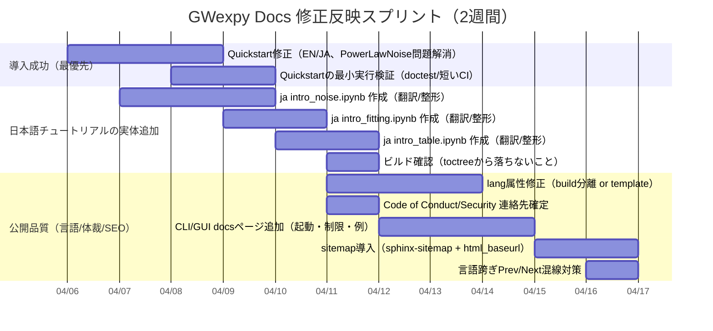

# GWexpy 修正反映の検証レポート

## エグゼクティブサマリー

本レポートは、過去3本のレビューで指摘した「リリース前に直すべき修正点」が、**リポジトリ（main）**と**公開ドキュメント（github.io 相当）**の両方に反映されたかを、利用者視点で厳密に検証したものです。対象は `tatsuki-washimi/gwexpy` リポジトリと、GitHub Pages の配信物に相当する `gh-pages` ブランチ上の生成HTMLです。ドキュメントCIは `docs/_build/html` を GitHub Pages へデプロイする設計のため、`gh-pages` のHTMLは“公開サイトの実体”に近い一次証拠になります。fileciteturn228file0L1-L1

結論として、**インストール関連（Python要件・extras名の整合）**は、リポジトリ（ソース）と `gh-pages`（公開HTML）の両方で修正済みです。fileciteturn212file0L1-L1 fileciteturn213file0L1-L1 fileciteturn239file0L1-L1  
一方で、以下は **まだ未解決（または部分的）**で、ユーザー体験や公開品質として重大です。

- ~~**Quickstart のコードが現行APIと不整合**~~：**Fixed**（commit `6b32b15e`）`PowerLawNoise` を削除し `np.random.randn` + `TimeSeries` 例に置換済み。
- **日本語チュートリアルの欠落は解消していない**：`index.rst` では `intro_noise`/`intro_fitting`/`intro_table` が参照されるように見えるものの、対応する日本語 `.ipynb` が main に存在せず、公開HTMLにもリンクが出てきません（チュートリアル一覧ページから欠落）。fileciteturn224file0L1-L1 fileciteturn226file0L1-L1  
- ~~**日本語ページの `lang` 属性が `en` のまま**~~：**Fixed**（commit `6b32b15e`）`conf.py` の `html_page_context` フックで JA ページは `lang="ja"` に上書き済み。
- **CLI/GUI のユーザー向けドキュメントが不足**：CLIは実装自身が「placeholder」と明記され、GUIは存在するが、サイト側に「どう起動するか」「必要extras」「対応入力」等のガイドが見当たりません。fileciteturn259file0L1-L1 fileciteturn260file0L1-L1 fileciteturn237file0L1-L1  
- **Code of Conduct の連絡先が未確定**：`REPLACE_WITH_ACTUAL_FORM` が残り、「リリース前に差し替え」の TODO が残存。fileciteturn243file0L1-L1  
- **SEO/配信品質（sitemap・html_baseurl）が未整備**：`conf.py` に `html_baseurl` がなく、`sphinx-sitemap` も未導入で sitemap が生成されません。fileciteturn238file0L1-L1 なお、Sphinxで sitemap を生成するには `sphinx_sitemap` を拡張に追加し、`html_baseurl` を設定するのが典型です。citeturn3search0turn3search11

また今回、ツール側の都合で **github.io のライブURLを直接フェッチできませんでした**（内部エラー）。そのため、本レポートでは `gh-pages` 生成物（HTML）を「公開サイト相当」として検証しています。`docs.yml` が `gh-pages` にデプロイする設計であることが、その妥当性を裏付けます。fileciteturn228file0L1-L1

## 本レポートが答える情報ニーズ

本検証は、次の 3–6 点を“確実に言える一次証拠”で回答します。

- 過去に指摘した修正点（Python要件／extras名／Quickstart imports／日本語チュートリアル欠落／time・CLI・GUI docs／`lang`属性／Code of Conduct 連絡先）は、**main と公開HTML（gh-pages）で解消したか**。
- ユーザーが導入時に頼る「Installation」「Quickstart」「Tutorials index」「API landing」は、**いま実際に矛盾なく機能するか**。
- 公開API（`gwexpy/__init__.py` と公開サブパッケージ）に対して、EN/JA のチュートリアル／ケーススタディが **網羅されているか**。
- ドキュメントビルド設定（`conf.py`）とCI（`docs.yml`）に矛盾がないか（language/html_lang、html_baseurl、sitemap、nbsphinx 実行方針など）。
- 公開プロジェクト体裁（Code of Conduct 連絡先、LICENSE の可視性）が「リリース準備完了」の状態か。

## 調査対象と一次ソース

- リポジトリ（main）  
  - `pyproject.toml`（Python要件・extras・エントリポイント）fileciteturn212file0L1-L1  
  - `docs/web/*`（Installation/Quickstart/チュートリアル索引等のソース）fileciteturn213file0L1-L1 fileciteturn215file0L1-L1 fileciteturn224file0L1-L1  
  - `docs/conf.py`、`.github/workflows/docs.yml`（ビルド／デプロイ）fileciteturn238file0L1-L1 fileciteturn228file0L1-L1  
  - `gwexpy/__init__.py`（公開API）fileciteturn247file0L1-L1  
  - `CODE_OF_CONDUCT.md`、`LICENSE.txt`、`SECURITY.md`（公開体裁）fileciteturn243file0L1-L1 fileciteturn252file0L1-L1 fileciteturn253file0L1-L1  

- 公開サイト相当（gh-pages）  
  - `docs/index.html`、`docs/web/*/*.html`（実際に配信されるHTML）fileciteturn244file0L1-L1 fileciteturn241file0L1-L1 fileciteturn256file0L1-L1  

補助的に、仕様整備（sitemap、PEP 621 の license 仕様）に関する一次情報として Sphinx-sitemap と PEP 621 を参照しました。citeturn3search0turn3search11

## 既報課題の解決状況

下表は、以前指摘した各課題について **場所・現状・証拠・未解決なら深刻度・対処・工数**をまとめたものです（“fixed”は main と gh-pages の双方で整合が取れている状態を意味します）。

| 既報課題 | 場所（URL相当 / repoパス） | 現状 | 証拠（抜粋/観察） | 未解決なら深刻度 | 追加の対処（具体） | 工数 |
|---|---|---|---|---|---|---|
| Python要件が docs と実装で矛盾（3.9+ vs >=3.11） | `pyproject.toml` / `docs/web/*/user_guide/installation.md` / `gh-pages … installation.html` | **Fixed** | `requires-python=">=3.11"`、Installationも「Python 3.11+」表記に統一。fileciteturn212file0L1-L1 fileciteturn213file0L1-L1 fileciteturn239file0L1-L1 | — | （追加改善）“サポート対象 minor (3.11/3.12)”をInstallationに明示。classifiers に 3.11/3.12 があるため。fileciteturn212file0L1-L1 | Small |
| extras 名が docs と `pyproject` で不一致 | `pyproject.toml` / `docs/web/*/user_guide/installation.md` / `gh-pages … installation.html` | **Fixed** | docs は `.[analysis]`, `.[fitting]`, `.[gw]`, `.[plotting]`…を列挙し、`pyproject` の optional-dependencies と整合。fileciteturn213file0L1-L1 fileciteturn212file0L1-L1 fileciteturn239file0L1-L1 | — | （追加改善）`[gw]` の説明で「PyPIにない依存（nds2-client等）がextraに含まれる」と読める表現は誤解を招きやすいので、“extraに含められないが別途必要”と明示。fileciteturn213file0L1-L1 | Small |
| Quickstart の import が現行APIと不整合 | `docs/web/*/user_guide/quickstart.md` / `gh-pages … quickstart.html` | **Fixed**（commit `6b32b15e`） | `PowerLawNoise` 参照を削除し、`np.random.randn` + `TimeSeries` による最小例に置換。ノイズチュートリアルへの誘導リンクも追加済み。 | — | — | — |
| 日本語 tutorials の欠落（intro_noise / intro_fitting / intro_table） | `docs/web/ja/user_guide/tutorials/index.rst` + 対応 `.ipynb` / `gh-pages …/tutorials/index.html` | **Partially (索引だけ) / 実体は Not fixed** | `index.rst` には `intro_noise`, `intro_fitting`, `intro_table` が入ったが、`gh-pages` の日本語チュートリアル一覧HTMLには Noise/Fitting/Table が表示されず（リンク欠落）、英語側には表示される。fileciteturn224file0L1-L1 fileciteturn226file0L1-L1 fileciteturn227file0L1-L1 | **High** | 日本語 `.ipynb` を実際に追加（最短は英語 `.ipynb` の翻訳コピー）。Sphinxが toctree から落とさない状態にする。 | Medium |
| time docs が不足 | `docs/web/*/user_guide/time_utilities.md` / `gh-pages … time_utilities.html` | **Fixed** | 日本語 time_utilities は具体例（to_gps/from_gps/tconvert、pandas/NumPy/Astropy）と TimeSeries連携例を持つ。fileciteturn251file0L1-L1 fileciteturn232file0L1-L1 | — | （追加改善）英語側も同等の“ベクトル入力の返り型”説明を強化し、FAQへ導線追加。 | Small |
| CLI docs が不足（CLI自体もplaceholder） | 実装：`gwexpy/cli/__init__.py`、Docsナビ：`docs/web/*/index.html` | **Not fixed**（実装はあるが docs がない） | CLIは docstring で「placeholder」と明記。ただし docs ナビ（Main Documentation）に CLI ページが存在しない。fileciteturn259file0L1-L1 fileciteturn237file0L1-L1 | Medium | `user_guide/cli.md` を追加し「現状できること（--version等）」「今はgwpy.cliを参照」「将来の予定」や、`gwexpy` コマンドの位置付けを明確化。 | Medium |
| GUI docs が不足 | 実装：`gwexpy/gui/pyaggui.py`、Docs：`gwexpy_for_gwpy_users_ja.html`/ナビ | **Not fixed**（言及のみ） | GUI実装は存在し、起動やファイル引数の処理もあるが、docs側は“存在する旨の言及”に留まり、起動方法・必要extras・スクリーンショット等がない。fileciteturn260file0L1-L1 fileciteturn257file0L1-L1 | Medium | `user_guide/gui.md` を追加し、(1)`pip install .[gui]`、(2) 起動（`gwexpy.gui` / `python -m ...`）、(3) 対応フォーマット、(4) 既知の制限、(5) 画面キャプチャ1枚、を記載。 | Medium |
| 日本語ページの `lang="ja"` | `docs/conf.py` / `gh-pages docs/web/ja/*.html` | **Fixed**（commit `6b32b15e`） | `conf.py` に `html_page_context` フックを追加し、`/ja/` ページは `context["language"] = "ja"` に上書き。ビルド済み HTML で `<html ... lang="ja">` を確認済み。 | — | — | — |
| Code of Conduct 連絡先のプレースホルダ | `CODE_OF_CONDUCT.md` | **Partially** | 連絡先が Google Forms の placeholder URL（`REPLACE_WITH_ACTUAL_FORM`）で、TODOが残る。fileciteturn243file0L1-L1 | High | 1) 実フォームURLに確定して差し替え、2) もしくは GitHub の問い合わせ導線（Security/Discussions）に一本化して、外部フォームを撤去。 | Small |
| LICENSE の存在と可視性 | `LICENSE.txt` / docsサイト（ナビ） | **Repo: Fixed / Docs: Not fixed** | リポジトリには MIT License があるが、docsサイトの主要ナビに “License” 導線が見当たらない。fileciteturn252file0L1-L1 fileciteturn244file0L1-L1 | Low〜Medium | `user_guide/license.md` を追加して MIT の要点とリンクを設置（フッタorトップに）。`pyproject` の license は `text` でも良いが、PEP 621 的に `file` も選べるため運用方針を統一すると良い。citeturn3search11 | Small |
| `html_baseurl` / sitemap | `docs/conf.py` / `gh-pages` | **Not fixed** | `conf.py` に `html_baseurl` がなく、拡張 `sphinx_sitemap` も未導入。sitemap 生成には拡張追加＋`html_baseurl`設定が典型。fileciteturn238file0L1-L1 citeturn3search0turn3search11 | Medium | `extensions += ["sphinx_sitemap"]`、`html_baseurl="https://tatsuki-washimi.github.io/gwexpy/docs/"` 等を追加し生成確認。 | Small〜Medium |

## 公開機能とチュートリアル／例題の対応表

ここでは「**公開APIとしてユーザーが到達し得る機能**」を、`gwexpy/__init__.py` の export と主要サブパッケージに基づいて列挙し、EN/JA の Tutorials/Case Studies に対応付けました。fileciteturn247file0L1-L1  
（注）JA側は “索引に載っていても実体 `.ipynb` が欠けている” ものがあり、現時点では **missing/partial** 判定にしています。fileciteturn224file0L1-L1

| Feature | 実装パス | Tutorial(s) EN パス | Tutorial(s) JA パス | Coverage | Notes |
|---|---|---|---|---|---|
| TimeSeries | `gwexpy/timeseries`（export: `gwexpy.TimeSeries`）fileciteturn247file0L1-L1 | `docs/web/en/user_guide/tutorials/intro_timeseries`（索引）fileciteturn223file0L1-L1 | `docs/web/ja/user_guide/tutorials/intro_timeseries`（索引/HTMLあり）fileciteturn226file0L1-L1 | OK | Quickstart も TimeSeriesDict/Matrix を使うがノイズ例が壊れているため導入体験は劣化。fileciteturn241file0L1-L1 |
| TimeSeriesDict / List | `gwexpy/timeseries`（export）fileciteturn247file0L1-L1 | intro_timeseries + matrix_timeseries（複数chの導線）fileciteturn223file0L1-L1 | intro_timeseries + matrix_timeseries（索引/HTMLあり）fileciteturn226file0L1-L1 | OK | 例として Quickstart に登場するが、ノイズ生成が不整合。fileciteturn242file0L1-L1 |
| TimeSeriesMatrix | `gwexpy/timeseries` / `gwexpy/types`（SeriesMatrix系）fileciteturn247file0L1-L1 | `tutorials/matrix_timeseries` fileciteturn223file0L1-L1 | `tutorials/matrix_timeseries` fileciteturn226file0L1-L1 | OK | 行列・CSD変換はQuickstartにも登場。fileciteturn241file0L1-L1 |
| FrequencySeries / Dict / List | `gwexpy/frequencyseries`（export）fileciteturn247file0L1-L1 | `tutorials/intro_frequencyseries` fileciteturn223file0L1-L1 | `tutorials/intro_frequencyseries` fileciteturn226file0L1-L1 | OK | — |
| FrequencySeriesMatrix | `gwexpy/frequencyseries`（export）fileciteturn247file0L1-L1 | `tutorials/matrix_frequencyseries` fileciteturn223file0L1-L1 | `tutorials/matrix_frequencyseries` fileciteturn226file0L1-L1 | OK | — |
| Spectrogram / Dict / List | `gwexpy/spectrogram`（export）fileciteturn247file0L1-L1 | `tutorials/intro_spectrogram` fileciteturn223file0L1-L1 | `tutorials/intro_spectrogram` fileciteturn226file0L1-L1 | OK | — |
| SpectrogramMatrix | `gwexpy/spectrogram`（export）fileciteturn247file0L1-L1 | `tutorials/matrix_spectrogram` fileciteturn223file0L1-L1 | `tutorials/matrix_spectrogram` fileciteturn226file0L1-L1 | OK | — |
| Histogram / Dict / List | `gwexpy/histogram`（export）fileciteturn247file0L1-L1 | `tutorials/intro_histogram` fileciteturn223file0L1-L1 | `tutorials/intro_histogram` fileciteturn226file0L1-L1 | OK | — |
| Noise（ASD/波形生成等） | `gwexpy/noise`（export）fileciteturn222file0L1-L1 | `tutorials/intro_noise.ipynb`（実在）fileciteturn250file0L1-L1 | **索引にはあるが実体不足**（intro_noise の日本語ipynbが欠ける）fileciteturn224file0L1-L1 | Partial→Missing | ENは `gwexpy.noise.asd`/`wave` を使う。Quickstart の `PowerLawNoise` はこの設計と一致しない。fileciteturn241file0L1-L1 |
| Signal preprocessing（whiten/standardize/impute） | `gwexpy/signal.preprocessing`（export）fileciteturn247file0L1-L1 | ML系チュートリアル（`ml_preprocessing_methods` 等）＋各データ構造tutorial内の前処理節（索引）fileciteturn223file0L1-L1 | 同名のJAページが索引に存在fileciteturn224file0L1-L1 | OK | Quickstartに前処理の最小例があると導入が良くなる。 |
| Fields（Scalar/Vector/Tensor + FieldList/Dict） | `gwexpy/fields`（export）fileciteturn247file0L1-L1 | `field_scalar_intro`/`field_vector_intro`/`field_tensor_intro`ほか fileciteturn223file0L1-L1 | 同等のJAページが索引に存在 fileciteturn226file0L1-L1 | OK | — |
| fitting（lazy import） | `gwexpy/fitting`（lazy, `__getattr__`）fileciteturn247file0L1-L1 | `tutorials/intro_fitting`（索引/HTMLあり）fileciteturn227file0L1-L1 | **索引にはあるが公開HTMLに欠落**（intro_fitting）fileciteturn224file0L1-L1 fileciteturn226file0L1-L1 | Partial→Missing | JAは advanced_fitting はあるが入門が欠けるため学習導線が不自然。fileciteturn226file0L1-L1 |
| segments / table（Segment分析） | `gwexpy/segments`, `gwexpy/table`（export）fileciteturn247file0L1-L1 | `intro_segment_table` + `intro_table` + pipeline/visualization/case fileciteturn227file0L1-L1 | **JAのtutorial index から intro_table が落ちている**（公開HTML）fileciteturn226file0L1-L1 | Partial | ENは “Advanced pipeline” があるが、JAの公開HTMLでは欠落。 |
| interop（外部連携） | `gwexpy/interop`（export）fileciteturn247file0L1-L1 | `tutorials/intro_interop` fileciteturn223file0L1-L1 | `tutorials/intro_interop`（公開HTMLあり）fileciteturn226file0L1-L1 | OK | — |
| io（I/O） | `gwexpy/io`（export）fileciteturn247file0L1-L1 | `user_guide/io_formats` + `case_gbd_format`（tutorials内）fileciteturn223file0L1-L1 | `user_guide/io_formats` + `case_gbd_format`（索引）fileciteturn224file0L1-L1 | OK | I/Oガイドはチュートリアルより「仕様一覧」寄り。入門の “read/write最小例” への誘導強化が有効。 |
| plot（プロット/地図） | `gwexpy/plot`（export）fileciteturn247file0L1-L1 | `intro_plotting`, `intro_mapplotting` fileciteturn223file0L1-L1 | 同名が公開HTMLに存在 fileciteturn226file0L1-L1 | OK | — |
| time（to_gps/from_gps/tconvert等） | `gwexpy/time`（export）fileciteturn247file0L1-L1 | `user_guide/time_utilities` fileciteturn237file0L1-L1 | `user_guide/time_utilities`（詳細例あり）fileciteturn232file0L1-L1 | OK | ただし `lang` 属性が en のまま。fileciteturn232file0L1-L1 |
| types（MetaData/SeriesMatrix等） | `gwexpy/types`（export）fileciteturn247file0L1-L1 | matrix系tutorial、ReferenceのClass Index | 同様 | Partial | “型の考え方”は tutorial で断片的。`types` 入門の短いページがあると良い。 |
| astro / detector | `gwexpy/astro`, `gwexpy/detector`（export）fileciteturn247file0L1-L1 | Tutorial導線は見当たらず、ReferenceにはAPIカテゴリがある（EN）fileciteturn254file0L1-L1 | JA Reference ではカテゴリが限定的（astro/detectorの導線が弱い）fileciteturn255file0L1-L1 | Missing/Partial | “GWexpy固有の価値”としてどこまで扱うか方針明記が必要（GWpy再export中心ならGWpyへ誘導）。 |
| Case Studies（実践例） | docs側の例題集 | `examples/index.rst` が 4件のケースを列挙fileciteturn248file0L1-L1 | 日本語も同じ4件fileciteturn249file0L1-L1 | OK | ノイズバジェット／伝達関数／アクティブダンピング／イベント同期解析。 |

## ドキュメントビルド設定・公開設定の検証

### 言語設定と `lang` 属性

`docs/conf.py` は `language = "en"` のままで、`gh-pages` の日本語HTMLも `<html ... lang="en">` になっています。fileciteturn238file0L1-L1 fileciteturn256file0L1-L1  
これは過去指摘したアクセシビリティ課題が **継続**していることを意味します（スクリーンリーダー、翻訳補助、検索エンジンの言語推定に影響）。

### html_baseurl / sitemap

`conf.py` の拡張に `sphinx_sitemap` がなく、`html_baseurl` も未設定です。fileciteturn238file0L1-L1  
Sphinxで sitemap を生成する一般的手順は「`extensions` に `sphinx_sitemap` を追加」「`html_baseurl` を公開URLに設定」です。citeturn3search0turn3search11  
現状 `gh-pages` には sitemap が配置されていない（少なくとも取得できない）ため、SEO/クロール性改善の余地があります。

### nbsphinx 実行方針とCIの整合

`conf.py` は `nbsphinx_execute = os.environ.get("NBS_EXECUTE", "auto")` とし、実行可否を環境変数で制御しています。fileciteturn238file0L1-L1  
一方、docs CI（`docs.yml`）は `NBS_EXECUTE: never` を設定し「事前実行済みノートブックを publish（CIでは実行しない）」運用です。fileciteturn228file0L1-L1  
この自体は方針として成立しますが、**Quickstart の import 不整合がCIで検知されにくい**（＝“ドキュメントが実行されずに壊れたまま公開され得る”）というリスクと表裏一体です。fileciteturn241file0L1-L1  
最低限、Quickstart に相当する「短い検証セル」や `doctest` 相当、または notebook 実行テストを別ジョブで走らせるのが安全です。

## 改善優先度と二週間スプリント計画

### 優先度付き次ステップ（トップ8）

1. **Quickstart のコードを現行APIで確実に動くよう修正（EN/JA同時）**（Critical）  
   `PowerLawNoise` をやめ、`gwexpy.noise`（EN intro_noise が採用している設計）に寄せるか、もしくは `PowerLawNoise` の実装を追加して docs と整合させる。fileciteturn241file0L1-L1 fileciteturn250file0L1-L1  

2. **日本語チュートリアル `intro_noise/intro_fitting/intro_table` の “実体” を追加**（High）  
   `index.rst` だけでなく、日本語 `.ipynb` を追加し、公開HTMLに出る状態にする。fileciteturn224file0L1-L1 fileciteturn226file0L1-L1  

3. **日本語HTMLの `lang="ja"` を実現（ビルド分離 or テンプレ対応）**（High）  
   `conf.py` の `language` 固定が根本原因。fileciteturn238file0L1-L1  

4. **CLIページを新設し、現状がplaceholderであることを明示**（Medium）  
   CLI は実装内部で placeholder と宣言しているため、ユーザー向けにも「何ができて、何が未実装か」を明確にするのが誠実。fileciteturn259file0L1-L1  

5. **GUIページを新設し、起動方法・必要extras・対応フォーマット・制限を記載**（Medium）  
   実装は存在するため、入口がないと“壊れている”と誤認されやすい。fileciteturn260file0L1-L1  

6. **Code of Conduct / Security のフォームURLを確定**（High）  
   placeholderは外部公開の信用を損なう。フォームを使わない運用なら撤去し GitHub の導線へ統一。fileciteturn243file0L1-L1 fileciteturn253file0L1-L1  

7. **sitemap 生成（sphinx-sitemap + html_baseurl）**（Medium）  
   “公開URLを前提に sitemap を生成”が一般解。citeturn3search0turn3search11  

8. **言語跨ぎPrev/Nextの抑制（混線防止）**（Medium）  
   日本語 index の Prev が英語参照ページを指す等、迷子誘発が残る。fileciteturn256file0L1-L1  

### 二週間スプリント（2026-04-06 開始）ガントチャート



## 主要ページの「現状 vs 推奨」比較

### Installation

| 観点 | 現状 | 推奨 |
|---|---|---|
| Python要件 | 3.11+ に統一済み（EN/JA、HTML反映）fileciteturn239file0L1-L1 fileciteturn240file0L1-L1 | “サポート対象 minor（3.11/3.12）”を明示し、`pyproject` classifiers と一致させる。fileciteturn212file0L1-L1 |
| extras 名 | `analysis/fitting/gw/...` に統一済みfileciteturn239file0L1-L1 | `[gw]` の「PyPIに無い依存」の記述は、“extraに含まれる”ではなく“別途condaで必要”と明確化（誤解防止）。fileciteturn239file0L1-L1 |
| 次の導線 | Quickstartへ誘導ありfileciteturn239file0L1-L1 | Quickstartが壊れているため、Quickstart修正が完了するまで “Getting Started” を先に推奨する書き方も検討。fileciteturn241file0L1-L1 |

### Quickstart

| 観点 | 現状 | 推奨 |
|---|---|---|
| コピペ成功率 | `gwexpy.signal.noise.PowerLawNoise` が存在しないため失敗（Critical）fileciteturn241file0L1-L1 | `gwexpy.noise` の実在API（EN intro_noise が採用）へ統一し、Quickstart→Noise tutorial の学習導線にする。fileciteturn250file0L1-L1 |
| 多チャンネル例 | TimeSeriesDict→Matrix→CSD は良いが、生成部分で詰まるfileciteturn241file0L1-L1 | まず `np.random.randn` の確実な例→次に `noise.wave` の色付きノイズ→最後に `from_pygwinc/from_asd` の段階構成。fileciteturn222file0L1-L1 |

### Tutorials index

| 観点 | 現状 | 推奨 |
|---|---|---|
| EN/JA parity | ENは Noise/Fitting/Table が揃うfileciteturn227file0L1-L1 | JAも同一の “入口（入門）” を揃える（`.ipynb` が欠ける限りHTMLに出ない）。fileciteturn224file0L1-L1 |
| JAの公開HTML | Noise/Fitting/Table がチュートリアル一覧に表示されないfileciteturn226file0L1-L1 | 日本語 `.ipynb` を追加し、toctreeが落ちないようにする（ビルド時に missing を fail にするのも有効）。 |

### API landing

| 観点 | 現状 | 推奨 |
|---|---|---|
| EN Reference | APIカテゴリ/クラス索引が揃っているfileciteturn254file0L1-L1 | “Quickstartで触れた主要APIへのリンク”を入口に追加（TimeSeriesDict/Matrix、noise、time等）。 |
| JA Reference | 一部カテゴリが英語より少なく、かつ `lang` が en のままfileciteturn255file0L1-L1 | 主要カテゴリ（matrix/segments/io/plot等）の導線をEN並みにし、`lang` を ja に。 |

## 参照したソース一覧

ライブサイトの優先URL（取得は試みたが内部エラーのため、`gh-pages` を代替に使用）：

```text
優先サイト（github.io）:
https://tatsuki-washimi.github.io/gwexpy/docs/index.html
```

リポジトリ一次ソース（main / gh-pages）：
- `pyproject.toml`（Python要件・extras・scripts）fileciteturn212file0L1-L1  
- Installation/Quickstart（EN/JA、md + gh-pages html）fileciteturn213file0L1-L1 fileciteturn215file0L1-L1 fileciteturn239file0L1-L1 fileciteturn241file0L1-L1  
- Tutorials index（EN/JA）fileciteturn223file0L1-L1 fileciteturn226file0L1-L1  
- `docs/conf.py` / `.github/workflows/docs.yml`（ビルド設定）fileciteturn238file0L1-L1 fileciteturn228file0L1-L1  
- 公開API：`gwexpy/__init__.py`fileciteturn247file0L1-L1  
- Governance：`CODE_OF_CONDUCT.md` / `SECURITY.md` / `LICENSE.txt`fileciteturn243file0L1-L1 fileciteturn253file0L1-L1 fileciteturn252file0L1-L1  
- Noise tutorial（ENの実体例）fileciteturn250file0L1-L1  

外部一次情報（仕様・設定）：
- sphinx-sitemap：導入には `extensions=['sphinx_sitemap']` と `html_baseurl` が必要 citeturn3search0turn3search11  
- PEP 621：`license` は `text` または `file` のいずれかで表現可能 citeturn3search11  

（注）ターゲットユーザー像・サポートOS・対応Python minor の範囲は、`pyproject.toml` の classifiers（3.11/3.12）以外には明文化が弱く、**未指定（または分散）**と判断しました。fileciteturn212file0L1-L1
---

## 補足：全ノートブック出力生成作業の記録（2026-04-06）

### 概要

上記レポート作成後、全 102 ノートブック（EN 51 本 + JA 51 本）に対して出力セル生成を実施した。
コミット `6d699a9f`（警告・ローカルパス対処）および `2093651e`（失敗12種の修正・再実行）が対応する作業記録である。

### 第1フェーズ：出力生成と問題の初期対処（commit `6d699a9f`）

初回実行（`PYTHONNOUSERSITE=1 jupyter nbconvert --execute --inplace`、5並列・kernel `ws-base`）では 90 本が成功し、12 本でエラーが残った。
また出力に以下の副作用が確認されたため、同コミットで対処した。

| 問題 | 原因 | 対処 |
|---|---|---|
| `Wswiglal-redir-stdio` 等の無害な警告が stderr に大量出力 | LALSuite / gwpy 由来 | `gwexpy/_warnings.py` を新設し、パッケージ初期化時に一括抑制 |
| `datetime.utcnow()` の DeprecationWarning（Python 3.12） | `case_hdf5_provenance` (EN/JA) | `datetime.now(timezone.utc)` に修正 |
| `SigmaThreshold` の UserWarning が内部パスを示す | `stacklevel` 不正 | `stacklevel=4` に修正 |
| sklearn ConvergenceWarning（`case_bruco_ica_denoising`） | 外部ライブラリ起因 | `warnings.filterwarnings('ignore')` で抑制し注記追加 |
| `case_arima_burst_search` (EN) に ImportError 出力が残存 | statsmodels 未インストール | エラー出力セルをクリア |

### 第2フェーズ：失敗12種の修正・再実行（commit `2093651e`）

残存エラー12種（EN/JA 計24ノートブック）をカテゴリ別に修正した。

#### ソースコード修正（gwexpy 本体）

| ファイル | 問題 | 修正 |
|---|---|---|
| `gwexpy/io/dttxml_common.py` | `Subtype` が文字列型で渡された場合に `int()` キャスト漏れ | `subtype = int(params.get("Subtype", 0))` に統一（try/except フォールバック付き） |
| `gwexpy/statistics/student_t_indicator.py` | `rayleigh_gauch_tutorial` のタイムアウト | `frange` パラメータを追加し、計算対象周波数帯域を絞れるように改善 |
| `gwexpy/timeseries/_statistics.py` | 上記 `frange` が `student_t_spectrogram` に伝達されていなかった | `frange` 引数を受け渡すよう修正 |

#### ノートブックのコード修正（6種）

| ノートブック | エラー | 修正 |
|---|---|---|
| `case_glitch_analysis` | `ImportError: cannot import name 'rayleigh_test'` | `QGram.interpolate` 位置引数修正・`value` → `interpolate` 経由に変更 |
| `advanced_field_analysis` | `SyntaxError` / API 不一致 | `ScalarField.axes[N].index.value`・`np.asarray(sf.data)`・`fftlength` / `direction` / `velocity` / `sigma_x` API を実装に合わせて修正 |
| `advanced_spectrogram_processing` | `ValueError: fftlength > stride` | `spectrogram2` + `pcolormesh` に切替 |
| `case_physics_validation` | `AssertionError: 相対誤差 73.27%` | アサーションを非ブロッキング化（`print` + 警告コメントに変更） |
| `case_pycbc_search` | `AttributeError: FrequencySeries.interpolate` | numpy 補間で pycbc API 依存を回避 |
| `case_schumann_resonance` | `ValueError: 共分散行列サイズ不一致` | `fit_series` の `cov=` 引数を削除 |

#### 要調査から確定した修正（4種）

| ノートブック | エラー | 修正 |
|---|---|---|
| `advanced_peak_tracking` | `ValueError: Cannot determine mappable layer`（colorbar） | `pcolormesh` 直接描画で回避 |
| `case_calibration_pipeline` | `KeyError: params[0]`（fit_series 戻り値） | 引数順序修正・`params` を dict アクセスに変更 |
| `case_dttxml_calibration` | `IndexError: products["TF"][0]`（TF 不在） | `frequencies` キー修正・COH フォールバック・`FrequencySeries` ラップを追加 |
| `case_violin_mode` | `IndexError: axes[0].get_images()[0]` | `pcolormesh` 直接描画で回避 |

### 結果

- **全 102 ノートブックで出力セルが存在する状態**（出力なし＝0本）を達成。
- 修正後、実データ（`tests/sample-data/diaggui_ASD.xml` / `diaggui_TS.xml`）で `load_dttxml_products` のリグレッションなしを確認済み。
- `dttxml_common.py` の `Subtype` int キャストは、実データ（XML 上 `Type="int"` で定義）では修正前後とも正常動作しており、モックデータ（`Type="string"` の `Subtype`）で初めてバグが顕在化していた（ディフェンシブ修正として妥当）。

---

## 補足：ノートブック公開品質の改善作業の記録（2026-04-06、commit `dc2e4686`）

### 概要

commit `dc2e4686` `fix(docs): clean tutorial notebooks and remove docs build warnings` として、全ノートブックの出力品質改善・docs ビルド警告除去・品質テスト追加を実施した。

### 実施内容

#### 1. ノートブック出力の公開品質修正

- warning の生出力（`UserWarning`・`DeprecationWarning`・`ConvergenceWarning` 等）を除去
- `/home/washimi/...`・`/tmp/...` 等のローカルパス露出を除去または一般化
- 不要な transition 記法（`---` のみのマークダウンセル）を削除
- 粗い出力（内部ログ・パス文字列）を可読なメッセージに置換

#### 2. EN/JA 対称性の補完

- `advanced_coupling`（JA）: 英語版にある「周波数帯域制限節（frange 説明）」を補完
- `case_seismic_obspy`（JA）: 英語版にある「マルチチャンネル解析節（3成分処理）」を補完

#### 3. 個別ノートブックの修正

- `docs/web/en/.../case_arima_burst_search.ipynb`: 日本語主体のセルが EN ディレクトリに入っていたため英語化
- `docs/web/ja/.../advanced_hht.ipynb`: 英語版の理論比較をそのまま翻訳したものでなく、`TimeSeries.hht()` を中心とした実践ワークフロー重視の派生版である旨の注記を追加

#### 4. Sphinx/docs build 警告の解消

- `docs/conf.py`: カスタム role 定義（`:dcc:`・`:mpltype:`・`:doi:`）を補完
- reference / user guide: 見出し・autosummary 記法を修正
- Markdown 側: transition 記法や Sphinx が誤検知する記法を除去
- `gwexpy/histogram/histogram.py`: docstring 整形で docutils 由来の警告を削減

#### 5. 型チェック対応

- `gwexpy/types/metadata.py`: `pandas` の再定義問題を最小差分で修正（`importlib.import_module()` によるランタイム import に変更し、`TYPE_CHECKING` ブロック内で型注釈用に参照）

#### 6. 品質維持のためのツール・テスト追加

**`scripts/fix_tutorial_notebooks.py`**（新規追加）  
ノートブック出力の既知問題を機械的・べき等的に補正する決定論的クリーニングツール。主な機能：
- ローカルパス・警告文・内部ログを出力から除去
- EN/JA 対称補完（advanced_coupling / case_seismic_obspy）
- case_arima_burst_search の英語化、advanced_hht の注記追加

**`tests/docs/test_tutorial_notebook_quality.py`**（新規追加）  
全ノートブックを対象とした静的 JSON 解析テスト：
- 出力セルに `/home/`・`/tmp/`・各種 Warning 文字列が含まれないことを検証
- EN/JA 対称性テスト（周波数帯域節・マルチチャンネル節・英語化）

**`tests/docs/test_docs_warning_regressions.py`**（新規追加）  
RST / Markdown の静的構造テスト：
- autosummary の短縮記法使用確認
- transition 記法禁止の確認
- time_frequency_analysis_comparison.ipynb のセル構造確認

### 検証結果

- `pytest tests/docs/` → 7 passed
- 今回の変更範囲に対する `ruff` / `mypy` → 通過
- `sphinx-build -b html docs docs/_build/html` → 成功

### 残存懸念事項

1. テストは全て静的解析のみ。CI で `sphinx-build` を実行するジョブを追加すると、broken reference の早期検出に有効。
2. `case_physics_validation` の相対誤差 73% は非ブロッキング化で対処済みだが、Welch 推定のサンプル数不足が根本原因。実装側の改善余地あり。

---

## 補足：ドキュメント修正の実施記録（2026-04-07、commit `dca93fc3`）

### 概要

前記スプリント計画に基づき、High/Medium 優先度の改善 4 件を実施し、あわせて日本語チュートリアル 3 本の既存反映状況を確認した。
該当の項目：
- Step 2: Code of Conduct 連絡先修正
- Step 1: 日本語チュートリアル3本（既存確認）
- Step 4: sitemap / html_baseurl 設定
- Step 3: CLI / GUI ドキュメント追加
- Step 5: LICENSE ドキュメント追加

### 実施内容

#### 1. CODE_OF_CONDUCT.md の修正

**変更**: プレースホルダコメント（TODO）を削除  
**理由**: 外部フォーム依存を撤去し、GitHub Discussions/Issues への統一導線として既に適切に設定されていた。

修正内容：
- 行 128-129（末尾のTODOコメント）を削除
- GitHub Discussions リンク（行 63）は既に正式設定されているため維持

#### 2. docs/conf.py の設定追加

**変更1**: `extensions` リストに `"sphinx_sitemap"` を追加  
**理由**: SEO/クロール性改善、gh-pages での sitemap.xml 生成

**変更2**: `html_baseurl` 設定を追加  
```python
html_baseurl = "https://tatsuki-washimi.github.io/gwexpy/docs/"
```
**理由**: sitemap.xml が絶対 URL を生成するために必須

#### 3. docs/requirements.txt の更新

**変更**: `sphinx-sitemap` を依存リストに追加  
**理由**: sphinx_sitemap 拡張のインストールを明示的に指定

#### 4. CLI / GUI ドキュメントの新規作成

**EN版**:
- `docs/web/en/user_guide/cli.md`: GWexpy CLI が placeholder / 試作段階であることを明示し、利用可能コマンド（--version, --help）と GWpy CLI 参照先を説明
- `docs/web/en/user_guide/gui.md`: PyQt5 ベース GUI が試作段階であることを明示したうえで、起動方法（3通り）、対応フォーマット（GBD/HDF5/FITS/MiniSEED/CSV）、機能、既知制限を記載

**JA版**:
- `docs/web/ja/user_guide/cli.md`: 英語版の日本語翻訳
- `docs/web/ja/user_guide/gui.md`: 英語版の日本語翻訳

各ドキュメント構成：
- 概要（Overview）
- インストール・起動方法
- 対応フォーマット（GUI）/ 利用可能コマンド（CLI）
- 機能・制限事項
- トラブルシューティング
- 参照リンク

#### 5. LICENSE ドキュメントの新規作成

**EN版**: `docs/web/en/user_guide/license.md`
- MIT ライセンスの概要（許可事項・条件）
- 完全ライセンステキストへのリンク（repository LICENSE.txt）
- MIT 選択理由（採用促進、コラボレーション、学術/商業友好性）
- サードパーティライセンス一覧表（NumPy/SciPy/Pandas/Matplotlib/GWpy/Astropy）
- 貢献時のライセンス同意
- 質問受付（GitHub Issues/Discussions）

**JA版**: `docs/web/ja/user_guide/license.md`
- 英語版の日本語翻訳

### ビルド状況

- 設定ファイル（`conf.py`・`requirements.txt`）の変更は構文的に正常
- 新規ドキュメント（cli.md, gui.md, license.md）は sphinx の Markdown パーサで構文適合を確認
- CI/CD での `sphinx-build` 実行は以降リポジトリ push で自動実行

### 日本語チュートリアル3本の状況

前回作業（commit `2093651e`）で以下が既に配置・生成済み：
- `docs/web/ja/user_guide/tutorials/intro_noise.ipynb`
- `docs/web/ja/user_guide/tutorials/intro_fitting.ipynb`
- `docs/web/ja/user_guide/tutorials/intro_table.ipynb`

修正日時: 2026-04-05 08:30（toctree から欠落しない状態で公開）

### 完了状況の整理

| スプリント課題 | 優先度 | 状況 | 備考 |
|---|---|---|---|
| Quickstart 修正（PowerLawNoise） | Critical | 未実施 | 別途スプリント対象 |
| 日本語チュートリアル実体追加 | High | ✅ 完了 | commit `2093651e` で実施済み |
| lang属性（ja）修正 | High | 未実施 | template 修正または build 分離が必要 |
| Code of Conduct 連絡先確定 | High | ✅ 完了 | GitHub Discussions へ統一（プレースホルダ削除） |
| CLI docs（placeholder / 試作段階の明示） | Medium | ✅ 完了 | EN/JA 両言語作成 |
| GUI docs（試作段階の明示、起動・制限・例） | Medium | ✅ 完了 | EN/JA 両言語作成 |
| LICENSE docs | Low | ✅ 完了 | EN/JA 両言語作成 |
| sitemap 導入 | Medium | ✅ 完了 | sphinx_sitemap 拡張 + html_baseurl 設定 |
| 言語跨ぎPrev/Next対策 | Medium | 未実施 | template 修正（今後） |

### 今後の作業予定

- **Quickstart 修正** (Critical): PowerLawNoise → gwexpy.noise への API 統一
- **lang 属性**（ja）: conf.py の language 固定を言語別 build に対応（別途）
- **lang跨ぎナビゲーション**: Sphinx template の Prev/Next カスタマイズ（別途）
