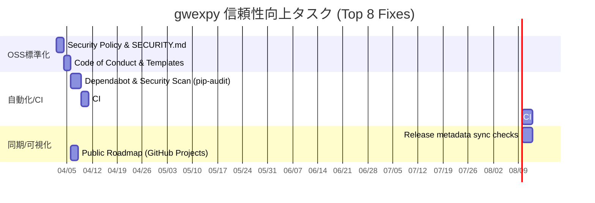

# gwexpy プロジェクト監査・分析統合レポート

最終更新日: 2026-04-02
ステータス: **継続的改善フェーズ（OSS標準化・信頼性向上）**

## 1. エグゼクティブサマリー

`gwexpy` は、研究用ソフトウェアとしては非常に高い完成度（ドキュメント・CI・再現性の骨格）を備えていますが、外部コントリビュータや第三者ユーザーが安心して関与するための「OSS運用の標準インフラ」が依然として薄い状態にあります。

2026-04-02 時点の再監査により、**「実装はされているが発見しにくい機能（例：GUI）」**の課題に加え、**「セキュリティポリシー、行動規範、マルチOSの最低限保証」**といった運用上の信頼性を担保する要素が、プロジェクトのさらなる成長（学術引用の定着と外部貢献の促進）における“最後の壁”となっていることが判明しました。

本レポートは、2026-04-01 時点の監査スナップショットと、その後の修復状況、および新たに特定された「運用品質」に関する 8 つの主要課題を統合した、ライブなロードマップである。

---

## 2. 理解と進捗のギャップ（解決済み事項の整理）

以前の監査（2026-04-01）で指摘された重大な課題のうち、以下の項目はすでに解消されています。ドキュメント上の「未解決」記述との混同に注意してください。

- **[DONE] バージョン情報の単一ソース化**: `pyproject.toml` に `dynamic = ["version"]` を導入し、`_version.py` を唯一の正解としました。
- **[DONE] ワイルドカードインポートの排除**: `gwexpy/io/` 内での `from gwpy.io.* import *` を、明示的な import に置き換えました。
- **[DONE] 広範な例外捕捉の具体化**: I/O 層を中心に、`except Exception:` を具体的な例外（`OSError`, `ValueError` 等）へ修正しました。
- **[DONE] 欠落していたチュートリアル作成**: `Histogram`, `Table`, `Noise`, `Fitting` 等の主要チュートリアルを `docs/` に追加しました。
- **[DONE] セキュリティポリシーの設定 (P0)**: `SECURITY.md` を作成し、脆弱性報告手順と pickle に関する警告を明記しました。
- **[DONE] セキュリティスキャンの自動化 (P0)**: `.github/workflows/security.yml` を導入し、`pip-audit`, `bandit`, `CodeQL` による自動スキャン（PR毎/週次）を構築しました。

> [!WARNING]
> **メタデータ同期のリスク**: main ブランチの `_version.py` は 0.1.1 を示していますが、`CITATION.cff` や `.zenodo.json` が 0.1.0 のまま残っているなど、リリース時の機械的な同期（CIでのチェック）が今後の課題です。

---

## 3. 2026-04-02 深掘り監査：OSS運用の標準インフラ (P0-P1)

学術ソフトウェアとしての第三者検証・引用・継続保守のコストを下げるための「運用上の信頼性」に関する課題です。

| 観点 | 現状とギャップ | リスク/影響 | 推奨アクション |
| :--- | :--- | :--- | :--- |
| **セキュリティ** | **[DONE]** `SECURITY.md` および脆弱性報告導線、`security.yml` による自動スキャンを導入済み。 | 脆弱性報告の漏れやサプライチェーンリスクの検知遅れ。 | 導入済み（継続的な監視とアラート対応）。 |
| **品質ゲート** | **[DONE]** `mypy` ジョブを CI に統合。現在は `continue-on-error` で可視化フェーズ。 | 型の退行が検知されず、メンテナンスコストが増大する。 | 導入済み（今後、エラー修正を進め強制化へ）。 |
| **マルチOS保証** | **[DONE]** Windows/macOS での `smoke-test` ジョブを CI に追加。 | ユーザー層が限定され、環境依存バグの発見が遅れる。 | 導入済み（主要なクラスのインポート・動作を確認）。 |
| **コミュニティ** | **[DONE]** `CODE_OF_CONDUCT.md`, Issue/PR テンプレート, `pre-commit` を整備。 | 外部協力の“入口摩擦”が増え、貢献の品質が安定しない。 | 導入済み（外部貢献への準備完了）。 |
| **再現性/配布** | テスト用サンプルデータが git 外にあり、新規参加者が再現しにくい。 | 外部からのバグ修正や機能追加のハードルが高くなる。 | 小さな fixture の同梱または自動DLスクリプトの提供。 |

---

## 4. 優先度付き改善ロードマップ (2026-Q2)

「機能追加」ではなく「信頼性・運用」に軸足を置いた「上位8手」を優先的に実施します。

### 📌 P0: 即時対応すべき「信頼」の基盤
1. **[DONE] セキュリティポリシーの策定**: `SECURITY.md` の追加と GitHub Security policy の整備。
2. **[DONE] 脆弱性スキャンの自動化**: `pip-audit` (OSV), `bandit`, `CodeQL` ワークフローの追加。

### 📌 P1: 外部貢献とマルチ環境対応

1. **[DONE] 行動規範 (CoC) とテンプレート**: `CODE_OF_CONDUCT.md` (English) と Issue/PR テンプレートの導入。
2. **[DONE] マルチOS Smoke Test**: Windows/macOS での `TimeSeries`, `FrequencySeries`, `Spectrogram` の動作確認を CI に追加。
3. **[DONE] CI での型チェック強制**: `mypy` ジョブを CI に統合（現在は `continue-on-error` での可視化）。
4. **[DONE] pre-commit 導入**: `ruff`, `mypy` などをコミット前にローカル実行可能に。

### 📌 P2: 透明性と同期の自動化

1. **リリースメタデータの同期**: `_version.py`, `CITATION.cff`, `CHANGELOG.md` の不整合を CI で検知。
2. **公開ロードマップの整備**: GitHub Projects 等を用い、課題の優先度を可視化。

### 実装タイムライン案 (2026-04-02 開始想定)

---

## 5. 検証計画

各フェーズ完了時に、機能的な回帰テストに加え、新設した「運用ゲート」の確認を行います。

1. **運用ゲート確認**:
   - `pip-audit` がクリーンであること。
   - PR テンプレートが GitHub 上で正しく表示されること。
   - `mypy` ジョブがパスすること。
2. **マルチOS検証**:
   - GitHub Actions 上で Windows/macOS ジョブが `PASS` すること。
3. **ドキュメント整合性**:
   - `docs/` 内の最新の機能（Histogram, Table等）が API Reference に正しく反映されていること。

---
*本レポートは、学術ソフトウェアとしての信頼性を高め、長期的な保守を可能にするための「生きた文書」として、タスクの完了に合わせて更新される。*
