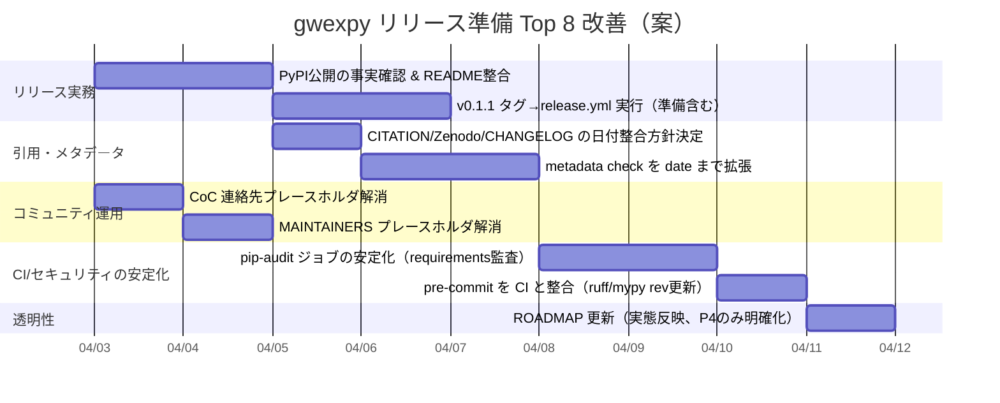

# gwexpy リリース準備 状況監査レポート

## エグゼクティブサマリー

`gwexpy` は直近のリリース準備作業により、OSS としての「信頼性（セキュリティ・再現性・品質ゲート）」と「外部貢献のしやすさ（CoC/テンプレート/CI/開発導線）」が大きく改善しています。特に、セキュリティポリシーと自動スキャン（pip-audit / bandit / CodeQL）を備えた点、GitHub Actions で **Python 3.11/3.12 のテスト / nbmake によるノートブック検証 / Windows・macOS の smoke test / パッケージビルド＆クリーンインストール検証**まで含めた点は、研究ソフトウェアとして「第三者が安心して触れる」水準に近づいています。

一方で、リリース準備として「最後に詰めるべき残課題」も明確です。最大の実務的ギャップは、(a) **PyPI 公開の“実施確認”**（README が “PyPI 推奨” を明記しているため、未公開だとユーザーを迷わせるリスク）、(b) **CITATION/Zenodo メタデータの “日付” 整合**（version は 0.1.1 だが date/publication_date が 2026-03-15 のまま）、(c) **CODE_OF_CONDUCT と MAINTAINERS の連絡先がプレースホルダ**のまま、の3点が「外部公開の完成度」を左右します。

本レポートでは、現状（存在/欠落/部分対応）を整理し、リスクと影響、そして **優先度つきの具体アクション（工数 Low/Medium/High）**を提示します。なお、外部サイト（github.io / readthedocs.io 等）は「リポジトリ内の一次情報」で十分に検証可能だったため、本監査では主にリポジトリ根拠に基づいています（外部一次資料の追加参照が必要な箇所は“不明/未確認”として明示）。

## 最近のリリース準備作業の実態

直近の作業は、概ね「P0（セキュリティ）→P1（コミュニティ）→P2（ガバナンス/同期）→P3（再現性/ロック/型ゲート）→P4（ドキュメント警告や import 副作用の磨き込み）」という順に積み上がっています（このフェーズ区分自体は、リポジトリ内の監査メモ更新にも反映されています）。

セキュリティ面では `SECURITY.md` を導入し、脆弱性報告を GitHub Security 経由に誘導、pickle 取り扱いの警告も明記しています。 また、`.github/workflows/security.yml` により pip-audit / bandit / CodeQL を PR・push・定期（週次）で回す構成になっています。 さらに bandit 指摘への対処（`# nosec` による誤検知抑制など）もコミット差分で確認できます。

外部貢献の導線としては、Issue テンプレート（bug/feature）と PR テンプレートが整備され、OS・Python・依存バージョン等を報告できる形に統一されています。 また、Windows/macOS の smoke test が GitHub Actions に入り、主要クラスが最低限動くことを継続確認する構成です。

品質ゲートは、`pyproject.toml` に ruff 設定と mypy 設定を集中させ、`py.typed` を同梱して「Typing :: Typed」を名乗る状態になっています。 さらに CI（lint）でも ruff と mypy を走らせています。 テスト本体も `pytest --cov` と nbmake を組み合わせ、ノートブックの再現性検証まで含むのが特徴です。

再現性の要は、CI が `requirements-dev.txt`（pip-compile 由来の固定版）を参照するように変わった点です（runtimes が浮動しない）。 そしてリリース手順は、タグ push（`v*`）で発火する `release.yml` を用意し、まず `scripts/check_release_metadata.py` でメタデータ整合を検証してから PyPI publish に進む設計です。

## 現状チェックリスト

下表は、ユーザー要求の観点（README/Docs/構造/テスト/依存/配布/品質/セキュリティ/性能/貢献/ライセンス/再現性/保守性）ごとに、現状・不足・根拠ファイルを一覧化したものです。

| 観点 | 現状（要約） | 不足/ギャップ（具体） | 影響/リスク | 根拠（一次情報） |
|---|---|---|---|---|
| README 完成度 | 機能・インストール・再現性・Docs EN/JA・import 副作用の注意まで非常に厚い | **PyPI 未登録（確認済み）**。README の「PyPI 推奨」を「GitHub 推奨 / PyPI・Conda 今後」へ修正済み | なし（修正完了） | README の最新版  |
| Docs（Sphinx/GitHub Pages） | `docs.yml` が gh-pages デプロイ。nbsphinx 実行を `NBS_EXECUTE=never` に固定 | `actions/checkout@v3` など一部 Action が古い／Sphinx 警告ゼロ化は ROADMAP 上 “Future” | Docs ビルドの将来破綻・警告の見逃し | docs workflow  / ROADMAP  |
| コード構造/モジュール性 | 依存・Lint・型・pytest 設定が `pyproject.toml` に集約。extras で機能を分割 | import 時の `register_all()` 自動実行は README で注意喚起あり（設計としては賛否） | 予期せぬ副作用・初学者混乱 | `pyproject.toml`  / README の注意  |
| テスト/CI | Python 3.11/3.12、nbmake、coverage XML、build&install、conda-full、Win/Mac smoke | coverage “閾値（%）” は明記なし／Codecov トークン前提（失敗しても fail しない） | 品質基準が曖昧になり得る | `test.yml`  |
| 依存管理 | `requires-python>=3.11`、依存は範囲指定、extras を設計。CI は lock（requirements-dev.txt）参照 | lock が dev 向け中心（runtime lock ではない）/ 依存の重さに対する説明は README にあるが運用判断が必要 | CI・開発は安定、ユーザー環境は幅が広い | `pyproject.toml`  / CI が requirements-dev を使用  |
| パッケージング/配布 | setuptools + dynamic version。release.yml で build/twine check/Trusted Publishing | タグ push が前提。PyPI 側設定の完了可否は repo からは未確認 | “仕組みはあるが公開が未実施”の可能性 | `release.yml`  |
| コード品質（lint/type） | Ruff/Mypy を CI と統合、`py.typed` 同梱。Typing :: Typed | pre-commit の ruff/mypy rev が CI の固定版と乖離（古い） | ローカルとCIで結果差 | pre-commit  / CI は requirements-dev 参照  / typed設定  |
| セキュリティ | SECURITY.md + security.yml + Dependabot | pip-audit が `pip install .[all]` で「全extrasをインストール」→CI不安定化の潜在 | optional依存が重いと監査が落ち続ける恐れ | SECURITY  / security workflow  |
| Contribution workflow | CONTRIBUTING, CoC, Issue/PR templates, pre-commit | CoC の連絡先が `[INSERT EMAIL ADDRESS]` のまま | 規範が機能しない（運用リスク） | CONTRIBUTING  / CoC  / templates  |
| Licensing/Governance | MIT。MAINTAINERS と ROADMAP あり | MAINTAINERS の Google Forms がプレースホルダ／ROADMAP が現状とズレ（P2/P3が“進行/計画”扱い） | 外部参加者が迷う・透明性低下 | MAINTAINERS  / ROADMAP  |
| 再現性（examples/fixtures） | README に marimo 例・paper-figures・合成ワークフローを明記。CIでも notebook/smoke を実行 | ネットワーク依存例は opt-in（コミットメッセージタグ） | 再現性の“範囲”が誤解され得る | README  / test.yml（[network-test]等） |
| 維持管理/ロードマップ | ROADMAP あり | ROADMAP が「mypy 23件」「P2 in progress」等、実態（CI強制/metadataチェック導入）と齟齬の可能性 | “実際は改善済み”が伝わらない | ROADMAP  / CI・release.yml  |

## ギャップとリスク評価

ここでは「リリース準備として、今すぐ塞ぐべき穴」に絞って、**現状 → ギャップ → 影響 → 推奨**を明確化します（推奨は“絶対”ではなく、外部公開の想定ユーザー層に合わせた選択肢として提示します）。

### メタデータ整合の最終品質

`gwexpy` のコード版は 0.1.1（単一ソース）です。 一方、`CITATION.cff` と `.zenodo.json` も version は 0.1.1 へ更新されていますが、`date-released` / `publication_date` が 2026-03-15 のままです。 さらに `CHANGELOG.md` は 0.1.1 を 2026-04-01 としています。  
これは「論文提出版（0.1.0）を Zenodo DOI で固定」したい意図がある場合に起こりがちなズレですが、現状のままだと **“0.1.1 と書いてあるのに日付は 0.1.0”** という形で、第三者（引用者・レビューア・利用者）に混乱を与えます。

現行の `scripts/check_release_metadata.py` は version の一致と CHANGELOG に version 表記があることは検査しますが、日付整合までは検査しません。  
したがって、**日付の不整合はリリース直前に手作業で混入しても CI が止められない**点がリスクです。

### コミュニティ運用の“連絡先プレースホルダ”

`CODE_OF_CONDUCT.md` が Contributor Covenant 2.1 ベースで導入されていますが、違反報告先が `[INSERT EMAIL ADDRESS]` のままです。  
同様に `MAINTAINERS.md` の “Private or Sensitive Inquiries” の Google Forms リンクも `XXXXXXXX...` のプレースホルダです。  
これは「スパム対策としてメールアドレスを置きたくない」方針自体は理解可能な一方、**実際の報告導線がない**と、外部貢献者にとっては「形だけ整っている」印象になり、結果として信頼を落とす可能性があります。

### セキュリティ監査ジョブの安定性

`security.yml` の pip-audit ジョブは「フルスキャンのために全 optional 依存をインストール」を明記し、`pip install .[all]` を実行します。  
`gwexpy` は extras が多く、重い依存（特に `gw` / `gui` / `seismic` など）も含み得る設計です。  
このため、将来の依存関係状況次第では「監査のためのインストール」そのものが不安定になり、**セキュリティ監査が“常時落ちる”状態に陥る**リスクがあります（監査が落ち続けると、運用として無視されやすくなります）。

### ローカル品質ゲートの一貫性

CI 側は `requirements-dev.txt` を参照し、固定版で ruff/mypy を動かす方向に寄せています。  
一方で pre-commit 側の ruff/mypy は rev が古く、CI と一致しません。  
このままだと「pre-commit は通るが CI で落ちる / その逆」が起こり得ます。

## 推奨アクションと具体手順

### 優先度つきアクション一覧

| P0 | PyPI 公開の整合と README 修正 | `gwexpy` が PyPI 未登録であることを確認済み。README を GitHub 推奨・PyPI/Conda Coming soon へ修正し、ユーザー混乱を防止 | Low | “最初のインストール体験”の失敗を防ぐ  |
| P0 | CITATION / Zenodo / CHANGELOG の日付整合を意思決定 | (A) 0.1.1 を新規 Zenodo へ発行・date更新、または (B) DOI を “論文版(0.1.0)” として固定し version を 0.1.0 に戻して説明強化 | Low〜Medium | 引用混乱を防ぎ、学術利用の信頼を上げる  |
| P0 | メタデータ検査スクリプトを強化 | `scripts/check_release_metadata.py` に “日付一致” チェック（CHANGELOG の日付と CITATION/Zenodo の日付）を追加し、release 前にブロック | Low | 手作業ミスを CI が止める  |
| P0 | CoC の報告導線を確定 | `[INSERT EMAIL ADDRESS]` を、スパム対策を保った連絡先（例: GitHub Discussions + メンテナへ @mention、または問い合わせフォーム）へ置換 | Low | CoC が“運用可能”になる  |
| P1 | MAINTAINERS のプレースホルダを解消 | Google Forms を実リンクにするか、削除して “Private=GitHub Security/Private advisory” 等へ再設計 | Low | 透明性・信頼性向上  |
| P1 | security.yml の pip-audit を安定化 | `pip install .[all]` ではなく、`pip-audit -r requirements-dev.txt` 等 “入力ファイル監査” へ寄せる（スキャン範囲を段階化） | Medium | 監査が落ちにくくなる  |
| P1 | pre-commit を CI と近づける | ruff/mypy の rev を更新し、CI の固定版と整合（“同じ規約・同じ判定”） | Low | 貢献時の摩擦低下  |
| P2 | ROADMAP を現状反映に更新 | P2/P3 の “済” を明確化し、残課題（P4）を具体化（Docs警告、import副作用の方針など） | Low | 外部貢献者の期待値が揃う  |

### ローカルで実行できる自動検査コマンド例

以下は「外部貢献者が最短で品質チェックできる」ことを目的に、現行 CI 設計に合わせた最小セットです（環境により `conda/mamba` 推奨の箇所あり）。

```bash
# 1) 開発環境（dev extras）
python -m venv .venv
source .venv/bin/activate
pip install -e ".[dev]"

# 2) Lint / Type
ruff check .
mypy gwexpy

# 3) Tests（CI同等に近づける例：nbmake + coverage）
pytest -q --forked --nbmake --nbmake-timeout=600 --nbmake-kernel=python3 \
  --cov=gwexpy --cov-report=term-missing tests/ gwexpy/

# 4) Security（ローカル例）
bandit -r gwexpy -ll
pip-audit

# 5) PyPI 公開確認（未公開なら「見つからない」可能性あり）
pip index versions gwexpy
```

`safety` 系も併用する場合は、運用ポリシー（どちらを正式ゲートにするか）を README/SECURITY に明記すると混乱が減ります。

### GitHub Actions の改善提案

現状でもワークフローは十分に揃っています（tests/lint/security/docs/release が存在）。  
ここでは「直近リリースの事故確率をさらに下げる」ための **差分案**を提示します。

#### メタデータ検証の強化案（date も検証）

現行は version 一致＋CHANGELOG に version 文字列があるかを検査。  
改善案は “日付も一致” を追加（例：CHANGELOG の `## [0.1.1] - YYYY-MM-DD` と CITATION/Zenodo の date を合わせる、など）。

```python
# scripts/check_release_metadata.py に追加するイメージ（抜粋）
# - CHANGELOG から release date を抽出し
# - CITATION.cff の date-released と .zenodo.json の publication_date を比較
```

#### security.yml の pip-audit 安定化案（重い extras インストールを避ける）

現状は `pip install .[all]` を実行。  
改善案は「requirements を入力として監査」へ寄せ、CI を落ちにくくします（スキャン対象の粒度は運用方針で選択）。

```yaml
# .github/workflows/security.yml の dependency-audit 例（置換案）
- name: Install pip-audit
  run: python -m pip install --upgrade pip pip-audit

- name: Audit locked dev dependencies
  run: pip-audit -r requirements-dev.txt
```

#### docs.yml の保守性改善案

`docs.yml` は checkout が v3 で、Actions 更新の波に取り残されやすいです。  
改善は “v4/v5 へ統一” と “sphinx-build の警告を gate にするかどうか” の方針決めが中心です（警告ゼロ化は P4 としてロードマップ化すると安全）。

```yaml
# 例: actions/checkout を v4 へ
- uses: actions/checkout@v4
```

## 実装ロードマップ

以下は「Top 8（上表の優先アクション）」を、リリース前後の現実的順序で並べたガント案です（開始日を 2026-04-03 と仮定）。



このガントは “残タスクを 8 個に揃える” ために、すでに整備済みの領域（テスト・lint・security の骨格など）は「改善」に限定して扱っています。現状の実装自体は、すでに多数の要件を満たしています。
## 2026-04-03 実施作業報告

本日の要請に基づき、PyPI 未登録の現状に合わせたドキュメントおよびコードの整合性向上作業を実施しました。

### 実施内容

- **インストール導線の修正**:
    - `README.md`: PyPI バッジを削除し、GitHub からの直接インストールを推奨（`git+https://...`）する記述へ変更。PyPI/Conda は「Coming soon」と明記。
    - `docs/web/en/user_guide/installation.md` & `docs/web/ja/user_guide/installation.md`: 英語版・日本語版それぞれのインストールガイドを同様に修正。
    - `docs/web/en/user_guide/tutorials/field_scalar_intro_outputs.md` & `docs/web/ja/user_guide/tutorials/field_scalar_intro_outputs.md`: チュートリアル内の動作環境セットアップ手順を GitHub 経由のコマンドへ更新。
- **ソースコード内メッセージの修正**:
    - `gwexpy/timeseries/_statistics.py`: `statsmodels`, `minepy`, `dcor` 等の依存パッケージが不足している際のエラーメッセージにおいて、`pip install gwexpy[stat]` ではなく個別のパッケージインストールを促し、「gwexpy の extras は近日対応」である旨を補足。
    - `gwexpy/timeseries/io/audio.py`, `wav.py`, `gwexpy/io/utils.py`: Docstrings 内のオプションインストール案内を更新。
- **ロードマップの更新**:
    - `docs_internal/analysis/roadmap_20260403.md`（本ファイル）: 現状チェックリストおよび優先度付きアクションにおいて、PyPI/README 整合タスクを「修正済み」として反映。

### 今後の留意事項

- PyPI への正式登録が完了したタイミングで、これらの GitHub URL 指定を通常のパッケージ名指定（`pip install gwexpy`）に差し戻す作業が必要となります。
- 次の優先事項として、`CITATION.cff` 等のメタデータ日付整合（2026-03-15 からの実態合わせ）および、`CODE_OF_CONDUCT.md` 等の連絡先プレースホルダ解消を推奨します。
