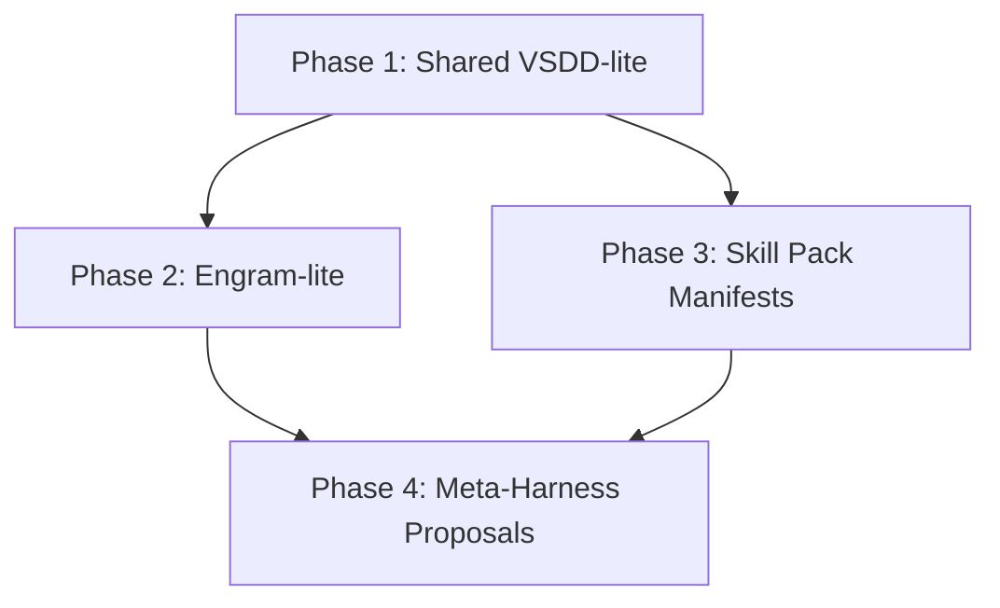

# Harness Optimization Roadmap Implementation Plan

Source: [docs/superpowers/plans/2026-04-04-harness-optimization-roadmap.md](/home/washimi/ai-harness/docs/superpowers/plans/2026-04-04-harness-optimization-roadmap.md)

> **For agentic workers:** REQUIRED: Use superpowers:subagent-driven-development (if subagents available) or superpowers:executing-plans to implement this plan. Steps use checkbox (`- [ ]`) syntax for tracking.

**Goal:** Add a shared verification backbone, local long-term memory, install-time skill pack distribution, and a safe Meta-Harness proposal loop without destabilizing the current multi-platform harness.

**Architecture:** Implement this as four gated phases in the order `VSDD-lite -> Engram-lite -> Skill Pack Manifests -> Meta-Harness Proposals`. Keep `rules/` as the normative layer, move fast feedback into shared executables, and treat memory and self-optimization as assistive systems rather than primary sources of truth.

**Tech Stack:** Bash, Python 3.10+, SQLite, Markdown docs, Claude hooks, Codex rules, multi-platform symlink installer

---

## Scope and constraints

- Preserve the existing shared repository model in [README.md](/home/washimi/ai-harness/README.md#L7).
- Do not make runtime behavior depend on a single vendor-specific hook system.
- Keep `rules/` authoritative; Engram only returns context snippets and prior decisions.
- Do not allow autonomous rule rewrites to land directly on `main`.
- Each phase must be independently testable before the next phase begins.

## Phase dependency map

## File map

### New files

- `bin/verify-changed-files`
- `config/quality-gates/manifest.yaml`
- `config/quality-gates/profiles/*.yaml`
- `bin/engram-init`
- `bin/engram-record`
- `bin/engram-query`
- `memory/engram/schema.sql`
- `memory/engram/README.md`
- `config/engram/policies.yaml`
- `config/skills/packs.yaml`
- `bin/render-skill-pack`
- `bin/install-skill-pack`
- `docs/architecture/harness-optimization.md`
- `docs/architecture/engram.md`
- `docs/architecture/skill-packs.md`
- `docs/architecture/meta-harness.md`
- `proposals/rules/README.md`
- `proposals/rules/pending/.gitkeep`
- `bin/propose-rule-update`
- `bin/review-rule-proposals`

### Existing files to modify

- `install.sh`
- `README.md`
- `skills/README.md`
- `hooks/claude/hooks.json`
- `codex/config.base.toml`
- `codex/rules/default.rules.example`
- `continue/config.yaml`
- `gemini/GEMINI.md`
- `bin/sync.sh`
- `skills/error-investigator/SKILL.md`
- `skills/knowledge-distiller/SKILL.md`
- `skills/create-rule/SKILL.md`
- `skills/project-hooks-creator/SKILL.md`
- `rules/README.md`

---

## Phase 1 — Shared VSDD-lite Foundation

### Deliverables

- Shared verification entrypoint for changed files
- Language-specific quality-gate profiles
- Claude hook integration
- Codex and other platform guidance

### Success Criteria

- `bin/verify-changed-files --changed` exits non-zero on failure
- Platform-specific quality checks are routed through a shared contract
- Codex rule templates allow the shared verifier safely

### Core tasks

1. Create the shared verification contract
2. Wire the verifier into Claude and Codex
3. Update install and operator documentation

### Exit gate

- `bin/verify-changed-files --help`
- `bin/verify-changed-files --changed`

---

## Phase 2 — Engram-lite Local Memory

### Deliverables

- SQLite-backed local memory store
- Session-start query path
- Session-end structured recording path
- Retention and privacy policy

### Success Criteria

- `bin/engram-init` creates the database
- `bin/engram-record` persists a structured event
- `bin/engram-query` returns bounded results
- Claude hooks can call Engram asynchronously

### Core tasks

1. Create the local memory schema and CLIs
2. Wire Engram into session lifecycle
3. Align memory-aware skills and workflows

### Exit gate

- `bin/engram-init`
- `bin/engram-record --help`
- `bin/engram-query --help`

---

## Phase 3 — Skill Pack Manifest Distribution

### Deliverables

- Install-time skill packs replace flat exposure by default
- Pack manifest supports `core`, `infra`, `data`, `mobile`, `authoring`
- Installer provisions packs per platform
- Documentation explains pack generation and override behavior

### Success Criteria

- `bin/render-skill-pack core` emits deterministic output
- `bin/install-skill-pack <platform> <pack>` installs or symlinks the selected pack
- `install.sh` defaults to a minimal core pack unless overridden
- Existing direct `skills/` symlink mode remains available

### Core tasks

1. Define pack manifest and renderer
2. Integrate pack selection into installation flow

### Exit gate

- `bin/render-skill-pack core`
- `bin/install-skill-pack codex core --check`
- `./install.sh --check`

---

## Phase 4 — Meta-Harness Proposal Loop

### Deliverables

- Rule-improvement proposals are generated from repeated incidents
- Proposals are stored under `proposals/rules/pending/`
- Review tooling validates proposals before promotion
- Auto-sync does not silently promote autonomous rule rewrites

### Success Criteria

- `bin/propose-rule-update` generates a proposal document
- `bin/review-rule-proposals` validates required fields
- Self-improvement points to proposals, not direct rule mutation

### Core tasks

1. Create the proposal queue and tooling
2. Rewire self-improvement entrypoints

### Exit gate

- `bin/propose-rule-update --help`
- `bin/review-rule-proposals --help`

---

## Implementation order

1. Phase 1 first
2. Phase 2 second
3. Phase 3 third
4. Phase 4 last

## Risk controls

- Do not remove existing `rules/` files during Phase 1 or 2
- Keep new platform integrations behind compatibility flags until validated
- Treat `hooks/claude/hooks.json` as an adapter, not the source of policy
- Never let `bin/sync.sh` auto-commit generated rule mutations without a review boundary

## Recommended commit slices

1. `feat: add shared verification runner`
2. `feat: route claude and codex to shared verification`
3. `feat: add local engram store and lifecycle hooks`
4. `feat: add skill pack manifests and installer support`
5. `feat: add meta-harness proposal queue`
6. `docs: document harness optimization architecture`

## Verification bundle

- `bash -n install.sh bin/verify-changed-files bin/engram-init bin/engram-record bin/engram-query bin/render-skill-pack bin/install-skill-pack bin/propose-rule-update bin/review-rule-proposals`
- `./install.sh --check`
- `rg -n "verify-changed-files|engram|skill pack|proposal" README.md skills rules hooks install.sh codex continue gemini docs`
- `git status --short`

## Handoff notes

- Phase 1 can be implemented and merged independently.
- Phase 2 should not ship until database location, retention, and privacy policy are documented.
- Phase 3 should keep a one-flag rollback to the current full-symlink strategy.
- Phase 4 requires human review policy before activation.

---

## Work Report

### Summary

This session implemented the roadmap through the minimum viable slices of all four phases:

- Phase 1: shared verification backbone
- Phase 2: Engram-lite local memory
- Phase 3: skill pack manifest distribution
- Phase 4: Meta-Harness proposal queue

### Implemented in this session

#### Phase 1

- Added `bin/verify-changed-files`
- Added `config/quality-gates/manifest.yaml` and language profiles
- Routed Claude quality-gate hook through the shared verifier
- Added Codex allow-rules for verifier usage
- Added regression tests for verifier CLI behavior

#### Phase 2

- Added SQLite-backed Engram schema and CLI set:
  - `bin/engram-init`
  - `bin/engram-record`
  - `bin/engram-query`
- Added event helpers:
  - `bin/engram-build-stop-event`
  - `bin/engram-build-incident-event`
- Added changed-file and tag-aware retrieval
- Wired Claude `SessionStart` and `Stop` hooks to Engram
- Updated `error-investigator` and `knowledge-distiller` to acknowledge Engram usage
- Added regression tests for Engram record/query/helper flows

#### Phase 3

- Added skill pack manifest `config/skills/packs.yaml`
- Added pack renderer and installer:
  - `bin/render-skill-pack`
  - `bin/install-skill-pack`
- Added common pack helper `bin/skill_pack_common.py`
- Extended `install.sh` with:
  - `--skill-pack`
  - `--all-skills`
  - platform default pack resolution
- Added regression tests for pack rendering and installation behavior

#### Phase 4

- Added proposal queue and CLI set:
  - `bin/propose-rule-update`
  - `bin/review-rule-proposals`
- Added common helper `bin/rule_proposal_common.py`
- Added proposal storage under `proposals/rules/pending/`
- Updated `create-rule` to prefer proposal generation when the harness is learning from recurring failures
- Updated `bin/sync.sh` documentation note to keep proposals as review artifacts, not canonical rules
- Added regression tests for proposal generation and validation

### Verification performed

- `python3 -m unittest tests.test_verify_changed_files -v`
- `python3 -m unittest tests.test_engram_cli -v`
- `python3 -m unittest tests.test_skill_pack_cli -v`
- `python3 -m unittest tests.test_rule_proposal_cli -v`
- `bash -n install.sh`
- `bash -n bin/sync.sh`
- `python3 bin/render-skill-pack core infra`
- `python3 bin/review-rule-proposals`

### Commits created in this session

- `f3e78e7` `feat(harness): add shared verification quality gates`
- `3e105e0` `feat: add local engram store and shared lifecycle hooks (Roadmap Phase 1-2)`
- `11b6142` `feat(harness): expand engram event helpers`
- `9dc518b` `feat(harness): add skill packs and rule proposal queue`

### Remaining work

- Phase 2: move from generic stop-hook notes to richer incident/fix generation from real evaluation outputs
- Phase 3: add stricter installer behavior and broader platform-specific pack guidance
- Phase 4: add proposal promotion workflow and stronger safeguards around autonomous rule evolution
