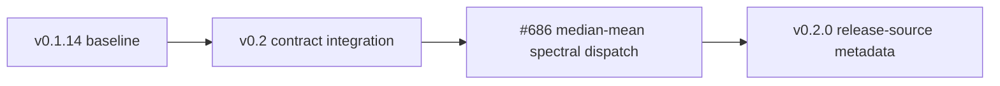

This minor release establishes the v0.2.0 semantic-contract baseline for
exact timing, interoperable persistence, deterministic provenance, and public
GWpy compatibility.

### Added

- **time (exact GPS state)**: `TimeSeries` and related supported paths retain
  keyword-only GPS-nanosecond origins through copies, slices, pickles, MNE,
  and HDF5 sidecars.  Exact state is kept separately from binary64 time
  coordinates where required.
- **HDF5 and provenance**: native HDF5 sidecars preserve exact epoch state,
  metadata, and structured provenance without changing the GWpy-readable core
  payload.  Provenance-aware pathname transactions now coordinate local POSIX
  processes with bounded advisory locking; append and caller-owned open
  containers preserve distinct datasets, while pathname replacement remains
  serialized last-writer-wins.
- **GWF reads**: `TimeSeries`, `TimeSeriesDict`, `StateVector`, and
  `StateVectorDict` support spawn-safe `parallel=` reads.  `nproc=` remains a
  compatibility alias.  Multi-worker reads accept only single local frame
  paths and fail before I/O for caches, URI/composite spellings, or unsupported
  nested execution.
- **coupling**: the public v1 coupling-segment schema, pandas/Astropy
  adapters, JSON envelopes, canonical coordinate units, and exact
  finite-precision grid checks are available.  `significance` remains outside
  the v1 schema.
- **spectral estimation**: `TimeSeries.psd()` and `TimeSeries.asd()` accept
  `method="median-mean"`; public `median_bias(n)` exposes the
  FINDCHIRP-compatible finite-sample correction.  PSD/ASD now guarantee
  GWexpy preservation of `name`, `channel`, and `epoch` across supported
  backends, while the backend remains authoritative for numerical values,
  units, and the frequency axis.

### Changed

- **bootstrap and I/O**: a plain `import gwexpy` no longer eagerly registers
  constructors or I/O.  Call `gwexpy.register_all(include_io=False)` for
  constructors or `gwexpy.register_all()` for constructors plus I/O; supported
  public I/O entry points register handlers on demand.
- **SeriesMatrix B0**: the 480-cell Phase A container contract is frozen.
  Dimensional raw-`ndarray` addition and subtraction with `SpectrogramMatrix`
  fail atomically with `TypeError`; the broader B1 composition runtime remains
  deferred (`adopted: false`) pending explicit human D21/data-model sign-off.

### Removed (breaking)

- The obsolete developer proxy imports `gwexpy.utils.shell`,
  `gwexpy.utils.sphinx`, `gwexpy.utils.sphinx.ex2rst`, and
  `gwexpy.utils.sphinx.zenodo` have been removed. Use `subprocess` and
  `shutil.which` for shell helpers, maintained documentation tooling directly,
  and a maintained Zenodo client or project release tooling as appropriate.

### Compatibility fixes

- GWpy 4 runtime proxies now expose curated public table, TimeSeries, LAL, and
  misc utility surfaces. The optional FrameL compatibility proxy is lazy: it
  imports without `python-framel` and reports the original dependency error
  only when a FrameL-backed symbol is requested.

### Update history

---
**Install:** `pip install gwexpy==0.2.0`
**Full changelog:** https://github.com/tatsuki-washimi/gwexpy/blob/main/CHANGELOG.md
